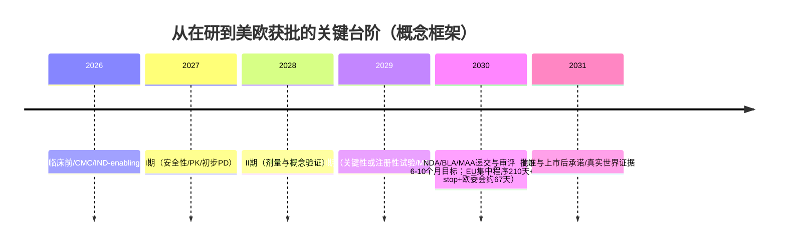

# 25个在研药物在美国与欧盟获批速度评估

报告日期：2026-02-11（America/New_York）。本报告仅基于可检索到的**英文**公开来源（监管机构/政府网站、公司公告、临床试验注册、PubMed/PMC论文等）；凡缺失信息均标注“未披露/未检索到”。对“获批速度”的判断以**当前证据强度 + 监管路径可行性 + 是否已进入美欧监管体系（IND/CTA）**为核心。

## 执行摘要

就“**最快可能在美欧获批**”而言，在本清单中最接近美欧注册节奏的是：
- **RN0361**：已披露获得美国食品药品监督管理局的IND clearance以启动II期研究，并披露I期“单次给药持续至少6个月、ApoC3最高降幅93%、TG最高降幅69%”等人群数据，属于“已进入美国监管通道且有明确临床信号”的少数项目之一。
- **BW-00112**：阿戈生物公告将BW-00112（ANGPTL3）描述为“在美国和中国处于II期”，意味着美国IND/试验体系已启动（尽管公开结果有限）。
- **SAL003**与**Ebronucimab（ebronucimab）**：两者都属于成熟靶点PCSK9单抗；Ebronucimab在中国已获批上市（对“技术成熟度/CMC体系/三期证据完备度”是正向信号），SAL003则披露中国BLA被受理且ClinicalTrials.gov登记了III期设计，但二者**未见明确美欧IND/CTA与关键MRCT路径披露**，因此“能否在美欧快速转化”主要受制于是否启动跨区域临床与差异化价值（疗效/给药频率/安全性/成本）的证明。

就“**最慢或高度不确定**”而言：
- **Xuezhikang**（红曲制剂）在美国/欧盟的监管定位与成分一致性/风险控制是核心障碍；美国对“含强化/添加lovastatin（与monacolin K结构相同）”的红曲产品并非按膳食补充剂允许销售；欧盟层面对红曲monacolins的安全性评估与法规限制也显著收紧，意味着若走药品注册路径，需要非常完整的质量与临床体系，且商业与监管可行性不明。
- **SR044、RP910、MWX203**：在英文生物医药语境下缺乏可靠“药物项目”证据（多为非药物编号/金额符号等同名噪音），因此无法进行有意义的获批速度推断。

关于“美欧审评时长”本身：FDA标准/优先审评目标分别为10个月/6个月；欧盟集中程序CHMP评价法定210天（不含clock stop），随后欧委会在约67天内作出决定；现实中因clock stop等因素，欧盟集中程序从启动到最终授权平均可达约465天（2023年数据）。因此，多数项目的“获批速度差异”主要由**临床开发耗时**与**能否获得加速工具**决定，而不是审评机构的“纯审评天数”。

## 方法与关键假设

**监管终点定义**：
- “美国获批”指提交NDA/BLA并获得FDA批准。
- “欧盟获批”指经欧洲药品管理局/CHMP出具正面意见并由欧盟委员会作出上市许可决定（集中程序）。

**审评时间基准（用于“提交后”部分的估算）**：
- FDA：优先审评目标6个月、标准审评目标10个月。
- 欧盟集中程序：CHMP评价210天（不含clock stop），欧委会在约67天内做决定；且EMA披露2023年集中程序总耗时平均约465天，若加速审评可显著缩短（EMA年报口径）。

**专利/数据独占（仅在公开资料缺失时作为“规则背景”，不等同于该项目一定获得）**：
- 美国：新专利一般为自申请日起20年；常见市场/数据独占类型包括NCE 5年、孤儿药7年、生物类似药路径下参考制品的12年参比独占等（不同路径适用不同规则）。
- 欧盟：本报告以“药品集中程序审评时长与可申请加速评估”的公开规则为主；对欧盟独占期改革与过渡期不在本报告做确定性假设。

**时间轴估算框架（从2026-02起算）**：
- 若项目处于**临床前/无可验证临床注册**：通常需要先完成IND-enabling/CMC与首次人体试验，进入美欧获批的现实窗口往往在**8–12年或更久**，且不确定性最高。
- 若处于**I期**：若顺利推进至关键性试验并能在美欧开展MRCT或桥接，通常窗口为**6–10年**。
- 若处于**II期**：通常窗口为**4–8年**。
- 若处于**III期/已有申报在其他主要市场受理**：若同步启动美欧关键性临床与CMC准备，窗口可在**3–6年**，但前提是已有美欧IND/CTA与可接受的关键终点策略。

为直观展示“提交前/提交后”的结构性时间消耗，本报告使用如下时间线模板：



## 汇总对比表

说明：
- “阶段”取公开英文证据所能支持的**最高**阶段（若仅有二次数据库提示且无注册/论文支撑，阶段可信度降低）。
- “加速资格”仅指公开资料是否披露（未披露不等于一定没有）。
- 时间为“最乐观/典型/最悲观（或不确定/不推进）”。

| 药物 | 主要适应症（公开英文） | 最高阶段（公开英文） | 加速指定（FDA/EMA） | 预计美国获批窗口 | 预计欧盟获批窗口 | 置信度 |
|---|---|---|---|---|---|---|
| SHR-1918 | HoFH/血脂异常（ANGPTL3单抗） | III期（注册/关键性试验登记） | 未披露 | 2030–2031 / 2032–2034 / 2035+或不推进 | 2030–2032 / 2032–2035 / 2036+或不推进 | 中-低 |
| BW-00112 | 混合型血脂异常（ANGPTL3项目） | II期（美国+中国） | 未披露 | 2030–2031 / 2032–2034 / 2035+ | 2030–2032 / 2032–2035 / 2036+ | 中 |
| FY101 | 血脂异常（ANGPTL3项目） | I期（数据库） | 未披露 | 2033–2034 / 2035–2037 / 2038+ | 2033–2035 / 2035–2038 / 2039+ | 低 |
| SYH2070 | 未披露（仅见I期注册迹象） | I期 | 未披露 | 2033–2035 / 2035–2038 / 2039+ | 2033–2036 / 2036–2039 / 2040+ | 低 |
| JS401 | 血脂异常（ANGPTL3 GalNAc-siRNA） | I期（中/澳获批开展） | 未披露 | 2033–2034 / 2035–2037 / 2038+ | 2033–2035 / 2035–2038 / 2039+ | 中-低 |
| SR044 | 无法确认药物项目（英文资料不足） | 未知 | 不适用 | 不可评估 | 不可评估 | 很低 |
| HRS-7249 | 高脂血症/高甘油三酯血症（机制未披露） | II期 | 未披露 | 2032–2033 / 2034–2036 / 2037+ | 2032–2034 / 2034–2037 / 2038+ | 低 |
| RN0361 | sHTG/FCS等（APOC3 GalNAc-siRNA） | 进入美国II期（FDA IND clearance） | 未披露 | 2029–2030 / 2031–2033 / 2034–2036 | 2029–2031 / 2031–2034 / 2035+ | 中 |
| Kylo-12 | HTG/FCS（APOC3 siRNA） | I期 | 未披露 | 2032–2033 / 2034–2036 / 2037+ | 2032–2034 / 2034–2037 / 2038+ | 低-中 |
| SYH2053 | FH/混合型高脂血症（PCSK9） | I期完成（中国） | 未披露 | 2033–2034 / 2035–2037 / 2038+ | 2033–2035 / 2035–2038 / 2039+ | 低 |
| BGT-002 | 血脂异常（ACLY抑制剂）；NASH早期探索 | Ib/IIa（NASH）+ I期（健康人） | 未披露 | 2032–2033 / 2035–2038 / 2039+或不推进 | 2032–2034 / 2035–2039 / 2040+或不推进 | 中-低 |
| AP025 | NASH（FGF21-Fc融合蛋白） | II期进行中 | 未披露 | 2031–2032 / 2033–2035 / 2036+ | 2031–2033 / 2033–2036 / 2037+ | 低-中 |
| SIPI-7623 | 高脂血症/动脉粥样硬化（FXR拮抗剂，动物/细胞） | 临床前 | 未披露 | 2036+ / 不确定 / 不推进 | 2036+ / 不确定 / 不推进 | 很低 |
| Xuezhikang | 心血管二级预防/降脂（红曲提取物） | 非美欧药品注册路径清晰项目 | 不适用 | 2036+或不现实 | 2036+或不现实 | 很低 |
| HS-10510 | 血脂异常（PCSK9项目） | I期（未招募） | 未披露 | 2034–2035 / 2036–2038 / 2039+ | 2034–2036 / 2036–2039 / 2040+ | 低 |
| CVI-LM001 | 高胆固醇血症（口服PCSK9调节剂） | II期（状态未知，信息停留在2020） | 未披露 | 2034+或不推进 | 2034+或不推进 | 很低 |
| MIL86 | 高胆固醇血症（PCSK9单抗） | II期（数据库） | 未披露 | 2031–2032 / 2033–2035 / 2036+ | 2031–2033 / 2033–2036 / 2037+ | 低 |
| SAL003 | 高胆固醇/混合型血脂异常（PCSK9 IgG4单抗） | III期（注册设计公开）+ 中国BLA受理（披露） | 未披露 | 2030–2031 / 2032–2034 / 2035+或不推进 | 2030–2032 / 2032–2035 / 2036+或不推进 | 中-低 |
| Ebronucimab | 高胆固醇/混合型血脂异常（PCSK9 IgG1单抗） | 已在中国获批上市 | 未披露 | 2029–2031 / 2032–2035 / 2036+或不推进 | 2029–2032 / 2032–2036 / 2037+或不推进 | 中 |
| DNV001 | 血脂异常（PCSK9 GalNAc-siRNA） | 中国IND通过（临床前→临床） | 未披露 | 2033–2034 / 2035–2037 / 2038+ | 2033–2035 / 2035–2038 / 2039+ | 低 |
| RP910 | 未检索到可靠英文药物信息 | 未知 | 不适用 | 不可评估 | 不可评估 | 很低 |
| RBD7022 | 高脂血症（PCSK9 GalNAc-siRNA） | I期完成 | 未披露 | 2033 / 2035–2037 / 2038+ | 2033–2035 / 2035–2038 / 2039+ | 中-低 |
| MWX203 | 未检索到可靠英文药物信息 | 未知 | 不适用 | 不可评估 | 不可评估 | 很低 |
| ASC41 | NASH（THRβ激动剂） | II期（52周） | 未披露 | 2031–2032 / 2033–2036 / 2037+或不推进 | 2031–2033 / 2033–2037 / 2038+或不推进 | 中-低 |
| HPG7233 | NASH/血脂异常（THRβ激动剂，动物/体内） | 临床前（公开英文证据仅到前临床） | 未披露 | 2034–2035 / 2036–2039 / 2040+或不推进 | 2034–2036 / 2036–2040 / 2041+或不推进 | 很低 |

## 逐项药物分析

为避免“假精确”，每个项目均以“**开发阶段 + 是否已进入美欧监管体系 + 关键数据是否公开**”来解释速度，并给出区间。

---

**SHR-1918**

机制/适应症：ANGPTL3靶向单抗；在HoFH人群中报告显著降LDL-C。
申办方/公司：公开英文信息未在同一处权威文件中明确归属，但项目与“SHR-”体系及临床登记显示与中国申办方相关。
当前研发/监管状态：存在III期治疗HoFH的临床登记（ClinicalTrials.gov编号NCT06723652）；另有与HRS-7249联合用于重度高甘油三酯血症高胰腺炎风险人群的II期试验登记。
关键临床结果：在HoFH非随机试验中，12周时不同基因型人群LDL-C相对基线下降约−56%至−72%区间；TEAE中较常见的是蛋白尿（15.4%），注射部位反应发生率低（3.8%，均为1级）。
加速通道/指定：未在检索到的英文公开资料中披露FDA Fast Track/Breakthrough/EMA PRIME等。
关键监管障碍：若目标为美欧（而非仅中国），需要明确（1）是否已建立美欧IND/CTA；（2）HoFH在美欧可接受的关键终点与比较策略；（3）生物制品CMC与免疫原性数据在跨区域的可比性。
美欧获批时间预估：
- 美国：最乐观2030–2031；典型2032–2034；最悲观2035+或不推进（核心取决于是否在2026–2027启动MRCT/桥接并形成可提交BLA的数据包）。
- 欧盟：与美国类似但通常总程序更长（clock stop显著影响），最乐观2030–2032；典型2032–2035；最悲观2036+或不推进。
置信度：中-低（主要假设：目前公开信息不足以证明已进入美欧监管临床体系）。

---

**BW-00112**

机制/适应症：Argo公告将BW-00112描述为“ANGPTL3”项目、用于血脂异常领域。
申办方/公司：Argo Biopharma。
当前研发/监管状态：公司公告称BW-00112“目前在美国和中国处于II期”；ClinicalTrials.gov登记了BW-00112在混合型血脂异常中的II期试验（含美国地点），这通常意味着已具备美国IND路径。
关键临床结果：未检索到已公开的关键性疗效/安全结论（ClinicalTrials.gov记录未见结果公布）。
加速通道/指定：未披露。
关键监管障碍：ANGPTL3赛道在美欧需要清晰定位（人群：难治高TG/HoFH/混合型血脂异常等）、证明差异化（给药频次/幅度/安全性）与长期安全性（含免疫原性/肝脂代谢影响）。
美欧获批时间预估：美国2030–2031（最乐观）/2032–2034（典型）/2035+（悲观）；欧盟+约0–1年。
置信度：中（因为“美国II期”与试验登记支持其已进入美国临床轨道，但缺少公开结果与后续III期策略）。

---

**FY101**

机制/适应症：英文数据库信息将FY101描述为针对ANGPTL3的项目，处于I期。
申办方/公司：未在可获得英文官方公告/注册中明确；以数据库描述为准。
当前研发/监管状态：I期（数据库口径）；未见可核验的美欧IND/CTA披露。
关键临床结果：未披露。
关键监管障碍：项目基础信息透明度不足（分子类型、给药频率、关键终点、人群定位），导致美欧可行路径无法细化。
美欧获批时间预估：美国2033–2034/2035–2037/2038+；欧盟类似。
置信度：低。

---

**SYH2070**

机制/适应症：仅能确认存在以SYH2070命名的I期登记；公司新闻提及在中美获得临床试验批准，但未披露明确靶点/分子类型。
申办方/公司：CSPC Pharmaceutical Group相关（按公开来源）。
当前研发/监管状态：I期（ClinicalTrials.gov登记）；另有市场披露称获得美国与中国临床试验批准，提示可能已完成/正在进行美国IND流程。
关键临床结果：未披露。
关键监管障碍：缺少靶点与适应症信息，无法判断是否可争取加速项目、也无法判断对照与关键终点策略。
美欧获批时间预估：美国2033–2035/2035–2038/2039+；欧盟类似（若确有美国IND则可略前移，但证据不足）。
置信度：低。

---

**JS401**

机制/适应症：君实相关英文报道披露JS401为**GalNAc-siRNA**，靶向ANGPTL3，用于血脂异常领域。
申办方/公司：Shanghai Junshi Biosciences。
当前研发/监管状态：报道称已获批在中国与澳大利亚开展临床试验，属于早期临床阶段；未见美欧IND/CTA公开披露。
关键临床结果：未披露。
关键监管障碍：siRNA项目在美欧获批通常需要对肝靶向递送、免疫刺激风险与长期安全性给出充分数据；同时需明确与既有降脂疗法的定位与组合策略。
美欧获批时间预估：美国2033–2034/2035–2037/2038+；欧盟类似。
置信度：中-低（公司层面披露“已获批开展临床”较明确，但缺少注册性结果与美欧路径证据）。

---

**SR044**

现状核查：在英文公开生物医药信息中无法形成“SR044为明确在研药物”的闭环证据；检索结果大量指向非药物编号，“仅在一则行业新闻稿中以候选名列表形式出现且缺乏器官/公司/试验注册信息”。
结论：无法做出美欧获批速度评估（建议提供该项目公司/靶点/试验注册号以便再检索）。
置信度：很低。

---

**HRS-7249**

机制/适应症：高脂血症；公开英文数据库未披露靶点/机制。
申办方/公司：ClinicalTrials.gov登记显示申办方为福建盛迪（Fujian Shengdi）相关实体。
当前研发/监管状态：I期健康受试者安全性/PK/PD研究（NCT06541457）与II期患者有效性/安全性研究（NCT07100418）；另有II期联合SHR-1918用于重度高TG合并高胰腺炎风险的试验登记。
关键临床结果：未见结果公布。
关键监管障碍：缺乏靶点/分子类型公开信息使得美欧桥接策略与比较优势不清；若定位“重度高TG/胰腺炎风险”人群，终点（TG下降幅度、胰腺炎事件）与安全性（肝/肌等）要求可能更高。
美欧获批时间预估：美国2032–2033/2034–2036/2037+；欧盟类似。
置信度：低。

---

**RN0361**

机制/适应症：APOC3靶向、GalNAc递送的siRNA；面向重度高甘油三酯血症、混合型血脂异常、家族性乳糜微粒血症等。
申办方/公司：Rona Therapeutics。
当前研发/监管状态：公司公告披露获得FDA IND clearance以启动II期研究；并且披露I期单次给药试验显示持续TG降低。
关键临床结果：在I期SAD试验中，ApoC3最高下降93%，TG最高下降69%，效果持续至至少Day 180；安全性方面未见严重不良事件，常见为轻度注射部位反应与一过性ALT/AST升高（被描述为GalNAc-siRNA典型表现）。
加速通道/指定：未披露Fast Track/Breakthrough/PRIME等，但鉴于适应症可能包含FCS等罕见重症人群，未来具备申请孤儿药/加速工具的“理论空间”（需公司披露为准）。
关键监管障碍：需要II期/III期证明“耐久TG下降”与临床获益（如胰腺炎风险降低或可接受替代终点）；以及长期肝安全性与免疫/炎症信号管理。
美欧获批时间预估：
- 美国：2029–2030（最乐观：II期快速成功并直接进入注册性研究，且申请优先审评）/2031–2033（典型）/2034–2036（悲观）。
- 欧盟：2029–2031/2031–2034/2035+（集中程序总耗时通常更长）。
置信度：中（有明确FDA IND clearance与人群数据支持，但注册终点与后续试验设计仍未公开）。

---

**Kylo-12**

机制/适应症：Sino Biopharm英文公告披露Kylo-12为APOC3 siRNA，用于HTG/FCS；并在其JPM材料中披露单次给药后较长持续降幅。
申办方/公司：Kylo管线来自Hygieia并被Sino Biopharm收购整合（英文公告）。
当前研发/监管状态：存在1期临床登记（NCT06783881），为健康受试者SAD研究，主要评价安全性/PK/PD。
关键临床结果：公司JPM 2026材料披露“10 mg单次给药在40周时维持约70% ApoC3下降与约60% TG下降”，提示长效潜力（但缺少同行评议全文细节与统计框架）。
关键监管障碍：需要在目标患者（sHTG/FCS）中证明可重复、可长期维持的降TG与临床结局获益；同时要与同靶点竞品（ASO/siRNA）在安全性、给药频率与疗效幅度上形成差异化。
美欧获批时间预估：美国2032–2033/2034–2036/2037+；欧盟类似。
置信度：低-中（有临床登记与公司披露PD幅度，但证据层级较早）。

---

**SYH2053**

机制/适应症：CSPC英文财报型材料将SYH2053列为PCSK9项目，用于FH与混合型高脂血症；临床登记为对正常或升高LDL-C人群的I期SAD研究。
申办方/公司：CSPC旗下企业为登记申办方。
当前研发/监管状态：I期试验已完成（NCT06229548），且登记明确“非美国FDA监管药物研究”。
关键临床结果：未见结果公布。
关键监管障碍：PCSK9领域在美欧已高度成熟（多款单抗/siRNA已上市），新进入者需要在给药频率、成本、疗效幅度、（尤其）CV结局证据或真实世界可及性上形成差异化。
美欧获批时间预估：美国2033–2034/2035–2037/2038+；欧盟类似。
置信度：低（缺少对美欧临床/监管推进的公开证据）。

---

**BGT-002**

机制/适应症：口服ACLY抑制剂；I期健康人研究显示降脂效应，且存在针对NASH的Ib/IIa研究登记。
申办方/公司：Burgeon Therapeutics（论文作者单位披露）；NASH试验注册亦显示由Burgeon更新。
当前研发/监管状态：
- I期健康受试者研究：共104名受试者，评估安全性/PK/PD；报告TC最高下降15.80%、non-HDL-C 18.50%、LDL-C 22.37%，且无SAE；3级AE（血TG升高）被评估为与药物无关。
- NASH研究：登记为单中心随机双盲MAD安慰剂对照Ib/IIa（NCT06491576），已完成。
关键监管障碍：NASH/代谢领域的注册终点与监管要求较复杂；ACLY抑制剂需长期安全性（肝脂代谢、肌肉、糖代谢等）与足够临床获益证据支撑。
美欧获批时间预估：美国2032–2033/2035–2038/2039+或不推进；欧盟类似。
置信度：中-低（I期有同行评议数据，但NASH注册路径与后续关键性试验策略未知）。

---

**AP025（TQA2225/AP025）**

机制/适应症：重组人FGF21-Fc融合蛋白注射液，用于成人NASH。
申办方/公司：临床登记显示为正大天晴相关实体（Chia Tai Tianqing）。
当前研发/监管状态：II期随机双盲安慰剂对照试验，计划120例，主要完成时间预计在2026–2027区间。
关键临床结果：未公开。
关键监管障碍：NASH注册终点与长期安全性；以及与同类代谢激素类/GLP-1类等竞品的差异化。
美欧获批时间预估：美国2031–2032/2033–2035/2036+；欧盟类似。
置信度：低-中（有明确II期登记，但缺乏结果与全球化路径披露）。

---

**SIPI-7623**

机制/适应症：论文报道SIPI-7623为FXR拮抗剂方向的小分子，动物与细胞模型显示降低胆固醇与甘油三酯、改善动脉粥样硬化。
申办方/公司：论文未构成明确产业化申办方路径信息。
当前研发/监管状态：英文公开证据停留在临床前。
关键监管障碍：缺乏人体数据与明确CMC/毒理路径；FXR相关通路存在胆汁酸代谢与肝胆安全性关注点。
美欧获批时间预估：2036+或不推进。
置信度：很低。

---

**Xuezhikang**

性质/适应症：红曲（red yeast rice）提取物制剂；PubMed报道其在中国大型随机对照研究子分析中降低冠状事件与死亡风险。
关键监管障碍（美国）：美国NCCIH总结指出，FDA认为“强化/添加lovastatin（与monacolin K结构相同）”的红曲产品不能作为膳食补充剂销售，并曾对相关违规产品发出警告信。此背景意味着若要在美国以药品形式获批，需要走完整药品注册体系并解决成分一致性与安全性监测。
关键监管障碍（欧盟）：EFSA在2018年与2025年科学意见中反复强调红曲monacolins具有显著安全性担忧，且无法确定“不引发健康担忧”的安全摄入量；欧盟法规对每日日用份量中≥3 mg monacolins设置了限制/禁止条件，进一步提高了以“含monacolin K的红曲制剂”在欧盟合规商业化的门槛。
美欧获批时间预估：以“药品”在美欧获批的现实窗口极不明确，最乐观也在2036+且高度依赖重新定位（如严格标准化的植物药/新药路径）与大规模质量/临床体系重建；典型情形为“不推进/不可行”。
置信度：很低（障碍来自监管定位与安全性/一致性要求，而非单纯“有无疗效信号”）。

---

**HS-10510**

机制/适应症：临床登记为用于LDL-C相关人群的I期研究；英文数据库将其归为PCSK9抑制方向。
申办方/公司：Hansoh Pharmaceutical Group（试验登记申办方）。
当前研发/监管状态：I期FIH（含与瑞舒伐他汀联用部分），状态“未开始招募”。
关键临床结果：未披露。
关键监管障碍：若为新型PCSK9小分子/新机制，需要在美欧证明与现有PCSK9单抗/siRNA相比的临床价值与长期安全性，并构建清晰的注册终点策略。
美欧获批时间预估：美国2034–2035/2036–2038/2039+；欧盟类似。
置信度：低。

---

**CVI-LM001**

机制/适应症：综述文章描述其通过抑制PCSK9基因表达并稳定LDLR mRNA等机制上调LDLR；ClinicalTrials.gov登记了在高胆固醇血症人群的II期研究（NCT04438096）。
申办方/公司：CVI Pharmaceuticals（按登记）。
当前研发/监管状态：NCT04438096最后更新停留在2020年，状态“Unknown status”，提示项目可能停滞或信息未维护。
关键临床结果：未见官方结果公布。
关键监管障碍：项目活跃度不明；即便重启，也需重新建立连续的临床与CMC证据链。
美欧获批时间预估：2034+或不推进。
置信度：很低。

---

**MIL86**

机制/适应症：英文数据库将MIL86描述为PCSK9单抗，用于高胆固醇血症等。
申办方/公司：Beijing Mabworks Biotech（按数据库）。
当前研发/监管状态：数据库层面显示处于临床阶段，但缺乏可核验的ClinicalTrials.gov试验记录与同行评议结果，阶段与进度可确认度有限。
关键监管障碍：同类PCSK9已在美欧成熟，需差异化与全球临床策略；且公开信息不足。
美欧获批时间预估：美国2031–2032/2033–2035/2036+；欧盟类似。
置信度：低。

---

**SAL003**

机制/适应症：Salubris披露SAL003为全人源抗PCSK9 IgG4单抗，拟用于高胆固醇血症与混合型血脂异常。
申办方/公司：Shenzhen Salubris Pharmaceuticals。
当前研发/监管状态：
- 公司英文资料披露I b期完成揭盲并获得初步统计分析结果（未披露数值）。
- PMC综述披露：2025年9月公司宣布BLA被中国NMPA受理；并提及两项安慰剂对照III期试验（单药12周、联用他汀24周）已完成。
- ClinicalTrials.gov登记显示III期单药研究设计（NCT07295418）。
关键监管障碍：要在美欧“加速”需先解决全球临床/桥接（既往研究多为中国人群）与差异化价值证明；此外PCSK9领域通常还涉及长期安全性与结局证据的规划。
美欧获批时间预估：美国2030–2031/2032–2034/2035+或不推进；欧盟2030–2032/2032–2035/2036+或不推进。
置信度：中-低（中国申报成熟度高，但美欧路径未被公开证据支持）。

---

**Ebronucimab**

机制/适应症：PCSK9靶向全人单抗（IgG1）；NMPA英文发布强调其阻断PCSK9与LDLR结合、增加LDLR数量从而降低LDL-C。
申办方/公司：Akeso公告其为公司非肿瘤产品之一并披露在中国获批两项适应症；NMPA英文新闻稿则将上市许可关联到Kangrong Dongfang（Guangdong）Pharmaceutical。二者关系在英文公开材料中未完全统一解释。
当前研发/监管状态：已在中国获批上市（NMPA英文新闻更新日期2025-02-19；Akeso披露NDA获批日期2024-09-30）。
关键临床结果：一项在HeFH患者的随机对照III期研究报告，ebronucimab在第12周的LDL-C降低幅度与安慰剂相比具有统计学显著差异（论文给出约−60%量级的降幅）。
关键监管障碍（美欧）：虽属成熟靶点，但若要在美欧“更快获批”，需要明确（1）是否已启动美国IND/欧盟CTA；（2）美欧人群的关键性临床策略（可否接受LDL-C替代终点、是否需结局试验/上市后承诺）；（3）与已上市PCSK9疗法的差异化与支付可行性。
美欧获批时间预估：美国2029–2031/2032–2035/2036+或不推进；欧盟2029–2032/2032–2036/2037+或不推进。
置信度：中（中国已批+有III期论文支撑成熟度，但缺少美欧直接推进证据）。

---

**DNV001**

机制/适应症：Hongene英文新闻稿将DNV001描述为GalNAc-siRNA，通过沉默肝细胞PCSK9表达降低LDL-C；并披露已获得中国CDE IND clearance，且前临床提示“每年两次注射的耐久降脂潜力”。
申办方/公司：Hangzhou Dingle Xinwei Biotechnology（按Hongene新闻稿）。
当前研发/监管状态：从公开英文信息看，处于“获中国IND后进入临床”的早期阶段；未见美欧IND/CTA披露。
关键临床结果：未披露人体数据。
关键监管障碍：需完成I/II/III期并解决siRNA类长期安全性与全球人群可比性；且PCSK9 siRNA赛道已有上市药物，差异化（给药频率、成本、疗效/安全边际）是核心。
美欧获批时间预估：美国2033–2034/2035–2037/2038+；欧盟类似。
置信度：低（处于临床早期且无美欧监管推进证据）。

---

**RP910**

在英文生物医药/临床试验注册/论文数据库中未检索到可确认RP910为在研药物的可靠证据；检索结果主要为与“Rp910（金额）”相关的噪音。
结论：无法评估获批速度。
置信度：很低。

---

**RBD7022**

机制/适应症：Ribo官方英文公告明确RBD7022为PCSK9 mRNA靶向siRNA，通过RNAi机制降低PCSK9从而增强LDL-C清除，并使用其GalNAc递送平台。
申办方/公司：Suzhou Ribo Life Science。
当前研发/监管状态：ClinicalTrials.gov显示I期（SAD/MAD）已完成（NCT05912296）。
关键临床结果：I期结果未公布；另有学术会议摘要在动物模型层面讨论与ApoC3 siRNA联用的降脂增益（非人体注册证据）。
关键监管障碍：进入美欧需建立MRCT或桥接；并在成熟PCSK9赛道证明差异化与长期安全性。
美欧获批时间预估：美国2033/2035–2037/2038+；欧盟类似。
置信度：中-低（公司公告对机制清晰，且有ClinicalTrials.gov记录支撑，但缺少临床结果与全球化路径）。

---

**MWX203**

未检索到可确认MWX203为在研药物的英文临床注册/公司公告/论文证据。
结论：无法评估获批速度。
置信度：很低。

---

**ASC41**

机制/适应症：THRβ激动剂，面向NASH；公司新闻稿披露为肝靶向且THRβ选择性。
申办方/公司：Ascletis旗下Gannex（新闻稿口径）。
当前研发/监管状态：II期52周随机双盲安慰剂对照试验（NCT05462353）于2022年披露首例给药并计划约180例；2024年披露中期（12周）分析。
关键临床结果（中期）：新闻稿披露在完成12周治疗的受试者中，肝脂含量相对基线平均下降最高达约68.2%，且多数达≥30%下降；并披露ALT/AST与血脂指标改善，以及不良事件与安慰剂相近等描述。
关键监管障碍：NASH项目通常需要更长期、更硬的临床/组织学证据与安全性积累；且赛道竞争激烈。中期结果虽积极，但距离美欧“注册包”仍远。
美欧获批时间预估：美国2031–2032/2033–2036/2037+或不推进；欧盟2031–2033/2033–2037/2038+或不推进。
置信度：中-低（有明确II期与中期信号，但注册路径不确定性较高）。

---

**HPG7233**

机制/适应症：Hepagene英文新闻稿将HPG7233描述为肝靶向、高选择性的THRβ小分子激动剂，面向NASH与血脂异常；并披露在动物模型中改善NAS评分与血脂相关指标。
申办方/公司：Hepagene Therapeutics（新闻稿）。
当前研发/监管状态：公开英文证据停留在前临床/会议展示层面，未见可核验的人体试验注册号。
关键监管障碍：尚未进入人体试验与美欧监管体系；THRβ激动剂在人体需要长期安全性（心血管/甲状腺轴/肝胆）与NASH终点证据。
美欧获批时间预估：美国2034–2035/2036–2039/2040+或不推进；欧盟类似。
置信度：很低。

## 影响获批速度的关键因素

**是否已进入美欧监管体系（IND/CTA）**
- 例如RN0361披露已获FDA IND clearance，意味着“从临床开发到注册”至少在美国具备程序入口。
- 相比之下，多数项目仅见中国临床或数据库信息，美欧路径属于“需要额外启动”的状态，通常会显著拉长时间窗口。

**注册终点是否清晰且可被监管接受**
- 血脂异常项目若以LDL-C/TG等替代终点注册，在历史上可行，但在成熟赛道会面临“差异化与长期获益/安全性”要求加严（尤其当竞品已具备结局证据时）。
- NASH项目的注册终点通常更复杂，且需要更长随访与组织学/长期安全性数据，因此即便II期信号不错，也未必意味着更快获批（ASC41、AP025、BGT-002均属于这一类）。

**审评加速工具对“提交后”阶段的真实影响有限但可量化**
- FDA优先审评将目标从10个月缩短至6个月；欧盟集中程序CHMP评价为210天（不含clock stop），欧委会约67天决策；现实总时间受clock stop显著影响，2023年平均总耗时约465天。
因此：对多数项目而言，“加速工具”最多节省数月到一年量级，真正决定“快慢”的仍是临床开发与证据质量。

**成分一致性与监管定位风险**
- Xuezhikang的主要风险是“在美欧是否能以药品路径成立”以及成分/剂量可控性与安全性争议，在美国与欧盟的法规与安全性评估背景下，这类产品要走新药路径会更慢更难。

## 关键来源链接

为满足“可点击链接”的需求：正文中每处引用的均可直接打开对应英文来源。另附对“审评时长/监管框架”最关键的公共链接（不含逐药物的全部链接，以免冗长）：

```text
FDA Priority Review（6个月 vs 10个月目标）：https://www.fda.gov/patients/fast-track-breakthrough-therapy-accelerated-approval-priority-review/priority-review
欧盟集中程序（评价210天 + 欧委会约67天决定）：https://health.ec.europa.eu/medicinal-products/legal-framework-governing-medicinal-products-human-use-eu/authorisation-procedures-centralised-procedure_en
EMA：中央程序与加速评估说明（含210天与程序细节）：https://www.ema.europa.eu/en/human-regulatory/marketing-authorisation/pre-authorisation-guidance
FDA：专利与市场独占FAQ（NCE 5年/孤儿药7年等）：https://www.fda.gov/drugs/development-approval-process-drugs/frequently-asked-questions-patents-and-exclusivity
FDA Purple Book参考制品12年独占背景：https://www.fda.gov/drugs/biosimilars/background-information-list-licensed-biological-products-reference-product-exclusivity-and
```
