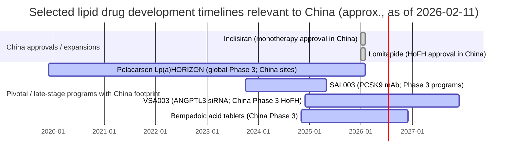

# China Dyslipidemia and Lipid Metabolism Drug Pipeline and Near‑Market Landscape as of February 11, 2026

## Executive summary

China’s dyslipidemia drug landscape has shifted rapidly from a “statin/ezetimibe + imported PCSK9” paradigm toward a multi‑mechanism market that now includes **multiple domestically developed PCSK9 monoclonal antibodies** already approved and launched/launching, plus **RNA‑based drugs** and **novel lipid‑pathway targets** entering pivotal studies.

Publicly visible late‑stage “next wave” programs for China include:
- **ANGPTL3 silencing (RNAi)**: VSA003 (Visirna) is in a **China‑based Phase III** in adolescent/adult HoFH patients and has received **Breakthrough Therapy** recognition in China (per hospital and industry reporting) with Phase III trial registration visible on China’s clinical-trial disclosure platforms.
- **ANGPTL3 antibody**: Hengrui’s SHR‑1918 has published China Phase II data in HoFH and has ongoing clinical development for broader dyslipidemia.
- **ACLY inhibition (oral, statin‑intolerance niche)**: bempedoic acid tablets (贝派度酸片) are in a **China Phase III** program (CTR20244318; also mirrored as NCT06780410).
- **SPPARMα (TG‑focused) innovation**: pemafibrate has China Phase III evidence and publications showing benefits on TG with potentially favorable hepatic/renal safety vs fenofibrate in Chinese patients.
- **Lp(a)‑targeted therapies**: pelacarsen’s global Phase III Lp(a)HORIZON trial includes extensive China sites; topline readout timing was publicly discussed as a key 2026 cardiovascular catalyst.

On the “already approved” side, China now has **four domestic PCSK9 monoclonal antibodies approved** (tafolecimab, ebronucimab, ongericimab, recaticimab) alongside imported **evolocumab** and **alirocumab**, as well as **inclisiran** (siRNA) with a China monotherapy approval update in January 2026 and NRDL access expectations highlighted in investor materials.

From a market‑opportunity perspective, dyslipidemia remains highly prevalent in China (national survey prevalence reported around **35.6%** among adults ≥18 in 2018) and treatment/control in broad populations has been persistently suboptimal, which expands the “headroom” for add‑ons (PCSK9 mAbs/siRNA, ACLY inhibitors, Lp(a) and TG‑targeted therapies) as reimbursement and guideline uptake improve.

## Scope, data sources, and caveats

This report covers **China‑relevant drugs** for **dyslipidemia and lipid metabolism disorders** (including primary hypercholesterolemia, mixed dyslipidemia, severe hypertriglyceridemia, familial hypercholesterolemia—including HoFH—and elevated Lp(a)), focusing on:
- drugs **approved in China**;
- drugs **in China clinical development** (Phase I–III) or with **China NDA/BLA filings/acceptances** publicly disclosed; and
- select global pivotal programs with **documented China site participation** (notably Lp(a)HORIZON).

Priority sources were:
- National Medical Products Administration announcements (Chinese/English pages where accessible) for approvals and indications;
- ClinicalTrials.gov NCT records and attached protocols when accessible;
- China drug trial disclosure listings (e.g., “CTR…” entries mirrored by third‑party viewers that cite the official platform);
- company press releases and investor presentations;
- peer‑reviewed publications (Phase II/III outcomes, Chinese substudies, safety).

Caveat on completeness: “**preclinical**” China programs are not systematically discoverable via public registries; therefore, **preclinical coverage is best‑effort and likely incomplete**, while **IND/clinical and approved** coverage is intended to be comprehensive for programs identifiable through the above primary sources as of 2026‑02‑11.

## Comparative pipeline tables and charts


### Mechanism and status comparison table

| Drug (generic) | Chinese name (as publicized) | Primary target/mechanism | Modality | China status (as of 2026‑02‑11) | Expected China launch timing |
|---|---|---|---|---|---|
| Tafolecimab | 托莱西单抗注射液 (信必乐) | PCSK9 inhibition → ↑LDLR recycling → ↓LDL‑C | mAb | Approved in China | Launched/launching (post‑approval) |
| Ongericimab | 昂戈瑞西单抗注射液 (君适达) | PCSK9 inhibition | mAb | Approved in China | Launched/launching |
| Ebronucimab | 伊努西单抗注射液 (伊喜宁) | PCSK9 inhibition | mAb | Approved in China | Launched/launching |
| Recaticimab | 注射用瑞卡西单抗 (艾心安) | PCSK9 inhibition (YTE Fc motif for longer t½) | mAb | Approved in China | Launched/launching |
| Inclisiran | 英克司兰钠注射液 (Leqvio) | PCSK9 mRNA silencing (RISC) → ↓PCSK9 | siRNA | Approved; monotherapy use approved Jan 2026 | Market expansion expected 2026 |
| Hybutimibe | 海博麦布片 | NPC1L1 inhibition → ↓intestinal cholesterol absorption | Small molecule | Approved in China | On market |
| Bempedoic acid | 贝派度酸片 | ACLY inhibition → ↓hepatic cholesterol synthesis | Small molecule | Phase III in China | Unspecified (earliest‑case post‑Phase III) |
| Pemafibrate | (Chinese name unspecified in primary sources) | Selective PPARα modulation (SPPARMα) → ↓TG, ↑HDL | Small molecule | Phase III evidence in China | Unspecified |
| Icosapent ethyl | (Chinese name not consistently shown in primary sources) | High‑purity EPA; TG lowering + CV risk reduction (label‑based) | Omega‑3 derivative | Approved (VHTG 2023; CVRR expansion 2024) | On market |
| Lomitapide (mesylate) | 甲磺酸洛美他派胶囊 | MTP inhibition → ↓VLDL assembly → ↓LDL‑C (HoFH) | Small molecule | Approved (priority review) | Rapid launch expected 2026 |
| VSA003 | VSA003注射液 | ANGPTL3 mRNA silencing → ↓LDL‑C & ↓TG (expected) | siRNA | Breakthrough status; Phase III HoFH | Earliest‑case after Phase III completion (inferred) |
| SHR‑1918 | (code name) | ANGPTL3 neutralization → ↓LDL‑C & ↓TG | mAb | Published China Phase II HoFH | Unspecified |
| SAL003 | SAL003注射液 | PCSK9 inhibition | mAb | Phase III programs recorded | Unspecified (depends on filing/approval) |
| Pelacarsen | TQJ230 (global name) | LPA antisense → ↓apo(a) synthesis → ↓Lp(a) | ASO | Global Phase III with China sites | Potential post‑2026 depending outcomes |
| Olpasiran | (global name) | LPA/apo(a) siRNA → ↓Lp(a) | siRNA | PK/PD study in Chinese participants completed | Unspecified |

**Table sources** are detailed inside each drug dossier; approval and trial‑stage assertions are drawn from NMPA notices and trial registries plus peer‑reviewed publications.

### Development timeline Gantt for selected late‑stage programs



Timeline anchoring references: pelacarsen trial timing and China site list (registry derivatives), SAL003 Phase III NCT and third‑party trial trackers, VSA003 Phase III (CTR/NCT) and “first patient dosed” announcements, and China Phase III bempedoic acid (CTR/NCT).

### Mermaid flowchart for the China regulatory path

```mermaid
flowchart TD
  A[Preclinical: target validation + tox + CMC] --> B[CDE IND / Clinical Trial Application]
  B --> C[Phase I (often healthy volunteers)]
  C --> D[Phase II (dose-finding / proof-of-concept)]
  D --> E[Phase III (pivotal / confirmatory)]
  E --> F[NDA/BLA submission to NMPA]
  F --> G{Expedited pathways?}
  G -->|Priority Review| H[Accelerated review timeline]
  G -->|Breakthrough Therapy| H
  G -->|Standard| I[Standard review timeline]
  H --> J[NMPA marketing authorization]
  I --> J
  J --> K[Post-approval supply readiness\n(lot release, manufacturing/import steps)]
  K --> L[NHSA NRDL negotiation & provincial access]
  L --> M[Commercial launch and uptake]
```

Expedited pathway examples in this dataset include VSA003’s Breakthrough Therapy recognition and lomitapide’s priority review pathway as described in China media coverage.

## Drug dossiers

Each dossier uses the following fields: **names**, **developer**, **mechanism**, **lipid‑disorder indications**, **China development status**, **key trials (IDs + results)**, **regulatory interactions**, **expected launch timing**, **China patent status**, **comparative positioning**, and **safety signals**. Items not found in accessible sources are marked **unspecified**.

### PCSK9 monoclonal antibodies approved in China

**Tafolecimab (IBI306)**
- **Chinese name / brand**: 托莱西单抗注射液；信必乐.
- **Developer**: Innovent Biologics.
- **Class / MoA**: anti‑PCSK9 mAb (LDLR pathway) to reduce LDL‑C.
- **China indications (lipid disorders)**: Primary hypercholesterolemia and mixed dyslipidemia (adult) with inadequate LDL‑C control on statins (per NMPA posting).
- **China status**: **Approved** (NMPA approval announced 2023‑08‑16).
- **Key trials and results**:
  - **CREDIT‑1 (Phase III; Chinese patients; non‑familial hypercholesterolemia)**: tafolecimab given at long intervals (450 mg Q4W or 600 mg Q6W) produced **>50% sustained LDL‑C reductions**, improved other lipids, and had an overall “good safety” profile in the publication and press communications.
  - **NCT04709536**: a study of IBI306 in participants with hypercholesterolemia reported robust lipid lowering and safety in a high/very‑high CV‑risk Chinese cohort.
- **Regulatory interactions**: NMPA approval announcement available; priority/breakthrough designations **unspecified** in accessible NMPA text.
- **Expected launch timing**: Approved; commercialization timing depends on supply and reimbursement; **unspecified** in sources.
- **China patent status**: **Unspecified** (composition/biologics patent landscape not retrieved in this run).
- **Comparative positioning**: Similar LDL‑C lowering magnitude to other PCSK9 antibodies; potential differentiation from dosing interval options (Q4W/Q6W) and local pricing/access.
- **Safety signals**: In the Phase III publication, common TEAEs included infections (e.g., upper respiratory, urinary tract) and hyperuricemia; injection‑site reactions are a class consideration.

**Ongericimab (JS002)**
- **Chinese name / brand**: 昂戈瑞西单抗注射液；君适达.
- **Developer**: Shanghai Junshi Biosciences.
- **Class / MoA**: anti‑PCSK9 mAb.
- **China indications (lipid disorders)**: Adult primary hypercholesterolemia (non‑familial) and mixed dyslipidemia with inadequate LDL‑C control on optimized LLT (per NMPA notice and Phase III publication).
- **China status**: **Approved** (NMPA approval reported October 2024; English update shown February 2025).
- **Key trials and results**:
  - **Phase III add‑on to optimized lipid‑lowering therapy in Chinese primary hypercholesterolemia/mixed dyslipidemia** reported significant LDL‑C reduction and safety (JAHA publication).
  - **Statin‑intolerant Phase III** also reported (Atherosclerosis publication).
  - Company interim materials summarize **>60% LDL‑C reduction vs placebo** with acceptable TEAE rates similar to placebo across dosing regimens.
- **Regulatory interactions**: NDA approval in China publicly disclosed by the developer.
- **Expected launch timing**: Approved; **unspecified** for national reimbursement timing.
- **China patent status**: **Unspecified**.
- **Comparative positioning**: Competes head‑to‑head with evolocumab/alirocumab and domestic PCSK9 mAbs; route and dosing broadly similar; differentiators are likely price, tender/NRDL access, and dosing device options.
- **Safety signals**: Class-consistent injection‑site reactions; TEAE incidence described as comparable to placebo in company materials; publication supports tolerability.

**Ebronucimab**
- **Chinese name / brand**: 伊努西单抗注射液；伊喜宁.
- **Developer/company**: NMPA notice attributes marketing authorization to Guangdong Kangrong Dongfang (publicly referenced as the applicant/MAH); clinical and historical development communications also involve Akeso.
- **Class / MoA**: anti‑PCSK9 mAb.
- **China indications (lipid disorders)**: Adult primary hypercholesterolemia and mixed dyslipidemia with inadequate LDL‑C control on statins (per NMPA notice framing).
- **China status**: **Approved** (China approval in 2024 with English NMPA update in 2025).
- **Key trials and results**:
  - Phase III RCT in Chinese patients (NCT05255094 referenced in secondary summaries; peer‑reviewed publication describes robust placebo‑adjusted LDL‑C reductions and typical injection‑site AEs).
  - Company release described LDL‑C reductions ~63–65% for Q2W and Q4W regimens, with injection‑site reactions as the main AE >5% and higher than placebo.
- **Regulatory interactions**: NMPA marketing approval granted.
- **Expected launch timing**: Approved; **unspecified** for broad reimbursement.
- **China patent status**: **Unspecified**.
- **Comparative positioning**: Similar LDL‑C lowering to other PCSK9 antibodies; competitive levers likely dosing frequency options, price, and institutional access.
- **Safety signals**: Injection‑site reactions highlighted; overall described as similar safety profile to other PCSK9 mAbs.

**Recaticimab (SHR‑1209)**
- **Chinese name / brand**: 注射用瑞卡西单抗；艾心安.
- **Developer**: Jiangsu Hengrui Pharmaceuticals.
- **Class / MoA**: anti‑PCSK9 mAb (engineered to extend half‑life via Fc changes described in reviews).
- **China indications (lipid disorders)**: Adult primary hypercholesterolemia and mixed dyslipidemia with inadequate LDL‑C control on moderate/high‑dose statins.
- **China status**: **Approved** (NMPA approval announced 2025‑01‑10; English update 2025‑06‑11).
- **Key trials and results**:
  - **REMAIN‑1 Phase III** (published) evaluated recaticimab in high‑risk Chinese populations (hypercholesterolemia/mixed dyslipidemia on statins) with clinically meaningful LDL‑C reductions; detailed endpoints and safety are described in the JACC publication.
- **Regulatory interactions**: NMPA marketing approval. Priority/breakthrough designations **unspecified** in accessible text.
- **Expected launch timing**: Approved; **unspecified** for NRDL timing.
- **China patent status**: **Unspecified**.
- **Comparative positioning**: Expected to compete as a domestic PCSK9 option; potential differentiation may include dosing interval/PK (engineered longer t½) and commercial terms.
- **Safety signals**: Typical PCSK9 mAb class safety profile; drug‑specific signal details **see REMAIN‑1**; no unique China‑specific black‑box warnings identified in accessed sources.

### PCSK9 pathway RNA drug approved in China

**Inclisiran (Leqvio)**
- **Chinese name**: English‑language investor material and Chinese reporting refer to inclisiran with China approvals; Chinese generic name string **not consistently captured** in accessible sources (commonly rendered as 英克司兰钠注射液).
- **Developer**: Novartis.
- **Class / MoA**: GalNAc‑conjugated siRNA targeting PCSK9 mRNA (in hepatocytes) → durable LDL‑C reduction.
- **China indications**: Approved in China for adults with primary hypercholesterolemia/mixed dyslipidemia in combination with statins (reported), with a formal update noting **monotherapy use approved in January 2026** in investor materials.
- **China status**: **Approved**; market expansion expected 2026 based on NRDL listing statements in investor materials.
- **Key trials and results** (China‑relevant):
  - Chinese clinical trial registrations exist (e.g., records in Hong Kong/Taiwan contexts and China sites in ORION programs); a 2023 cost‑effectiveness analysis explicitly models inclisiran in Chinese hypercholesterolemia populations.
- **Regulatory interactions**: approval + monotherapy update; priority/breakthrough designations **unspecified**.
- **Expected launch timing**: Already approved; **broader uptake** hinges on NRDL and procurement dynamics; investor materials state “opening market for 2026.”
- **China patent status**: **Unspecified** (not evaluated here).
- **Comparative positioning**:
  - vs PCSK9 mAbs: less frequent dosing and potentially better adherence; similar LDL‑C reduction magnitude in global programs; China reimbursement will be decisive.
  - vs bempedoic acid: different niche (injectable siRNA; stronger LDL‑C lowering), but both target “high residual LDL‑C / statin limitations.”
- **Safety signals**: broadly favorable in established programs; injection‑site reactions are expected class AEs; China‑specific safety signals **unspecified** in accessed sources.

### Lipid absorption inhibitor approved in China

**Hybutimibe (Haibomab; 海博麦布)**
- **Chinese name**: 海博麦布片.
- **Developer**: Zhejiang Hisun Pharmaceutical (as widely reported in coverage of the product).
- **Class / MoA**: cholesterol absorption inhibitor via NPC1L1 (same pathway class as ezetimibe).
- **Indications**: hypercholesterolemia treatment (specific label language **unspecified** in accessible NMPA text excerpt).
- **China status**: Approved in China (NMPA notice dated 2021‑06‑28).
- **Key trials, regulatory interactions, patents, pricing**: **Unspecified** in accessible primary sources in this run.
- **Comparative positioning**: oral adjunct alternative/competitor to ezetimibe; likely used in combination with statins where absorption inhibition is desired.
- **Safety**: **Unspecified** here (class safety typically favorable).

### Novel LDL‑C oral synthesis inhibitor in China Phase III

**Bempedoic acid (贝派度酸片)**
- **Chinese name**: 贝派度酸片 (as used in China trial materials).
- **Developer (China)**: Gan & Lee Pharmaceuticals (China Phase III sponsor communications).
- **Class / MoA**: ACLY inhibitor; oral LDL‑C lowering option often positioned for **statin‑intolerant** or “not at goal” patients.
- **Indications (China trial)**: hyperlipidemia not adequately controlled by statins / statin‑inadequate control (terminology differs by protocol).
- **China development status**: **Phase III** (CTR20244318); the trial is placebo‑controlled and evaluates LDL‑C percent change at 12 weeks as primary endpoint (as shown in the trial disclosure viewer).
- **Key clinical trial identifiers and design**:
  - **CTR20244318**: primary endpoint “% change in LDL‑C at Week 12”; secondary endpoints include TC change, LDL‑C goal attainment, and AE/SAE monitoring.
  - **NCT06780410**: described as a Phase III study of bempedoic acid tablets in hyperlipidemia insufficiently controlled by statins.
- **Summary clinical evidence (global, for positioning)**: placebo‑controlled trials show LDL‑C reduction with a safety profile that includes elevations in uric acid and gout risk; these inform China risk‑management expectations.
- **Regulatory interactions**: IND/Phase III approvals exist (trial approved); NMPA expedited designations **unspecified**.
- **Expected launch date**: **Unspecified**; earliest‑case launch would be after Phase III completion and NDA review (inference).
- **China patent status**: **Unspecified**; multiple China companies reportedly show interest, but patent settlement details are generally US‑focused in public sources.
- **Comparative positioning**:
  - vs statins: oral option without skeletal muscle activation (often positioned for statin intolerance).
  - vs PCSK9 mAbs/siRNA: less potent LDL‑C lowering but oral convenience; a plausible add‑on or alternative when injectables are inaccessible.
- **Safety signals to watch in China**: gout/hyperuricemia, cholelithiasis, liver enzyme changes (class‑consistent global findings), requiring monitoring in China populations.

### Omega‑3 derivative approved in China for TG and CV risk reduction

**Icosapent ethyl (VASCEPA)**
- **Developer / China partner**: Amarin Corporation and Eddingpharm.
- **China status & indications**:
  - Original China approval for **very high / severe hypertriglyceridemia** (approved in 2023, per partner communications).
  - Indication expansion: **cardiovascular risk reduction (CVRR)** approval in Mainland China announced July 8, 2024, as adjunct to statin therapy in adult patients with elevated TG (≥150 mg/dL) and other high‑risk traits (REDUCE‑IT‑like population).
- **MoA / class**: high‑purity EPA derivative; label‑supported CV risk reduction beyond TG lowering (mechanistic details vary; clinical positioning is evidence‑driven).
- **Key trial anchor (global)**: REDUCE‑IT is the referenced pivotal CV outcomes evidence base (not China‑specific).
- **Regulatory interactions**: NMPA approvals (VHTG then CVRR). NRDL pathway preparation described by company/coverage.
- **Expected launch**: Approved; commercial roll‑out in China is ongoing; specific timing **unspecified**.
- **China patent status**: **Unspecified**.
- **Comparative positioning**:
  - vs generic omega‑3 mixtures: differentiated by outcomes evidence and purified EPA profile described in filings; likely positioned for residual risk patients already on statins.
- **Safety signals**: Trial‑based and label‑based AEs (e.g., bleeding/AF signals discussed globally) are **not detailed** in the China approval announcements captured here; China safety specifics **unspecified** in sources.

### Rare disease HoFH drug newly approved in China

**Lomitapide (MTP inhibitor; “甲磺酸洛美他派胶囊”)**
- **Chinese name**: 甲磺酸洛美他派胶囊.
- **Developer**: widely associated with Chiesi Group commercialization (China coverage references “Chiesi China”).
- **Class / MoA**: oral microsomal triglyceride transfer protein (MTP) inhibitor → reduces VLDL assembly and lowers LDL‑C independent of LDLR function (key for HoFH).
- **Indication (China)**: adjunct to low‑fat diet and other lipid‑lowering therapies (with/without LDL apheresis) for **adult HoFH**.
- **China status**: **Approved** (approval reported January 30–31, 2026).
- **Regulatory interactions**: China coverage states inclusion in the “clinically urgently needed overseas drugs” list and use of **priority review**, with approval in <6 months from acceptance (as reported by media).
- **Expected launch**: “rapid access” narrative suggests 2026 availability; exact commercial launch date **unspecified**.
- **Key efficacy evidence**: Chinese coverage cites LDL‑C reductions on the order of ~40–60% in HoFH when added to background therapy, consistent with established program knowledge; China‑specific pivotal dataset details **not provided** in the NMPA‑approval news snippets captured here.
- **Safety signals**: Not detailed in the approval news snippets; globally, lomitapide is associated with GI effects and hepatic fat/liver enzyme monitoring requirements (not fully sourced here for China label).
- **China patent status**: **Unspecified**.
- **Comparative positioning**:
  - Highly specialized: HoFH patients with extremely high LDL‑C often inadequately controlled even on multi‑drug regimens; lomitapide adds an LDLR‑independent mechanism.

### ANGPTL3‑pathway innovation in China

**VSA003 (ANGPTL3 siRNA; Visirna)**
- **Chinese name**: VSA003注射液.
- **Developer**: Visirna Therapeutics (维亚臻生物).
- **Class / MoA**: liver‑targeted RNAi therapeutic targeting **ANGPTL3 mRNA** (expected to reduce LDL‑C and TG).
- **Indications (China development)**: HoFH is the clear pivotal focus; earlier Phase I listing also references primary hypercholesterolemia and mixed dyslipidemia as potential indications.
- **China development status**:
  - **Phase I** in healthy volunteers (CTR20231369).
  - **Phase III** in Chinese adolescent and adult HoFH (CTR20244397), with first patient dosing disclosed (Dec 2024).
  - Also listed as **NCT06712771** (“Phase 3… in Chinese HoFH patients”).
- **Key trial identifiers & endpoints**:
  - **CTR20244397**: randomized, double‑blind, placebo‑controlled, multicenter Phase III (details per developer/media).
  - Detailed endpoints/populations in the ClinicalTrials.gov synopsis for NCT06712771 note ANGPTL3 RNAi therapy evaluation in HoFH.
- **Regulatory interactions**: Hospital and industry reporting indicates **Breakthrough Therapy** recognition by NMPA/CDE for HoFH use.
- **Expected launch date**: Not published; if Phase III completes around 2027 (as suggested in third‑party summaries), earliest‑case launch would be after 2027 subject to NDA review (explicitly **inference**).
- **China patent status**: **Unspecified** (no CN patent analysis retrieved).
- **Comparative positioning**:
  - vs PCSK9: mechanistically broader (ANGPTL3 affects multiple lipid parameters) and potentially valuable for HoFH and mixed dyslipidemias with high TG.
  - vs evinacumab (ANGPTL3 antibody, not China‑approved in this dataset): VSA003 represents an RNAi approach aimed at the same pathway.
- **Safety signals**: Phase III is ongoing; safety profile remains **incomplete** publicly; monitoring focuses are expected to include liver‑related markers and injection‑site reactions typical for siRNA injectables (specific signals **unspecified**).

**SHR‑1918 (anti‑ANGPTL3 antibody; Hengrui)**
- **Developer**: Jiangsu Hengrui Pharmaceuticals.
- **Class / MoA**: fully human monoclonal antibody targeting ANGPTL3.
- **Indications**: HoFH (published Phase II single‑arm China trial) and broader dyslipidemia populations with inadequate lipid control (company description).
- **China development status**: Published Phase II HoFH trial conducted across eight China sites (Dec 2023–Apr 2024).
- **Key trial identifier and summary**: PubMed abstract describes multicenter single‑arm Phase II in HoFH, with background LLT in China; ACC summary notes baseline LDL‑C and patient characteristics (all Asian; multiple LLT background drugs).
- **Regulatory interactions**: NMPA filings/expedited designations **unspecified** in accessible sources.
- **Expected launch**: **Unspecified**.
- **China patent status**: **Unspecified**.
- **Comparative positioning**: Potential HoFH adjunct and possibly broader “mixed lipid” tool (LDL‑C + TG impacts) if Phase III confirms benefit; would compete with VSA003 (ANGPTL3 silencing) and PCSK9‑focused therapies.
- **Safety**: Detailed adverse‑event profile should be taken from the full Phase II publication; major China‑specific safety signals **not extracted** here beyond trial descriptions.

### China Phase III domestic PCSK9 antibody program not yet approved

**SAL003 (anti‑PCSK9 mAb; Shenzhen Salubris)**
- **Chinese name**: SAL003注射液.
- **Developer**: Shenzhen Salubris Pharmaceuticals.
- **Class / MoA**: anti‑PCSK9 mAb; preclinical/PK modeling publications describe an IgG4‑derived design concept and model‑informed dose work.
- **Indications**: hypercholesterolemia and mixed dyslipidemia (monotherapy and combination with statins) in Phase III records.
- **China development status**:
  - **NCT07295418**: Phase III monotherapy study.
  - **NCT07253584**: Phase III add‑on with statin therapy.
  - Third‑party trackers summarize Phase 3 size and timing (e.g., 2023–2025).
- **Summary results**: **Unspecified** in primary sources captured here (no posted results text retrieved).
- **Regulatory interactions**: NDA filing/acceptance **unspecified**.
- **Expected launch**: **Unspecified** (depends on submission/approval).
- **China patent status**: **Unspecified**.
- **Comparative positioning**: Would enter a crowded PCSK9 antibody space already containing multiple domestic approvals; commercial success would likely depend on differentiation via price, device, dosing schedule evidence, and reimbursement.
- **Safety**: Expected to be class‑consistent (injection‑site reactions, mild infections), but drug‑specific signal **unspecified**.

### Lp(a)‑targeted therapies with China participation

**Pelacarsen (TQJ230; Lp(a)HORIZON)**
- **Developers**: Ionis Pharmaceuticals (originator/partner communications) and Novartis (global development).
- **Class / MoA**: GalNAc‑conjugated antisense oligonucleotide targeting LPA/apo(a) synthesis in the liver → reduces Lp(a).
- **Indication focus**: reduction of major cardiovascular events risk in patients with established CVD and elevated Lp(a) (outcomes trial).
- **Development status relevant to China**:
  - **NCT04023552**: Phase III multinational outcomes study.
  - China site list is extensive (multiple provinces/cities) as shown in registry derivatives (ICH GCP listing).
  - Readout timing was publicly discussed as a key H1 2026 catalyst.
- **Key endpoints**: primary composite endpoint includes CV death, nonfatal MI, nonfatal stroke, and urgent coronary revascularization requiring hospitalization (design paper).
- **Regulatory interactions in China**: NMPA filing status **unspecified**; current stage is global Phase III evidence generation.
- **Expected China launch**: contingent on Phase III outcome and China submission; **unspecified**.
- **China patent status**: **Unspecified**.
- **Comparative positioning**: would become a first‑in‑class pharmacologic Lp(a) reducer if outcomes positive; complementary to LDL‑C therapies (statins/PCSK9/inclisiran) that only modestly lower Lp(a).
- **Safety**: Phase III outcomes trial will define event‑driven safety; no China‑specific signals identified in these sources.

**Olpasiran (AMG 890)**
- **Developer**: Amgen.
- **Class / MoA**: GalNAc‑conjugated siRNA targeting apo(a)/LPA mRNA → reduces circulating Lp(a).
- **China development status**: Phase I PK/PD in **Chinese participants** with elevated serum Lp(a) (NCT04987320); publication reports safety/tolerability and PK/PD consistency vs other populations.
- **Endpoints / populations**: PK and Lp(a) response as primary pharmacology readouts; Chinese participants with elevated Lp(a).
- **Regulatory interactions**: NMPA status **unspecified** (development is clinical).
- **Expected China launch**: **Unspecified** (requires late‑stage outcomes data and China filing).
- **China patent status**: **Unspecified**.
- **Comparative positioning**: potential future add‑on for residual Lp(a) risk, complementary to LDL‑C‑lowering therapies; would compete with pelacarsen and other Lp(a) drugs if they enter China.
- **Safety**: Chinese participant study described as safe and well tolerated (publication).

### Early-stage RNA therapeutics in China for lipid targets

The following programs are **clearly in clinical development** and relevant to China, but public efficacy datasets are limited (often Phase I).

**RN0191 (PCSK9 siRNA; Rona Therapeutics)**
- **Developer**: Rona Therapeutics.
- **MoA**: siRNA targeting PCSK9.
- **Status**: Phase I single ascending dose in healthy volunteers; results described as sustained PCSK9 lowering and LDL‑C reduction with good tolerance (as reported).
- **Trial IDs**: NCT06423157 referenced for Phase I.
- **China regulatory interactions / patents**: **Unspecified**.

**RBD7022 (PCSK9 siRNA; Suzhou Ribo/partners)**
- **Developer**: Suzhou Ribo Life Science (per trial listing).
- **MoA**: PCSK9 gene silencing via siRNA.
- **Status**: Phase I (NCT06374173) evaluating safety/tolerability/PK/PD in participants with hypercholesterolemia.
- **Results**: **Unspecified** (no posted results captured).
- **China interactions / patents**: **Unspecified**.

**SGB‑3403 (PCSK9 siRNA)**
- **Status**: Phase I record exists (NCT06239714) as an siRNA program targeting PCSK9, with safety and LDL‑C lowering described in trial synopsis sources.
- **Developer/company**: **Unspecified** in primary sources captured here.
- **Results / patents**: **Unspecified**.

**RN0361 (ApoC‑III siRNA; hypertriglyceridemia)**
- **Developer**: Rona Therapeutics.
- **MoA / indication**: ApoC‑III silencing to reduce triglycerides, targeting hypertriglyceridemia and related disorders (per pipeline description).
- **Status**: Phase I (pipeline‑reported).
- **Trial IDs, results, regulatory interactions, patents**: **Unspecified**.

### Pemafibrate in Chinese dyslipidemia

**Pemafibrate (K‑877; SPPARMα)**
- **Class / MoA**: selective PPARα modulator (TG lowering, HDL‑C raising; metabolic effects).
- **China development evidence**:
  - A China Phase III randomized trial is described as registered on chinadrugtrials.org.cn with identifier **CTR20211983**, conducted across 31 sites, comparing pemafibrate with placebo and fenofibrate.
  - Peer‑reviewed publication concludes pemafibrate improved TG and had favorable hepatic/renal safety vs fenofibrate in Chinese patients.
- **China approval status**: **Unspecified** in sources captured here (no NMPA approval notice retrieved in this run).
- **Expected launch**: **Unspecified**.
- **China patent status**: **Unspecified**.
- **Comparative positioning**: could compete with fenofibrate and other TG‑lowering drugs, potentially positioned where safety margins are valued and as part of mixed dyslipidemia management.
- **Safety signals**: comparative hepatic/renal safety vs fenofibrate is highlighted as a differentiator in Chinese publication; detailed AE spectrum should be referenced from the full article.

## Safety, competitive positioning, and China market opportunity

### Clinical context and unmet need in China

China’s adult dyslipidemia prevalence remains high: the 2018 national survey prevalence among adults ≥18 years is reported as **35.6%**, and multiple national and provincial analyses emphasize that dyslipidemia is often inadequately treated and LDL‑C targets are frequently unmet, even among established ASCVD patients.

For established ASCVD, a large China dataset reported low lipid‑lowering treatment penetration and modest LDL‑C control, including an LDL‑C (≤70 mg/dL) control rate around **26.6%** among adults with ASCVD, with substantial gaps between treated and untreated individuals.

Familial hypercholesterolemia (FH) remains underdiagnosed: one China review estimated ~**5.5 million** FH patients with <1% diagnosis/treatment in China.

This creates a tiered opportunity:
- **Broad mass market**: statins + ezetimibe/absorption inhibitors (including hybutimibe) and TG drugs.
- **High‑risk intensification**: PCSK9 mAbs + inclisiran + (future) bempedoic acid.
- **Precision lipid disorders**: HoFH and severe disorders requiring LDLR‑independent or ANGPTL3‑directed mechanisms.

### Competitive positioning by therapeutic “job to be done”

**First-line LDL‑C lowering (statins, often with ezetimibe)** is the default comparator set; novel drugs enter when:
- LDL‑C remains above target despite maximally tolerated statins (common in very‑high‑risk ASCVD);
- statin intolerance limits high‑intensity dosing; or
- monogenic disorders (FH/HoFH) require more potent or LDLR‑independent pathways.

**China’s PCSK9 antibody “stack” (evolocumab/alirocumab + multiple domestic mAbs)** creates intra‑class competition. Published Phase III results for tafolecimab, ongericimab, and ebronucimab show LDL‑C lowering in the ~50–60%+ range versus placebo under various regimens, consistent with PCSK9 antibody class benchmarks.

**Inclisiran** may differentiate primarily on **dosing frequency and adherence economics**, with investor materials explicitly framing 2026 as a commercial “opening.”

**Bempedoic acid** (if approved) is strategically positioned for **statin‑intolerant** or statin‑limited patients needing an additional oral LDL‑C option, but will compete against (and be complemented by) the PCSK9 class depending on price and access.

**Icosapent ethyl** competes in “residual risk” and hypertriglyceridemia segments, differentiated by outcomes-based indications and successive China approvals (VHTG then CVRR).

**ANGPTL3‑directed programs** (VSA003, SHR‑1918) are notable because they target lipid metabolism beyond LDL‑C alone and may offer LDLR‑independent benefit relevant to HoFH.

### Safety signals likely to shape China adoption

Across key mechanisms:
- **PCSK9 mAbs**: injection‑site reactions and mild infections are common; pivotal China trials report generally good tolerability and placebo‑like TEAE rates in some materials.
- **Inclisiran**: injection‑site reactions are expected; longer‑interval dosing may reduce treatment burden, potentially aiding adherence.
- **Bempedoic acid**: gout/hyperuricemia and gallstone signals are prominent in global evidence syntheses and should be monitored in China Phase III.
- **Lomitapide**: while China approval reporting focuses on unmet need and rapid review, clinicians should expect hepatic and GI monitoring requirements consistent with the MTP mechanism (China label specifics not retrieved here).
- **ANGPTL3 therapies**: safety is still being defined for VSA003 (ongoing Phase III) and SHR‑1918 (Phase II).

### Estimated China market opportunity

Because pricing and reimbursement are dynamic, this section provides **scenario-based sizing** grounded in epidemiology and program positioning.

**Addressable prevalence (baseline)**
- Adult dyslipidemia prevalence in China was reported as **35.6%** in a national survey (2018).
- Dyslipidemia management remains suboptimal in population studies, with important gaps in treatment and control.
- FH burden estimates in China include multi‑million scale, with very low diagnosis/treatment rates.
- HoFH is rare but high‑impact; multiple China sources cite **~5,000** patients, aligning with the urgency behind HoFH pathways (lomitapide approval; VSA003 Phase III).

**Commercial segmentation (illustrative)**
- **Mass dyslipidemia** (statins, ezetimibe/hybutimibe): largest by volume; pricing pressure and generic dominance; innovation uptake depends on incremental benefit vs cost.
- **High/very‑high ASCVD risk needing intensive LDL‑C lowering**: meaningful opportunity for PCSK9 mAbs and inclisiran; the JAMA dataset showing low treatment rates among ASCVD patients implies significant “room to grow” as access expands.
- **Statin intolerance / statin‑limited patients**: bempedoic acid could expand oral non‑statin options if China Phase III succeeds.
- **Residual TG risk / CV risk reduction**: VASCEPA’s CVRR approval creates a branded therapy niche beyond TG lowering.
- **Rare genetic lipid disorders**: HoFH remains a small‑population but high‑value segment (lomitapide; potential future ANGPTL3 therapies).
- **Emerging Lp(a) market**: pelacarsen’s Phase III readout cycle (with many China sites) could catalyze a new prevention market if outcomes are positive; China launch would require local regulatory filings and reimbursement strategies.

**Pricing and reimbursement (what is publicly visible here)**
- Public sources in this run consistently emphasize **NRDL preparation** for VASCEPA and **NRDL “market opening for 2026”** framing for inclisiran, but do **not** provide authoritative negotiated net prices.
- Therefore, pricing is marked **unspecified** for most products; market opportunity is most sensitive to (1) NRDL entry, (2) provincial procurement, and (3) guideline‑driven uptake in ASCVD prevention.

## Key data gaps and reference map

### High‑impact data gaps (drug‑level)

- **China patent status**: For most innovative biologics and RNA drugs listed here, the China patent family (CN filings, expiry, SPC/extension where applicable) was **not retrievable** within accessible sources and is marked **unspecified** across dossiers.
- **Exact China label language and reimbursement pricing**: NMPA approvals are identifiable, but full label PDFs and NRDL price outcomes were not consistently accessible; thus, several entries include **approval confirmation without full label granularity**.
- **SAL003 Phase III results**: trial existence is clear (NCT records), but results are **not** captured in accessible sources for this run.
- **Early‑stage RNA programs**: Phase I evidence is often only partially public; detailed endpoints, dose‑response curves, and China regulatory interactions remain limited to brief disclosures.

### Reference map of the most “load‑bearing” primary sources used

- NMPA approval announcements: tafolecimab, ongericimab, ebronucimab, recaticimab.
- China approval expansions and partners: inclisiran investor/regulatory communications; VASCEPA China CVRR approval press release.
- China HoFH access: lomitapide China approval reporting and priority review narrative.
- China pivotal and publications for domestic PCSK9 mAbs: tafolecimab (CREDIT‑1), ongericimab Phase III (JAHA), ebronucimab Phase III (publication/press).
- China Phase III pipeline: bempedoic acid CTR20244318; VSA003 CTR20244397 and NCT06712771.
- China epidemiology baseline for market context: dyslipidemia prevalence and treatment/control gaps (JAMA Network Open / guideline commentaries).
