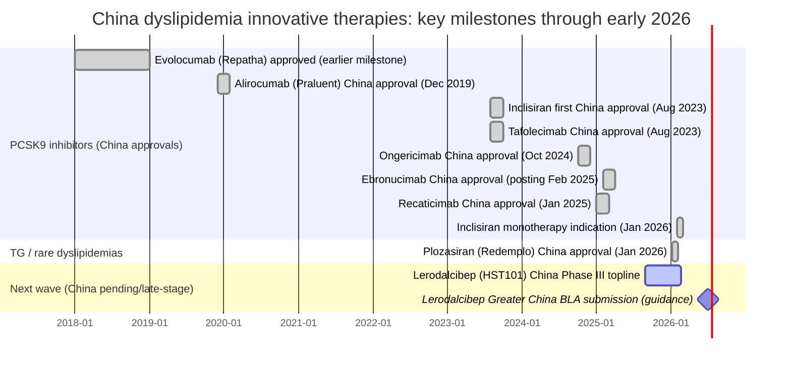

# Comprehensive Catalog of Dyslipidemia Drugs in China

## Executive summary

China’s dyslipidemia innovation landscape has shifted from a statin/ezetimibe-centered market to a crowded **PCSK9 pathway** market (monoclonal antibodies, a long-acting siRNA, and additional next‑generation entrants), with **new RNA therapies for triglyceride disorders** and early **gene-editing** programs now appearing in Chinese regulatory and clinical-trial records.

The most consequential “recent” milestones (relative to the user’s as‑of date window of Feb 2026) are:
- **Inclisiran (Leqvio/乐可为)** received a **new China indication** on **January 28, 2026** enabling **monotherapy** use (adjunct to diet) for adult non‑familial primary hypercholesterolemia or mixed dyslipidemia—expanding beyond prior “add‑on to statins/other LLTs” positioning.
- **Plozasiran (Redemplo/普乐司兰钠注射液; trade name 瑞达普)**—an **apoC‑III siRNA**—was **approved by China’s regulator** on **January 7, 2026** via priority review for **familial chylomicronemia syndrome (FCS)** to reduce triglycerides on top of dietary control.
- China now has **multiple domestically-developed PCSK9 monoclonal antibodies** approved (e.g., **tafolecimab**, **ongericimab**, **ebronucimab**, **recaticimab**) and additional late-stage/imported contenders (e.g., **lerodalcibep**) aiming for 2026–2027 filings/approvals in Greater China.

From a market-sizing perspective, China’s adult dyslipidemia burden is very large, but treatment and control rates remain low by multiple sources, creating a wide funnel for intensified lipid-lowering therapy. For example, a 2018 national survey cited in the 2023 Chinese lipid guideline reported **35.6% prevalence** in adults ≥18 years.  A cardiovascular report summary (China CVD report 2021) reports dyslipidemia among adults ≥35 years at **16.1%**, with **treatment 7.8%** and **control 4.0%**, underscoring a persistent “implementation gap.”

## Methods and scope

This catalog prioritizes **up-to-date, China-relevant, pharmacologic and biotechnologic therapies** intended to treat dyslipidemia phenotypes (hypercholesterolemia, hypertriglyceridemia, mixed dyslipidemia, FH, elevated Lp(a)), with emphasis on: (a) **approved innovative therapies in China**, and (b) **clinical-stage (Phase I–III) or near-filing candidates with explicit China regulatory or trial presence**. The anchor sources prioritized were: Chinese approvals/approval notices from the National Medical Products Administration, reimbursement/NRDL information from the National Healthcare Security Administration where available, trial identifiers from Chinese Clinical Trial Registry and ClinicalTrials.gov, plus peer‑reviewed publications and company announcements.

Important limitations:
- **Preclinical pipelines in China are not fully transparent**; therefore, “all drugs” at the *preclinical* stage cannot be guaranteed comprehensive without paid/closed databases and direct company disclosures. This report is intended to be **near-complete for approvals and late-stage/China-visible clinical programs** as of February 2026, but **incompleteness risk rises** as one moves earlier in R&D.
- Many trials are registered with minimal publicly disclosed results; where topline outcomes are not publicly available, fields are marked **Unspecified**.

## China clinical and commercial context

The policy and clinical context behind China’s rapid uptake of injectable LDL‑C therapies is the combination of (i) high prevalence of dyslipidemia and (ii) documented gaps in awareness/treatment/control. A systematic review/meta-analysis (mainland China adults) estimated dyslipidemia prevalence at **~42.1%**, with awareness/treatment/control at **18.2%/11.6%/5.4%**, respectively.  The 2023 Chinese lipid guideline cites national survey data that dyslipidemia prevalence in adults ≥18 was **35.6% (2018 survey)**, higher than the 2015 survey referenced therein.

High-intensity and “next-step” lipid therapies in China tend to cluster around these segments:
- **ASCVD/very high risk** patients not reaching LDL‑C targets on maximally tolerated oral therapy (statins ± ezetimibe), which aligns with the labeled positioning of the newly approved PCSK9 antibodies and inclisiran for combination therapy.
- **Familial hypercholesterolemia (FH)**: prevalence estimates vary by method; e.g., China PEACE Million Persons Project analysis reported **FH prevalence 0.13% (≈1 in 769) in ages 35–75** using Chinese FH criteria.
- **Hypertriglyceridemia and rare TG syndromes** such as **FCS**, now directly addressed by approved apoC‑III siRNA therapy (plozasiran) in China.
- **Elevated Lp(a)** and residual risk: a mainland China adult meta-analysis estimated elevated Lp(a) prevalence at **~19.4%** (noting study heterogeneity and definitions).

## Comparative tables

### Mechanism and modality map

| Therapeutic axis | Drug (generic; brand) | Modality | China status (Feb 2026) |
|---|---:|---:|---|
| PCSK9 protein neutralization | Evolocumab; Repatha | mAb | Approved (innovator import)  |
|  | Alirocumab; Praluent/波立达 | mAb | Approved; supply disruption reported in 2025  |
|  | Tafolecimab; SINTBILO/信必乐 | mAb | Approved  |
|  | Ongericimab; 君适达/Junshida | mAb | Approved  |
|  | Ebronucimab; 伊喜宁 | mAb | Approved  |
|  | Recaticimab; 艾心安 | mAb | Approved  |
| PCSK9 synthesis inhibition | Inclisiran sodium; Leqvio/乐可为 | siRNA | Approved; new monotherapy indication Jan 2026  |
| PCSK9 binding protein | Lerodalcibep; HST101 (China) | fusion protein (adnectin–albumin) | Phase III China topline; Greater China BLA submission expected 1H 2026  |
| PCSK9 small molecule inhibition | AZD0780 | small molecule | Phase III registered in China (public reports)  |
| ApoC‑III silencing (TG lowering) | Plozasiran sodium; Redemplo/瑞达普 | siRNA | Approved (FCS) Jan 2026  |
| ANGPTL3 inhibition (LDL‑C + TG effects) | SHR‑1918 | mAb | Clinical-stage; published Phase 2‑type data  |
| Lp(a) lowering | Olpasiran | siRNA | China-focused PK/PD study in Chinese participants; global outcomes program ongoing  |
| One-time genetic approach (PCSK9) | YOLT‑101 | in vivo base editing | China IND approval; early IIT clinical data disclosed  |
| Lp(a) small molecule disruptor (watchlist) | YS2302018 (CSPC → AZ) | small molecule | Preclinical licensing disclosed; China development specifics not public  |

### Development phase and expected time to market in China

Interpretation key: “Expected time to market” reflects **publicly stated** timelines where available; otherwise **Unspecified**.

| Drug | China regulatory status | Expected/actual China launch timing |
|---|---|---|
| Evolocumab | Approved | Unspecified (marketed; initial China approval occurred prior to 2020)  |
| Alirocumab | Approved; reimbursement listing occurred; supply stoppage reported Aug 2025 | Launched (e.g., Sanofi reported launch in China in 2020); supply paused 2025  |
| Inclisiran | Approved; **new monotherapy indication approved Jan 28, 2026** | Marketed; NRDL coverage for prior indications reported effective 2026-01-01; monotherapy indication not yet NRDL per company statement  |
| Tafolecimab | Approved (domestic) | Marketed; launch date unspecified  |
| Ongericimab | Approved (domestic) | Marketed; approval reported Oct 2024  |
| Ebronucimab | Approved (domestic) | Marketed; NMPA English posting dated Feb 2025  |
| Recaticimab | Approved (domestic) | Approved Jan 2025; national first-batch shipping reported Jan 2025  |
| Plozasiran | Approved Jan 7, 2026 (priority review; FCS) | Approved Jan 2026; launched/marketed in Greater China via partner per announcements  |
| Lerodalcibep (HST101) | Phase III China topline; filing planned | Greater China BLA submission expected 1H 2026; potential approval in 2027  |
| AZD0780 | Phase III China trial registered (public report) | Unspecified  |
| SHR‑1918 | Clinical-stage (published) | Unspecified  |
| YOLT‑101 | IND approved; IIT underway | Unspecified (early clinical)  |
| Olpasiran | China PK/PD study for Chinese participants | Unspecified (not approved globally or in China)  |

### Timeline view of China approvals and near-term filings



Milestone date anchors reflect public disclosures for inclisiran’s new indication (Jan 28, 2026) and plozasiran’s approval (Jan 7, 2026), and filing expectations for lerodalcibep in Greater China.

## Drug catalog with clinical and commercial analysis

### PCSK9 pathway therapies

#### Evolocumab (Repatha) — PCSK9 monoclonal antibody
- **Class/mechanism**: anti‑PCSK9 mAb; increases LDL receptor recycling → lowers LDL‑C.
- **Developer/manufacturer**: Amgen.
- **China regulatory status**: Approved in China; Amgen reports China approval for HoFH in 2018 and a later approval for CV risk reduction.
- **Route/dosing form**: subcutaneous injection; commonly Q2W or Q4W regimens in PCSK9 mAb class (trial/regulatory context).
- **Reimbursement/pricing**: Listed among additions to China’s 2021 NRDL per industry readouts (together with alirocumab).
- **Market positioning in China**: Established import PCSK9 mAb; now competes in a market with several domestic PCSK9 biologics and an siRNA alternative.

#### Alirocumab (Praluent/波立达) — PCSK9 monoclonal antibody
- **Class/mechanism**: anti‑PCSK9 mAb.
- **Developer**: Regeneron Pharmaceuticals and Sanofi collaboration (global) (company reporting).
- **China regulatory status**: Sanofi reported **NMPA approval in Dec 2019** for (i) primary hypercholesterolemia/mixed dyslipidemia and (ii) patients with established ASCVD to reduce MI/stroke/UA hospitalization.
- **Launch and supply**: Sanofi reported launch in China in 2020; later, Reuters reported **Sanofi stopped supplying Praluent in China** due to limited availability in Aug 2025.
- **Route/dosing form**: subcutaneous injection (global labeling class).
- **Reimbursement/pricing**: A Beijing News report stated Praluent was included in China’s NRDL (2021) with a sharp price cut (reported as from 1982 yuan to 306 yuan per syringe).
- **Market positioning**: First wave import PCSK9 mAb, but commercial continuity is challenged by supply constraints and accelerating domestic competition.

#### Inclisiran sodium injection (Leqvio/乐可为) — PCSK9 siRNA
- **Class/mechanism**: GalNAc‑conjugated siRNA that silences hepatic PCSK9 production (PCSK9 synthesis inhibition).
- **Developer**: Novartis (global MAH context and China press releases).
- **China regulatory status**:
  - First China approval publicly announced Aug 2023 for adult primary hypercholesterolemia (HeFH and non-familial) or mixed dyslipidemia, primarily as add‑on/combination therapy (with defined scenarios for statin insufficient response or intolerance).
  - **New China indication** announced **Jan 28, 2026**: monotherapy (adjunct to diet) for adults with **non‑familial** primary hypercholesterolemia or mixed dyslipidemia to lower LDL‑C.
- **Route/dosing form**: subcutaneous injection; ORION trials use dosing at day 1, day 90, then every 6 months.
- **China-relevant trial identifiers and results**:
  - **ORION‑18 (NCT04765657)** enrolled across Asia including China; inclisiran 300 mg reduced LDL‑C and was safe as an adjunct to diet and maximally tolerated statin therapy (w/ or w/o other LLTs).
  - A Chinese PK/PD study **NCT04774003** (ORION‑14) in Chinese hypercholesterolemia patients reported significant LDL‑C and PCSK9 reductions through day 90 after single-dose inclisiran; safety/tolerability were acceptable in that report.
- **Comparator(s)**: placebo in ORION‑18 and ORION‑14.
- **Reimbursement/pricing**: Novartis stated the earlier China-approved indication(s) were included in China’s **2025 NRDL** (effective Jan 1, 2026), while the newly approved monotherapy indication is not yet within NRDL payment scope (per company statement).
- **Market positioning**: Differentiates primarily on **adherence/low administration frequency** versus Q2W/Q4W antibodies; new monotherapy label can broaden addressable population (e.g., statin‑averse/intolerant) but payer coverage may lag label expansion.

#### Tafolecimab injection (SINTBILO/信必乐) — PCSK9 monoclonal antibody
- **Class/mechanism**: anti‑PCSK9 mAb.
- **Developer/manufacturer**: Innovent Biologics (domestic).
- **China regulatory status**: approved by China NMPA (Aug 2023) for adult primary hypercholesterolemia and mixed dyslipidemia (per NMPA and company announcement).
- **Route/dosing form**: subcutaneous injection; approved and trialed regimens include Q2W and Q4W schedules; company announcement and publications describe multiple regimens.
- **Key China trial identifiers and efficacy**:
  - **CREDIT‑2 (NCT04179669)** in Chinese HeFH: at week 12, tafolecimab 150 mg every 2 weeks or 450 mg every 4 weeks produced large LDL‑C reductions vs placebo with favorable safety profile.
  - Additional phase 3 programs for hypercholesterolemia include **NCT04289285** and **NCT04709536** (CREDIT‑1/4).
- **Comparator(s)**: placebo (typically on background stable lipid‑lowering therapy).
- **Market positioning**: First domestic PCSK9 mAb approval wave; positioned for patients not at LDL‑C target on moderate/high dose statins and other LLTs; competes directly with multiple domestic PCSK9 mAbs and inclisiran.
- **Pricing/reimbursement**: Public pricing/NRDL specifics vary by source and year; where not confirmed by primary payer documents, treated as **Unspecified** in this catalog.

#### Ongericimab injection (君适达/Junshida) — PCSK9 monoclonal antibody
- **Class/mechanism**: recombinant humanized anti‑PCSK9 mAb (domestic).
- **Developer**: Shanghai Junshi Biosciences.
- **China regulatory status**: Approval by China’s regulator reported October 2024 (BioWorld), with NMPA English posting listing the product (Feb 2025 posting date).
- **Evidence base and trials**: BioWorld reports the approval supported by two Phase III studies.
- **Comparator(s)**: commonly placebo on background therapy in PCSK9 mAb programs (specific trial comparators not fully disclosed in the cited regulatory news snippet → **Unspecified**).
- **Market positioning**: Adds further domestic competition in PCSK9; likely driven by cost/coverage and supply stability versus imports.

#### Ebronucimab injection (伊喜宁) — PCSK9 monoclonal antibody
- **Class/mechanism**: anti‑PCSK9 mAb.
- **Developer**: Akeso / partners (global development context) (NMPA English listing and antibody database summaries).
- **China regulatory status**: NMPA English listing indicates approval for marketing (posting dated Feb 19, 2025) and provides the trade name 伊喜宁.
- **China-relevant clinical results**: A published analysis reports LDL‑C reductions around ~60% vs placebo under Q2W/Q4W regimens in Chinese hypercholesterolemia populations (data excerpted in secondary publication).
- **Comparator(s)**: placebo in reported study contexts.
- **Market positioning**: PCSK9 mAb competitor with typical class‑level LDL‑C potency; differentiators likely to be dosing convenience, device, price/NRDL status, and supply.

#### Recaticimab for injection (艾心安) — long-acting PCSK9 monoclonal antibody
- **Class/mechanism**: fully human IgG1 anti‑PCSK9 mAb. Mechanism and labeled combination/monotherapy scenarios are described by NMPA English posting.
- **Developer/manufacturer**: Jiangsu Hengrui Pharmaceuticals group (China MAH/affiliate context) (company communications and NMPA posting referencing Guangdong Hengrui).
- **China regulatory status**: first approval reported **Jan 8, 2025** (first approval in China) and NMPA English posting describes the product and indications.
- **Indications (China)**:
  - Add‑on to statins (± other LLTs) for adults with primary hypercholesterolemia (HeFH and non‑familial) and mixed dyslipidemia not reaching LDL‑C targets on moderate/higher statin doses.
  - Monotherapy for adult non‑familial hypercholesterolemia and mixed dyslipidemia to reduce LDL‑C/TC/ApoB.
- **Key China trial identifiers and efficacy**:
  - REMAIN trials are registered on ClinicalTrials.gov (e.g., **NCT04849000**), and publications describe LDL‑C lowering with extended dosing intervals (Q8W–Q12W) versus placebo.
- **Comparator(s)**: placebo in REMAIN‑1 and related trials.
- **Commercialization**: Hengrui reported first batch shipment/clinical use initiation in Jan 2025 (company news).
- **Market positioning**: Differentiation through **extended dosing interval** (Hengrui describes “super long‑acting”); competes with inclisiran’s twice‑yearly schedule and other PCSK9 mAbs with q2–4 week regimens.

#### Lerodalcibep (HST101 in China) — monthly PCSK9 binding fusion protein
- **Class/mechanism**: small recombinant fusion protein (“adnectin” PCSK9-binding domain fused to albumin) designed for monthly SC dosing.
- **Developer (global)**: LIB Therapeutics; China development by Hasten Biopharmaceutical with downstream Greater China commercialization arrangement reported with Everest Medicines.
- **China regulatory status**: China Phase 3 topline results disclosed Aug 2025 for HST101-301; product not yet approved in China (company statement).
- **China trial identifiers and design**: HST101‑301 described as enrolling Chinese adults with ASCVD or ASCVD high risk (including HeFH), randomized 2:1 (HST101 vs placebo), dosing **300 mg SC Q4W** over 12 weeks double‑blind, then extension.
- **Comparator(s)**: placebo (China Phase 3).
- **Expected filing/launch timing**: Public disclosure indicates Greater China BLA submission expected 1H 2026 and potential approval in 2027 (Everest/Hasten communications).
- **Market positioning**: A “middle ground” between q2–4 week antibodies and twice‑yearly inclisiran—monthly dosing, small volume, and room‑temperature stability are positioned as adherence and logistics advantages.

#### AZD0780 — oral small-molecule PCSK9 inhibitor
- **Class/mechanism**: oral small-molecule PCSK9 inhibitor in AstraZeneca cardiovascular pipeline.
- **Developer**: AstraZeneca.
- **China regulatory status**: a public industry report states AstraZeneca registered a China Phase III trial for AZD0780 in Sept 2025 on China’s drug clinical trial registration platform.
- **Efficacy/safety**: Unspecified (Phase III stage; results not in public sources cited here).
- **Comparator(s)**: Unspecified (trial design not fully available in the accessible public snippet).
- **Market positioning**: If successful, an oral PCSK9 option could compete for patients who resist injections, potentially expanding PCSK9 pathway penetration beyond specialty cardiometabolic clinics.

### Triglyceride-focused RNA therapy

#### Plozasiran sodium injection (Redemplo; 瑞达普) — apoC‑III siRNA for FCS
- **Class/mechanism**: small interfering RNA designed to suppress apoC‑III production, reducing TG by improving breakdown/clearance of TG-rich lipoproteins (mechanism described in company/secondary reports).
- **Developer/manufacturer**: Arrowhead Pharmaceuticals; marketed in Greater China by partner (public announcements).
- **China regulatory status**: China NMPA approved **普乐司兰钠注射液** (trade name 瑞达普) on **Jan 7, 2026** through priority review, indicated to reduce TG in adult FCS patients on dietary control.
- **Indication(s)**: Familial chylomicronemia syndrome (FCS) hypertriglyceridemia (rare genetic dyslipidemia).
- **Route/dosing form**: subcutaneous injection; some company/secondary reports describe **once every three months** administration (global program description).
- **Comparator(s)**: Typically placebo in pivotal programs (specific China pivotal trial details not fully disclosed in the NMPA approval notice excerpt → **Unspecified**).
- **Pricing/reimbursement in China**: Not publicly confirmed in primary payer sources at time of writing → **Unspecified**.
- **Market positioning**: First approved siRNA for FCS in China; expected to anchor apoC‑III silencing platform entry into China and potentially expand into larger hypertriglyceridemia segments if future China indications are pursued.

### ANGPTL3 and multi-lipid effects

#### SHR‑1918 — ANGPTL3 monoclonal antibody (LDL‑C and TG lowering)
- **Class/mechanism**: monoclonal antibody targeting ANGPTL‑3, a regulator of lipid metabolism; inhibits ANGPTL3-mediated effects on TG-rich lipoprotein processing and LDL-related pathways.
- **Developer**: Hengrui (clinical development context).
- **China regulatory status**: Clinical-stage; published trial results exist (not marketed).
- **Key trial identifier and results**: In a published study (linked to **NCT06109831**), ANGPTL3 inhibition with SHR‑1918 added to standard lipid‑lowering therapy reduced LDL‑C by **~21.7% to 29.9%** in moderate or higher ASCVD risk patients; effects were dose/frequency dependent and also reported substantial TG lowering in conference/journal summaries.
- **Comparator(s)**: placebo-controlled design implied by the referenced clinical trial context (details not fully visible in the short source excerpt) → **Comparator unspecified** in this catalog.
- **Market positioning**: Mechanistic complement to PCSK9 (LDL‑C focus) by delivering mixed lipid improvements (LDL‑C + TG), potentially targeting mixed dyslipidemia or residual TG-rich lipoprotein risk that persists after LDL optimization.

### Lp(a) and residual risk agents with China clinical presence

#### Olpasiran — Lp(a) siRNA (China bridging study + global outcomes program)
- **Class/mechanism**: siRNA targeting apolipoprotein(a) production, substantially reducing Lp(a).
- **Developer**: Amgen (global program context).
- **China regulatory/trial status**: A China-focused study in Chinese participants exists: **NCT04987320** evaluates PK/PD/safety/tolerability in Chinese participants with elevated Lp(a).
- **Efficacy/safety (China-relevant)**: A 2025 publication states olpasiran was safe and well tolerated in Chinese participants, with PK and Lp(a) responses consistent with broader datasets (supporting no ethnicity-based dose adjustment in that analysis).
- **Comparator(s)**: Typically placebo in controlled designs; specific comparator not fully disclosed in the short NCT snippet → **Unspecified** for this catalog.
- **Market positioning**: Addresses residual cardiovascular risk from elevated Lp(a), which is not directly corrected by statins and is common enough to be strategically important; in China, potential demand is supported by high dyslipidemia prevalence and non-trivial elevated Lp(a) prevalence estimates.

### Gene and genome editing programs with China regulatory visibility

#### YOLT‑101 — in vivo base editing targeting PCSK9 (HeFH)
- **Modality/mechanism**: in vivo base-editing therapy designed to permanently disrupt PCSK9 in liver, lowering LDL‑C.
- **Developer**: YolTech Therapeutics.
- **China regulatory status**: Chinese IND approval reported July 2025 (secondary news source).
- **Clinical trial identifiers and early data**: YolTech reports interim IIT data for YOLT‑101 and references an associated clinical record **NCT06458010**, with early disclosure via medRxiv.
- **Comparator(s)**: early-stage gene editing IIT; comparator typically none (single-arm) → **Unspecified**.
- **Market positioning**: Potential “one‑and‑done” LDL‑C therapy for patients with HeFH and refractory dyslipidemia, but commercialization timing and risk profile are highly uncertain early in development.

## Pricing and reimbursement notes

Because China drug payment policy is dynamic and negotiated, this report treats “pricing” as **publicly disclosed** only when found in sources. Key points supported by accessible sources include:
- **Repatha (evolocumab)** and **Praluent (alirocumab)** were cited among **2021 NRDL additions** in an industry readout.
- A Chinese media report describes Praluent’s NRDL-related price reduction and notes subsequent patient-reported supply disruptions.
- Novartis states inclisiran’s earlier China indications were included in the **2025 NRDL** (effective Jan 1, 2026) while the **new monotherapy indication** (approved Jan 28, 2026) is not yet in NRDL coverage scope.

For most newer domestic PCSK9 mAbs (tafolecimab/ongericimab/ebronucimab/recaticimab) and for newly approved plozasiran, **publicly verifiable, primary-source pricing** was not consistently available through the accessible primary payer sources in this browsing session, and is therefore marked **Unspecified** unless otherwise stated.

## Primary source links and registry pointers

The citations throughout this report link to the sources. The following are direct source-document URLs (provided as plain text per user request):

```text
China NMPA (approval notices / regulatory updates)
- Tafolecimab injection approval (NMPA English): https://english.nmpa.gov.cn/2023-08/16/c_1011088.htm
- Ongericimab injection approval listing (NMPA English index page shows entry): https://english.nmpa.gov.cn/drugs_7.html
- Ebronucimab injection approval listing (NMPA English index page shows entry): https://english.nmpa.gov.cn/drugs_7.html
- Recaticimab for injection (NMPA English): https://english.nmpa.gov.cn/2025-06/11/c_1101534.htm
- Plozasiran sodium injection approval (NMPA Chinese): https://www.nmpa.gov.cn/zhuanti/cxylqx/cxypxx/20260107172352108.html

Company announcements
- Novartis China: inclisiran first China approval (Aug 2023): https://www.novartis.com.cn/news/quanqiushouchuangxiaoganraornajiangdanguchunyaowulekeweiyingkesilannazhusheyezaizhongguohuopi-yinianliangzhenyouxiaojiangzhizhulihuanzhexuezhidabiao
- Novartis China: inclisiran monotherapy indication approval (Jan 28, 2026): https://www.novartis.com.cn/news/quanqiushouchuangxiaoganraornajiangdanguchunyaowulekeweiyingkesilannazhusheyezaizhongguoxinzenghuopidanyaozhiliaoshiyingzheng
- Hasten: lerodalcibep (HST101) China Phase III topline (Aug 2025): https://www.hastenpharma.com/en/news/114.html
- Junshi + NMPA ongericimab: (use NMPA English listing / BioWorld coverage in citations)

Clinical trial identifiers referenced (ClinicalTrials.gov)
- Inclisiran ORION-18: NCT04765657
- Inclisiran ORION-14 (Chinese PK/PD): NCT04774003
- Tafolecimab CREDIT-2: NCT04179669
- Recaticimab REMAIN-1: NCT04849000
- Lerodalcibep (HST101) China Phase III: NCT06568471
- Olpasiran Chinese participant PK/PD: NCT04987320

Reimbursement / supply
- Reuters report on Praluent supply stop: (see citation-linked Reuters item)
- 2021 NRDL industry readout referencing PCSK9 mAbs: (see citation-linked item)
```

