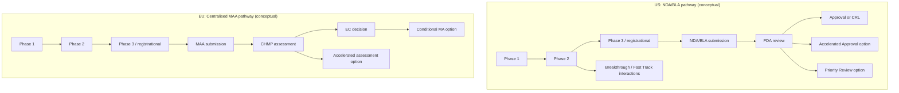
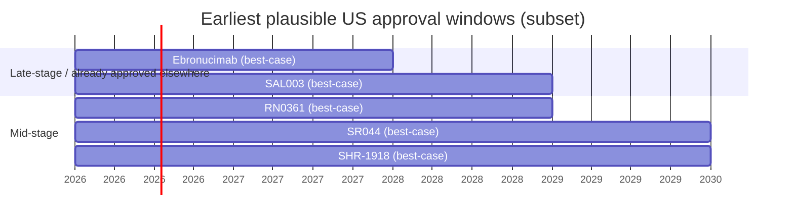

# US and EU Approval Outlook for Selected Investigational Drugs

## Executive summary

This report assesses **25 investigational drug programs** (as of **February 2026**) and estimates how quickly each could *realistically* reach **first approval in the US and EU**, **and why**, using **English-language, primary/official sources wherever available** (trial registries, regulator pages, and company disclosures). Across this set, the overriding constraint is not scientific plausibility but **development maturity + global (US/EU) regulatory strategy**.

Most programs are **lipid / cardiometabolic** and cluster around **validated targets**—**PCSK9**, **ANGPTL3**, and **apoC-III**—often using **siRNA/GalNAc** or **monoclonal antibody** modalities. Several others target **MASH/NASH** using mechanisms like **THR-β agonism** or **FGF21-based** therapy. This creates two distinct approval-speed regimes:

- **Lipid-lowering programs** (PCSK9 / ANGPTL3 / apoC-III): can sometimes pursue approval on **lipid surrogates** (e.g., LDL-C) rather than waiting for cardiovascular outcomes trials (though outcomes trials may be needed later for “CV risk reduction” labeling). The FDA has explicitly noted that **triglyceride lowering has historically been accepted as a surrogate endpoint** supporting approval in severe hypertriglyceridemia contexts, which can accelerate paths for apoC-III/ANGPTL3 programs aiming at pancreatitis-risk populations.
- **MASH/NASH programs**: even after the first FDA approval in this space (resmetirom/Rezdiffra), development remains slower and riskier because regulators typically require **histology-based endpoints** and/or long-term outcome confirmation, while trials are longer, larger, and operationally complex.

**Fastest-to-approval candidates (US/EU) in this list (conditional on sponsors pursuing US/EU filings now):**
- **Ebronucimab**: already **approved by China’s NMPA** for hypercholesterolemia/mixed dyslipidemia; has Phase 3 LDL-C efficacy data published. US/EU could be relatively fast *if* full CMC + bridging strategy is executed, but competition is intense.
- **SAL003**: Phase 3 programs appear **completed** in hypercholesterolemia/mixed dyslipidemia; could be among the earliest *if* a US/EU package is built.
- **SHR-1918**: strong Phase 2 HoFH LDL-C reductions reported; prior regulatory precedent exists for ANGPTL3 inhibition in HoFH (evinacumab success), but US/EU timing depends on global Phase 3 and positioning vs existing therapy.

For the majority that are **Phase 1 or early Phase 2**, **earliest plausible US/EU approval generally falls in the early-to-mid 2030s**, **even under optimistic assumptions**, and **worst-case is no approval** (program stops, strategy change, or failure). This is a standard maturity reality rather than a judgment on scientific merit.

## Regulatory and clinical context for timeline estimates

### Regulators and key “clock” mechanics

The analysis is anchored on the approval frameworks of the **U.S. Food and Drug Administration** (FDA) and the **European Medicines Agency** (EMA) for the **United States** and **European Union** respectively.

For EMA’s centralized procedure, CHMP assessment time is described as **up to 210 “active” days** (excluding “clock-stops”), with the possibility of **accelerated assessment to 150 days** when justified.   Conditional marketing authorisation (CMA) is a defined mechanism to approve medicines addressing unmet need on the basis of **less comprehensive clinical data**, contingent on post-authorisation obligations.   The CHMP opinion is transmitted to the European Commission for the legally binding decision.

### Trial registries and what “status” means

Where available, program status is drawn from **ClinicalTrials.gov** postings (including linked protocol PDFs when relevant) and corroborating company releases. Registry entries often lag real operations (e.g., “not yet recruiting” while sites are initiating), so “status” should be interpreted as *best available public signal*, not certainty.

### What can accelerate (or slow) US/EU approval for this set

Four cross-cutting factors dominate “speed to approval” for these candidates:

**Endpoint strategy (surrogates vs outcomes).**
For lipid disorders, regulators have long accepted surrogate lipid endpoints in certain contexts. The FDA has described triglycerides as historically accepted as a surrogate endpoint supporting approvals for some hypertriglyceridemia therapies.   LDL-C reduction is also an established basis for hypercholesterolemia programs, and FDA communications around PCSK9-targeted therapies explicitly position LDL-C lowering as a core measure tied to approved indications.

**Unmet need and rarity (designation leverage).**
Rare indications can unlock incentives and potentially faster paths (e.g., orphan designation incentives for qualifying rare diseases).   Breakthrough Therapy designation, by contrast, requires preliminary clinical evidence suggesting substantial improvement over available therapy on clinically significant endpoints.

**Global development footprint.**
Many programs here are primarily advanced in **China**; US/EU approval speed depends on whether sponsors run **ICH-compliant, inspection-ready** studies and CMC suitable for US/EU filings, and whether data are acceptable without extensive bridging.

**CMC/manufacturing readiness.**
This is particularly pivotal for **siRNA/GalNAc** programs (oligonucleotide purity, conjugation consistency, analytical characterization) and monoclonal antibodies (process control, comparability, immunogenicity plans). Public sources frequently emphasize CDMO/scale-up milestones as gating steps (e.g., DNV001’s manufacturing support narrative).

### Pathway diagram (US vs EU)

The core pathway differences referenced above (accelerated approval programs in the US; accelerated assessment and conditional marketing authorisation in the EU) are described by FDA and EMA public materials.

## Cross-drug comparison

### Comparative table of approval timing and drivers

**Interpretation note:** The “best-case” timelines below assume (i) clinical success, (ii) rapid start of the *next* required trial(s), (iii) no major CMC deficiencies, and (iv) the sponsor **actively pursues US/EU development**. “Typical” assumes realistic operational pacing and at least one non-trivial delay. “Worst-case” includes discontinuation or no US/EU filing.

| Drug | Most plausible first US/EU indication (based on current data) | Current public stage (global) | Earliest realistic approval (US) | Earliest realistic approval (EU) | Typical approval (US / EU) | Biggest speed driver / biggest drag (summary) |
|---|---|---:|---:|---:|---:|---|
| SHR-1918 | HoFH or severe hyperlipidemia (ANGPTL3 mAb precedent) | Phase 2 efficacy published | Q4 2029 | Q2 2030 | 2031 / 2032 | Driver: strong LDL-C effect; Drag: needs global registrational plan |
| BW-00112 | Mixed dyslipidemia / HTG (ANGPTL3 siRNA) | Phase 2 ongoing (est. completion 2028) | 2032 | 2033 | 2034 / 2035 | Driver: validated target; Drag: long Phase 2 + then Phase 3 |
| FY101 | Hyperlipidemia (mechanism unclear) | Phase 1 (China) | 2034+ | 2035+ | 2036+ / 2037+ | Driver: none evident; Drag: sparse data + unclear differentiation |
| SYH2070 | HTG / mixed hyperlipidemia (ANGPTL3 siRNA) | FDA/China CTA; early clinical | 2033 | 2034 | 2035 / 2036 | Driver: US trial entry; Drag: early phase + must prove durable benefit |
| JS401 | Hyperlipidemia (ANGPTL3 siRNA) | Phase 1 disclosed | 2033 | 2034 | 2035 / 2036 | Driver: validated target; Drag: early phase + competitive field |
| SR044 | Mixed dyslipidemia / HTG (apoC-III siRNA) | Phase 2 recruiting | 2030 | 2031 | 2032 / 2033 | Driver: apoC-III endpoint relevance; Drag: needs Phase 3 + pancreatitis outcomes clarity |
| HRS-7249 | Hyperlipidemia / severe HTG combo | Phase 2 | 2031 | 2032 | 2033 / 2034 | Driver: combination strategy; Drag: mechanism differentiation unclear publicly |
| RN0361 | HTG / SHTG (apoC-III siRNA) | Phase 2 IND-cleared (US) | 2029 | 2030 | 2031 / 2032 | Driver: FDA IND + early potency/durability; Drag: execution of Phase 2→3 |
| Kylo-12 | HTG / FCS (apoC-III siRNA) | Phase 1 | 2033 | 2034 | 2035 / 2036 | Driver: rare/severe indication possible; Drag: very early phase |
| SYH2053 | Hypercholesterolemia (PCSK9 siRNA) | Phase 1 | 2032 | 2033 | 2034 / 2035 | Driver: PCSK9 precedent; Drag: differentiation vs inclisiran and others |
| BGT-002 | MASH/NASH | Phase 1b/2a with published early human data | 2032 | 2033 | 2034 / 2035 | Driver: mechanistic rationale + early human signals; Drag: MASH registrational burden |
| AP025 | MASH/NASH (FGF21-Fc) | Phase 2 | 2031 | 2032 | 2033 / 2034 | Driver: biomarker improvements; Drag: histology endpoints + long trials |
| SIPI-7623 | Dyslipidemia (FXR antagonist; unclear program) | Reported Phase 1 (China) | 2034+ | 2035+ | 2036+ / 2037+ | Driver: novel mechanism; Drag: limited transparent clinical details |
| Xuezhikang | Hyperlipidemia (natural statin mixture) | Legacy/heterogeneous; trial exists | Unclear / unlikely | Unclear / unlikely | — | Driver: historical lipid/CV data; Drag: regulatory classification + standardization challenges |
| HS-10510 | Primary hypercholesterolemia / mixed dyslipidemia | Phase 1 | 2033 | 2034 | 2035 / 2036 | Driver: oral therapy potential; Drag: early phase + limited public MoA |
| CVI-LM001 | Hypercholesterolemia (oral PCSK9 modulator) | Phase 2 | 2029 | 2030 | 2031 / 2032 | Driver: oral PCSK9; Drag: needs Phase 3 + competitive landscape |
| MIL86 | Hyperlipidemia (PCSK9 mAb) | Phase 2 completed (China) | 2030 | 2031 | 2032 / 2033 | Driver: mature mAb platform; Drag: US/EU bridging + crowded class |
| SAL003 | Hypercholesterolemia / mixed dyslipidemia (anti-PCSK9 mAb) | Phase 3 completed | 2029 | 2030 | 2031 / 2032 | Driver: late-stage completion; Drag: US/EU filing not yet evidenced |
| Ebronucimab | Hypercholesterolemia / mixed dyslipidemia (anti-PCSK9 mAb) | Approved in China | 2028 | 2029 | 2030 / 2031 | Driver: approved + Phase 3 published; Drag: must justify US/EU value in mature market |
| DNV001 | Primary/mixed hypercholesterolemia (PCSK9 siRNA) | Phase 2 | 2031 | 2032 | 2033 / 2034 | Driver: siRNA precedent; Drag: Phase 2→3 + CMC scale-up |
| RP910 | Dyslipidemia (PCSK9 RNAi; limited detail) | Phase 1 | 2034 | 2035 | 2036+ / 2037+ | Driver: target validated; Drag: sparse transparent clinical information |
| RBD7022 | Hypercholesterolemia / ASCVD adjunct (PCSK9 siRNA) | Phase 1 data disclosed; Phase 2 referenced | 2030 | 2031 | 2032 / 2033 | Driver: durable PCSK9 suppression; Drag: registrational strategy vs incumbents |
| MWX203 | Dyslipidemia (siRNA; target not public) | Phase 1 | 2033 | 2034 | 2035 / 2036 | Driver: entry into clinic; Drag: unknown differentiation + early phase |
| ASC41 | MASH/NASH (THR-β agonist) | Phase 2 with interim results | 2031 | 2032 | 2033 / 2034 | Driver: liver fat reductions; Drag: needs histology + long-term safety |
| HPG7233 | NASH + dyslipidemia (THR-β agonist) | FDA IND cleared; pre/early clinical | 2034 | 2035 | 2036+ / 2037+ | Driver: FDA IND; Drag: not yet late-stage + class safety scrutiny |

### Short Gantt view of “earliest plausible approval” for a subset

The following subset illustrates how late-stage readiness dominates timelines. (Dates are scenario estimates derived from the evidence cited in the drug sections.)

## Drug-by-drug assessments

**Unspecified** below means “not found in the English-language sources reviewed” (not proof of absence). Where possible, each entry lists trial identifiers, enrollment, endpoints, and results.

### SHR-1918

**Sponsor / indication / modality.** Developed by **Jiangsu Hengrui Medicine Co., Ltd.**; a **fully human monoclonal antibody targeting ANGPTL3**; studied in **HoFH** and broader hyperlipidemia/ASCVD-risk populations.

**Regulatory/clinical status.** A multicenter, single-arm **Phase 2** HoFH trial (China sites; Dec 2023–Apr 2024) evaluated 600 mg SC Q4W for 12 weeks.   Reported outcomes included **~59% mean LDL-C reduction** at end of treatment and a manageable safety profile.   Separately, a study in moderate/higher ASCVD-risk patients reported additional LDL-C reductions (~22–30%) on standard therapy and references **NCT06109831**.

**FDA/EMA designations.** Unspecified (no public Fast Track/BTD/PRIME/Orphan found for SHR-1918 in reviewed sources).

**US/EU earliest approval timeline (realistic).**
- **Best-case:** US **Q4 2029**, EU **Q2 2030** (requires rapid initiation of a registrational program in HoFH or another high-need population, leveraging precedent for ANGPTL3 inhibition).
- **Typical:** US **2031**, EU **2032**.
- **Worst-case:** no US/EU filing or no approval.

**Why (accelerators / delays).** The strongest accelerator is **regulatory precedent**: FDA and EMA already approve the ANGPTL3 antibody **evinacumab (Evkeeza)** for HoFH, demonstrating that the target is clinically validated and that rare-disease lipid endpoints can be sufficient for approval in that context.   The main drag is that SHR-1918’s public evidence is largely **China-centric**, so US/EU timelines depend on whether Hengrui runs bridging/global studies and prepares a BLA-grade CMC package aligned to US/EU expectations.

### BW-00112

**Sponsor / indication / modality.** Developed by **Shanghai Argo Biopharmaceutical Co., Ltd.**; described as a **GalNAc-conjugated ANGPTL3 siRNA** intended for dyslipidemias.   Argo disclosed deal terms where **Novartis** received rights of first negotiation/interest around BW-00112, and BW-00112 was described as **in Phase 2 in the U.S. and China**.

**Regulatory/clinical status.** A Phase 2 mixed dyslipidemia study (ClinicalTrials.gov **NCT06497127**) is listed with **145 participants**, start date Feb 2024, and **estimated completion March 2028**.

**FDA/EMA designations.** Unspecified.

**US/EU timeline estimate.**
- **Best-case:** US **2032**, EU **2033** (Phase 2 completes ~2028, then Phase 3 + filing).
- **Typical:** US **2034**, EU **2035**.
- **Worst-case:** no approval.

**Key drivers.** ANGPTL3 is well validated genetically and pharmacologically (supporting plausibility), but the **Phase 2 completion horizon (2028)** alone pushes earliest approval into the 2030s, and any move to broad labels (ASCVD risk reduction) would likely require outcomes evidence beyond lipid surrogates.

### FY101

**Sponsor / indication / modality.** Reported as FY101 “injection” for hyperlipidemia; English-language details are sparse and largely appear through translated market/industry summaries. A trial record is described on PatSnap as a Phase 1 dose-escalation study in China (registry CTR20251757).   An English-language market news translation reports NMPA clinical trial approval for hyperlipidemia.

**Regulatory/clinical status.** **Phase 1 (China)**; enrollment/endpoints/results: unspecified in reviewed English sources beyond high-level safety/PK/PD framing.

**FDA/EMA designations.** Unspecified.

**US/EU timeline estimate.**
- **Best-case:** US **2034+**, EU **2035+** (would require a full US/EU clinical program starting from early phase).
- **Typical:** US **2036+**, EU **2037+**.
- **Worst-case:** no US/EU filing.

**Key drivers.** The limiting factor is **information and strategy opacity**: without a clearly articulated mechanism, differentiated profile, or disclosed US/EU development intent, realistic US/EU approval speed is low even if China development proceeds.

### SYH2070

**Sponsor / indication / modality.** Developed by **CSPC Pharmaceutical Group Limited**. Company disclosures describe SYH2070 as a **double-stranded siRNA** delivered to liver via **GalNAc**, **targeting ANGPTL3**, for hypertriglyceridemia or mixed hyperlipidemia.

**Regulatory/clinical status.** CSPC publicly stated SYH2070 obtained **FDA clinical trial approval in the U.S.** and NMPA approval in China (Sept 2025).   A Phase 1 ClinicalTrials.gov entry is associated with SYH2070 (NCT07241923).

**FDA/EMA designations.** Unspecified (beyond trial authorization/IND).

**US/EU timeline estimate.**
- **Best-case:** US **2033**, EU **2034**.
- **Typical:** US **2035**, EU **2036**.
- **Worst-case:** no approval.

**Key drivers.** Entry into US clinical testing is a meaningful accelerator, but SYH2070 remains early-stage; it must demonstrate durable, clinically meaningful triglyceride/apoB effects and competitive differentiation vs other ANGPTL3/apoC-III programs, while scaling oligonucleotide CMC.

### JS401

**Sponsor / indication / modality.** Developed by **Shanghai Junshi Biosciences Co., Ltd.** and described as a **siRNA targeting ANGPTL3 mRNA** for hyperlipidemia.

**Regulatory/clinical status.** Junshi reports indicate the program is in early clinical development (global highest phase described as Phase I in several industry databases) and linked to ClinicalTrials.gov **NCT06041165**.   Pivotal/Phase 3 trials: unspecified.

**FDA/EMA designations.** Unspecified.

**US/EU timeline estimate.**
- **Best-case:** US **2033**, EU **2034**.
- **Typical:** US **2035**, EU **2036**.
- **Worst-case:** no approval.

**Key drivers.** Even with a validated target, US/EU speed hinges on whether Junshi builds a differentiated product profile (dose interval, magnitude of TG/LDL effects, safety) and invests in global trials amid crowded ANGPTL3 competition.

### SR044

**Identity note.** In English-language clinical-trial aggregators, **SR-044** is used in association with **RBD5044**, an apoC-III–targeting siRNA program from Ribo.   Primary company sources emphasize the name **RBD5044**.

**Sponsor / indication / modality.** Developed by **Suzhou Ribo Life Science Co., Ltd.** / affiliated entities; an **apoC-III (APOC3)–targeting siRNA** for hypertriglyceridemia and mixed dyslipidemia.

**Regulatory/clinical status.**
- A Phase 2 mixed dyslipidemia study appears as **NCT06797401**.
- Ribo (English site) reported Phase 1 data in healthy subjects: **ApoC3 reduction up to 84%** and **TG reduction up to 70%**, with durability reported through 6 months follow-up.
- Ribo’s Ribocure affiliate announced Swedish MPA authorization for a Phase 2 trial in mixed dyslipidemia.

**FDA/EMA designations.** Unspecified for SR044/RBD5044 in reviewed sources (note: Ribo has orphan designation for a different asset, not this one).

**US/EU timeline estimate.**
- **Best-case:** US **2030**, EU **2031** (assuming a rapid Phase 2→Phase 3 transition and a registrational plan that leans on TG surrogate acceptance in pancreatitis-risk populations).
- **Typical:** US **2032**, EU **2033**.
- **Worst-case:** no approval.

**Key drivers.** ApoC-III inhibition is a high-relevance mechanism for severe TG disorders, potentially enabling faster development if regulators accept lipid surrogates and if safety (notably platelet and hepatic signals that affected prior approaches) remains clean over longer follow-up.

### HRS-7249

**Sponsor / indication / modality.** Associated with Fujian Shengdi / Suncadia entities in trial listings; public English sources do not clearly specify mechanism. ClinicalTrials.gov lists HRS-7249 studies in hyperlipidemia and combination with SHR-1918 in severe hypertriglyceridemia.

**Regulatory/clinical status.**
- Hyperlipidemia study: **NCT07100418** (described as evaluating efficacy/safety and dose selection).
- Severe hypertriglyceridemia (high pancreatitis risk) combination study with SHR-1918: **NCT07308392**; online trial trackers cite **~108 participants** and sponsor Fujian Shengdi.

**FDA/EMA designations.** Unspecified.

**US/EU timeline estimate.**
- **Best-case:** US **2031**, EU **2032**.
- **Typical:** US **2033**, EU **2034**.
- **Worst-case:** no approval.

**Key drivers.** Combination development could accelerate perceived clinical value (larger TG reductions; pancreatitis risk mitigation), but the key drag is **unclear public differentiation** and the need to show robust safety/benefit in a population where endpoints and event rates can complicate trial design.

### RN0361

**Sponsor / indication / modality.** Developed by **Rona Therapeutics**; an **APOC3-targeted siRNA** for hypertriglyceridemia (including severe HTG).

**Regulatory/clinical status.**
- Phase 1 ClinicalTrials.gov study: **NCT06471543**.   Veeva’s trial mirror lists **~108 participants** and describes healthy + hypertriglyceridemic subjects.
- Rona announced **FDA IND clearance** to initiate a Phase 2 study (March 2025) and described a planned randomized, placebo-controlled, multicenter global Phase 2 with nine-month follow-up.
- Rona later disclosed Phase 1 results indicating **durable ApoC3 and TG reductions lasting at least six months** after a single dose.

**FDA/EMA designations.** No public FDA expedited designation identified; IND clearance is confirmed.

**US/EU timeline estimate.**
- **Best-case:** US **Q4 2029**, EU **Q2 2030**.
- **Typical:** US **2031**, EU **2032**.
- **Worst-case:** no approval.

**Key drivers.** RN0361 is unusually well positioned among early-stage programs because it has (i) an FDA-cleared Phase 2 plan, (ii) a mechanistically direct surrogate (ApoC3/TG), and (iii) early durability signals.   The gating risk is the “Phase 2 to Phase 3” bridge: showing clinically persuasive benefit in populations where the regulator agrees on endpoints (TG surrogate vs pancreatitis events) and ensuring long-term safety (hepatic, platelet, injection-site).

### Kylo-12

**Sponsor / indication / modality.** ClinicalTrials.gov lists sponsor as Kylonova (Xiamen) Biopharma.   PatSnap describes Kylo-12 as an **APOC3 siRNA** for hypertriglyceridemia.   A Sino Biopharm disclosure (in English) describes Kylo-12 as **APOC3 siRNA** for hypertriglyceridemia and familial chylomicronemia syndrome (FCS).

**Regulatory/clinical status.** Phase 1 single-ascending-dose study in healthy subjects (**NCT06783881**) with **~50 subjects** is described in ClinicalTrials.gov summaries.

**FDA/EMA designations.** Unspecified.

**US/EU timeline estimate.**
- **Best-case:** US **2033**, EU **2034**.
- **Typical:** US **2035**, EU **2036**.
- **Worst-case:** no approval.

**Key drivers.** ApoC3 is a strong TG biology lever, and rare-disease positioning (FCS) can support faster development, but Kylo-12 is at Phase 1 and must still establish dose/durability/safety and then execute registrational trials.

### SYH2053

**Sponsor / indication / modality.** Same corporate sponsor as SYH2070 (CSPC). PatSnap describes SYH2053 as a **PCSK9 siRNA** and references a randomized SAD study in subjects with normal/elevated LDL-C.   BioWorld reported NMPA clearance for SYH-2053 clinical studies (Nov 2023).

**Regulatory/clinical status.** Phase 1 ClinicalTrials.gov identifier **NCT06229548** is associated with SYH2053.   Public human efficacy results: unspecified.

**FDA/EMA designations.** Unspecified.

**US/EU timeline estimate.**
- **Best-case:** US **2032**, EU **2033**.
- **Typical:** US **2034**, EU **2035**.
- **Worst-case:** no approval.

**Key drivers.** PCSK9 is highly validated with multiple approved modalities (including inclisiran), which reduces biological risk but increases **differentiation and market-access bar**; faster approval would require a clearly superior dosing interval, magnitude, or tolerability profile.

### BGT-002

**Sponsor / indication / modality.** PatSnap and academic sources associate BGT-002 with Bojiyuan/Burgeon Therapeutics and Chinese Academy of Sciences-related innovation.   Scientific reporting describes BGT-002 (also referenced as 326E) as an **ACLY/PPARα dual regulator** with relevance to MASH.

**Regulatory/clinical status.**
- Phase 1 safety/PK/PD and lipid-lowering effects in healthy subjects were published (favorable tolerability; lipid-lowering signal), supporting further development.
- A Phase Ib/IIa trial in NASH/MASH is listed as **NCT06491576**.

**FDA/EMA designations.** Unspecified.

**US/EU timeline estimate.**
- **Best-case:** US **2032**, EU **2033**.
- **Typical:** US **2034**, EU **2035**.
- **Worst-case:** no approval.

**Key drivers.** MASH programs have higher trial-duration and evidence burdens. Even with promising biomarker signals, approval generally requires large, well-controlled, longer-duration studies. The existence of an FDA-approved MASH therapy (resmetirom) clarifies a path but does not necessarily shorten it for new entrants.

### AP025

**Sponsor / indication / modality.** Program disclosures within Sino Biopharm materials describe TQA2225/AP025 as a **recombinant human FGF21-Fc fusion protein** in Phase 2 for MASH.

**Regulatory/clinical status.** The NASH Phase 2 study is listed as **NCT06569524**; Veeva trial mirrors describe **~120 estimated participants**.   Public results: unspecified.

**FDA/EMA designations.** Unspecified.

**US/EU timeline estimate.**
- **Best-case:** US **2031**, EU **2032**.
- **Typical:** US **2033**, EU **2034**.
- **Worst-case:** no approval.

**Key drivers.** FGF21 biology is relevant to metabolic liver disease, but the gating factor is still **MASH registrational design** (histology, duration, safety). The program appears China-centric in public sources, so US/EU speed also depends on global trial execution.

### SIPI-7623

**Sponsor / indication / modality.** Academic publications describe SIPI-7623 as an **FXR antagonist** with hypolipidemic/anti-atherosclerotic effects in animal models.   Reviews note SIPI-7623 is undergoing a **Phase 1 trial** in China for mixed hyperlipidemia, but without clear registry details in English sources reviewed.

**Regulatory/clinical status.** Phase 1 (reported); enrollment/endpoints/results: unspecified in reviewed English sources.

**FDA/EMA designations.** Unspecified.

**US/EU timeline estimate.**
- **Best-case:** US **2034+**, EU **2035+**.
- **Typical:** US **2036+**, EU **2037+**.
- **Worst-case:** no approval.

**Key drivers.** The primary limiter is **low transparency** (trial identifiers/results not clearly surfaced in English), which typically correlates with slower US/EU program build-out.

### Xuezhikang

**Sponsor / indication / modality.** Xuezhikang is described in peer-reviewed literature as a red-yeast-rice–derived product containing natural statin-like components and used for dyslipidemia; studies report LDL-C lowering and outcomes in Chinese populations.

**Regulatory/clinical status.** A ClinicalTrials.gov record exists for Xuezhikang lipid-lowering study (**NCT01327014**).   However, a major barrier to US/EU drug approval pathways is product standardization and regulatory classification: FDA warning letters indicate that red yeast rice products with enhanced/added lovastatin cannot be marketed as dietary supplements.   In the EU, EFSA has issued safety concerns regarding monacolin K exposure (lovastatin-identical component) from red yeast rice.

**FDA/EMA designations.** Not applicable / unspecified.

**US/EU approval outlook.** **Unclear and unlikely on a standard timeline** unless a sponsor pursues a fully characterized, pharmaceutical-grade product with modern CMC and a clear regulatory path (NDA/MAA), which is not evidenced in the reviewed sources.

**Key drivers.** While clinical signals exist, **regulatory and CMC feasibility** (consistent active composition, impurities like citrinin, and the lovastatin-equivalence issue) are the dominant determinants in the US/EU.

### HS-10510

**Sponsor / indication / modality.** Developed by **Hansoh Pharmaceutical Group Company Limited**; HS-10510 tablets are positioned for **primary hypercholesterolemia and mixed dyslipidemia**.

**Regulatory/clinical status.** A Phase 1 study is listed as **NCT07001787**, evaluating safety/PK/PD after single and multiple ascending doses, including food-effect and combination with rosuvastatin.   Mechanism/target is not specified in the reviewed official trial summary snippet.

**FDA/EMA designations.** Unspecified.

**US/EU timeline estimate.**
- **Best-case:** US **2033**, EU **2034**.
- **Typical:** US **2035**, EU **2036**.
- **Worst-case:** no approval.

**Key drivers.** Oral lipid-lowering candidates can be commercially compelling, but HS-10510 is early-phase and must establish differentiated efficacy/safety versus multiple incumbents and fast-followers.

### CVI-LM001

**Sponsor / indication / modality.** Developed by **CVI Pharmaceuticals** and described by the sponsor as a **first-in-class oral once-daily PCSK9 modulator** for LDL-C lowering.

**Regulatory/clinical status.** A Phase 2 study in drug-naïve elevated LDL-C subjects is listed as **NCT04438096**.   Secondary reporting notes a 28-day study where 300 mg dosing reduced LDL-C ~26.3% (company-disclosed).

**FDA/EMA designations.** Unspecified.

**US/EU timeline estimate.**
- **Best-case:** US **Q4 2029**, EU **Q2 2030**.
- **Typical:** US **2031**, EU **2032**.
- **Worst-case:** no approval.

**Key drivers.** The key accelerator is the “oral PCSK9” value proposition (if Phase 2 and subsequent Phase 3 confirm meaningful LDL-C lowering with clean safety). Drag comes from a crowded competitive set (mAbs, siRNA, and emerging oral PCSK9 inhibitors), which can raise evidentiary expectations even when regulatory approval is technically feasible.

### MIL86

**Sponsor / indication / modality.** Developed by **Beijing Mabworks Biotech Co., Ltd.**; described as a **PCSK9 antibody** program for hyperlipidemia.

**Regulatory/clinical status.** The sponsor’s pipeline page lists MIL86 as **Phase II trial (completed)**.   Public Phase 3/registrational trial details in US/EU: unspecified in reviewed sources.

**FDA/EMA designations.** Unspecified.

**US/EU timeline estimate.**
- **Best-case:** US **2030**, EU **2031**.
- **Typical:** US **2032**, EU **2033**.
- **Worst-case:** no approval.

**Key drivers.** Although monoclonal antibody development is operationally mature, the **PCSK9 mAb class is saturated** in the US/EU; absent clear differentiation or a biosimilar pathway strategy, US/EU filings may not be prioritized, slowing real-world time to approval.

### SAL003

**Sponsor / indication / modality.** Developed by **Shenzhen Salubris Pharmaceuticals Co., Ltd.**; SAL003 is a **fully human anti-PCSK9 monoclonal antibody** for hypercholesterolemia/mixed dyslipidemia.

**Regulatory/clinical status.** ClinicalTrials.gov lists Phase 3 studies:
- Combination with statins in hypercholesterolemia/mixed dyslipidemia: **NCT07253584** (Phase 3).
- Monotherapy: **NCT07295418** (Phase 3).
Larvol’s trial tracker summarizes these as completed and cites sample sizes in the high hundreds (e.g., 720).   A peer-reviewed modeling paper discusses SAL003 design and dose rationale.

**FDA/EMA designations.** Unspecified.

**US/EU timeline estimate.**
- **Best-case:** US **2029**, EU **2030**.
- **Typical:** US **2031**, EU **2032**.
- **Worst-case:** no US/EU approval.

**Key drivers.** SAL003 appears near-ready from a clinical-maturity standpoint, but US/EU speed is dominated by whether the sponsor pursues filings and how regulators view the program’s value in a landscape with multiple approved PCSK9 options.

### Ebronucimab

**Sponsor / indication / modality.** Developed by **Akeso, Inc.** / partners; a **fully human anti-PCSK9 monoclonal antibody**. China NMPA (English site) reports marketing approval for adult primary hypercholesterolemia and mixed dyslipidemia inadequately controlled on statins.

**Regulatory/clinical status.**
- China NMPA approval is explicitly reported.
- A Phase 3 randomized, placebo-controlled trial reported LDL-C reduction as the primary endpoint (baseline to week 12), with ~59–60% placebo-adjusted LDL-C reduction for Q4W or Q2W dosing regimens, published in 2024.
- Akeso announced NDA acceptance by NMPA in 2023 and earlier enrollment completion statements.

**FDA/EMA designations.** Unspecified in reviewed sources for lipid indications.

**US/EU timeline estimate.**
- **Best-case:** US **Q4 2028**, EU **Q2 2029** (conditional on immediate US/EU bridging strategy and filing).
- **Typical:** US **2030**, EU **2031**.
- **Worst-case:** no US/EU filing or no approval.

**Key drivers.** The strongest accelerator is that ebronucimab is already approved in a major market with Phase 3 evidence and standard lipid endpoints. The strongest drag is **commercial/regulatory prioritization** in markets where several PCSK9 approaches are already approved and payers may be restrictive without differentiated claims.

### DNV001

**Sponsor / indication / modality.** Developed by **Hangzhou Dingle Xinwei Biotechnology Co., Ltd.**; described as a **GalNAc-conjugated siRNA** for dyslipidemia, designed to lower LDL-C via PCSK9 silencing (per industry reporting).

**Regulatory/clinical status.** ClinicalTrials.gov lists a multicenter randomized double-blind placebo-controlled **Phase 2** study (**NCT07391722**) in hypercholesterolemia.   PatSnap describes the Phase 2 as enrolling statin-inadequately-controlled primary or mixed hypercholesterolemia and capturing PK/PD and immunogenicity features.

**FDA/EMA designations.** Unspecified.

**US/EU timeline estimate.**
- **Best-case:** US **2031**, EU **2032**.
- **Typical:** US **2033**, EU **2034**.
- **Worst-case:** no approval.

**Key drivers.** Accelerators include target validation (PCSK9), and if dosing intervals are long, differentiation is possible. The drag is that DNV001 appears primarily on a China trajectory, and US/EU approval requires full global development and a robust oligonucleotide CMC dossier.

### RP910

**Sponsor / indication / modality.** Public English sources are limited. PatSnap and Pharmcube entries associate RP910 with a **PCSK9 RNAi** approach for dyslipidemia and early clinical stage.

**Regulatory/clinical status.** **Phase 1** (as described in English-language drug intelligence listings). Enrollment/endpoints/results: unspecified.

**FDA/EMA designations.** Unspecified.

**US/EU timeline estimate.**
- **Best-case:** US **2034**, EU **2035**.
- **Typical:** US **2036+**, EU **2037+**.
- **Worst-case:** no approval.

**Key drivers.** The central constraint is **insufficient public clinical detail** and unclear US/EU development intent.

### RBD7022

**Sponsor / indication / modality.** PCSK9-targeting siRNA program from Suzhou Ribo. Company communications and reviews describe it as a liver-targeted siRNA approach relevant to familial hypercholesterolemia and ASCVD patients needing additional LDL-C lowering.

**Regulatory/clinical status.** ClinicalTrials.gov lists **NCT05912296**, describing SAD/MAD dosing (including a second dose at Day 28 in MAD groups).   Ribo disclosed Phase 1 data and stated the PCSK9 program is now in Phase 2 with enrollment completed; it reported up to **75% PCSK9 reduction** with durability at 6 months.   Ribo also announced China CDE approval for first-in-human clinical trial earlier in development.

**FDA/EMA designations.** Unspecified for RBD7022 in reviewed sources.

**US/EU timeline estimate.**
- **Best-case:** US **2030**, EU **2031**.
- **Typical:** US **2032**, EU **2033**.
- **Worst-case:** no approval.

**Key drivers.** The accelerator is a disclosed durable PD marker (PCSK9 suppression) consistent with the class. The drag is that approval speed depends on rapid execution of registrational trials and on positioning in a market with inclisiran and other next-gen LDL-lowering programs.

### MWX203

**Sponsor / indication / modality.** Developed by **Shanghai Minwei Biotechnology Co., Ltd.**; described as an siRNA drug (target not specified in reviewed English materials). PatSnap lists MWX203 in Phase 1 for dyslipidemias with start date June 2025.   The sponsor’s English website states IND approval for MWX203 injection in 2025.

**Regulatory/clinical status.** **Phase 1**; enrollment/endpoints/results: unspecified.

**FDA/EMA designations.** Unspecified.

**US/EU timeline estimate.**
- **Best-case:** US **2033**, EU **2034**.
- **Typical:** US **2035**, EU **2036**.
- **Worst-case:** no approval.

**Key drivers.** Typical for early-stage oligonucleotide programs: the pace will be governed by target disclosure/differentiation, early human efficacy durability, and scalable CMC.

### ASC41

**Sponsor / indication / modality.** Developed by **Ascletis Pharma Inc.** / its Gannex affiliate; ASC41 is described as a **THR-β agonist** for NASH/MASH.

**Regulatory/clinical status.** ClinicalTrials.gov lists the Phase 2 serial-biopsy program (**NCT05462353**) with endpoints including hepatic fat fraction change by **MRI-PDFF** at 24 and 52 weeks and effects on serum lipids.   Company press releases report interim Phase 2 results: up to **68.2% mean relative reduction in liver fat** at 12 weeks, with high proportions achieving ≥30% relative reduction.

**FDA/EMA designations.** Unspecified.

**US/EU timeline estimate.**
- **Best-case:** US **2031**, EU **2032**.
- **Typical:** US **2033**, EU **2034**.
- **Worst-case:** no approval.

**Key drivers.** The accelerator is biomarker efficacy in a mechanistically promising class (THR-β), but the primary drag is the need for a **robust histology-based registrational package** and long-term safety monitoring typical of MASH.

### HPG7233

**Sponsor / indication / modality.** Developed by **Hepagene Therapeutics Inc.**; a **THR-β agonist** for NASH and dyslipidemia.

**Regulatory/clinical status.** Hepagene announced **FDA IND clearance** (Sept 2023), describing preclinical selectivity, liver-enrichment, and effects on liver triglyceride/serum LDL-C in models.   Clinical trial identifiers, enrollment, endpoints, and human results: unspecified in reviewed English sources.

**FDA/EMA designations.** IND cleared; other expedited designations unspecified.

**US/EU timeline estimate.**
- **Best-case:** US **2034**, EU **2035**.
- **Typical:** US **2036+**, EU **2037+**.
- **Worst-case:** no approval.

**Key drivers.** The key accelerator is entry into the FDA clinical system via IND; however, without disclosed Phase 1/2 human results and given the inherent duration of MASH development, timelines remain long.

## Limitations and monitoring indicators

### Limitations of this assessment

- **English-language constraint:** Several of these programs appear primarily in China-facing disclosures and registries; restricting to English sources increases the frequency of “unspecified” fields and may miss local designations or interim reads.
- **Registry parsing granularity:** Some ClinicalTrials.gov entries provide only high-level snippets in public mirrors; where enrollment and endpoints are not explicitly visible in the accessible snippet, they are marked unspecified.
- **Timelines are scenario estimates, not forecasts:** They assume clinical success and rapid operational execution; real-world outcomes are often slower.

### What to monitor to materially revise timelines

Across nearly all programs, the factors most likely to shift US/EU approval estimates earlier (or later) are:

- **Initiation of US/EU registrational trials** (not just Phase 1 entry), with clear primary endpoints aligned to label claims.
- **Public evidence of FDA/EMA expedited designations** (Fast Track, Breakthrough, Orphan; EMA PRIME/accelerated assessment eligibility), especially for HoFH/FCS/pancreatitis-risk populations.
- **CMC disclosures** signaling inspection readiness and comparability (especially for siRNA/GalNAc scale-up and antibody process changes).
- For MASH candidates, movement from **MRI-PDFF and biomarker** signals to **histologic endpoints** and long-term outcomes—mirroring the evidentiary logic behind accelerated paths in the space.
