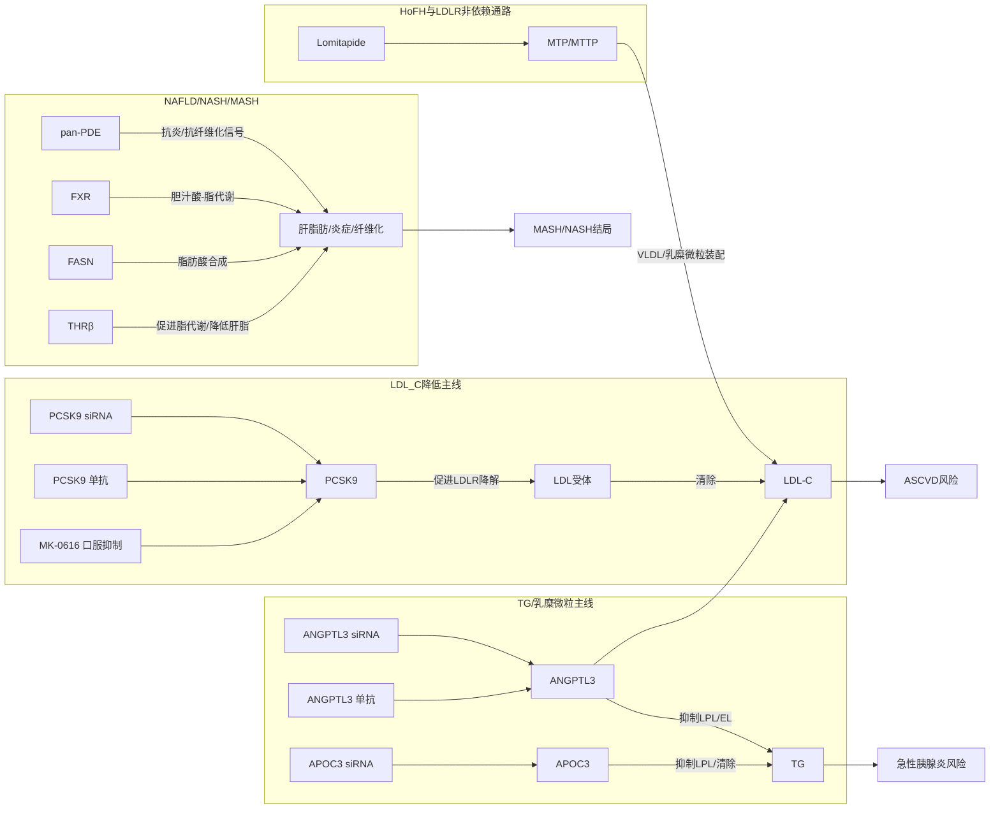
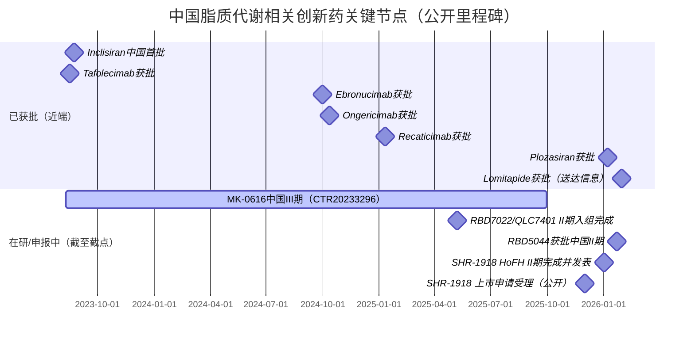

# 中国血脂异常与脂质代谢相关疾病在研与近端上市药物全景报告

## 执行摘要

截至2026-02-11（信息截点），中国在“血脂异常（LDL-C/TG/Lp(a)）+脂质代谢相关肝病（NAFLD/NASH/MASH）”领域出现两个清晰趋势：其一，**以PCSK9为核心的LDL-C降低路径已高度成熟并快速国产化/多样化（单抗、siRNA、口服抑制剂进入III期）**；其二，研发重心明显向“残余风险”转移，尤其是**高甘油三酯血症/家族性乳糜微粒血症综合征（FCS）与ANGPTL3、APOC3、Lp(a)等遗传学强驱动靶点**，带动核酸药物与多靶点代谢调节剂加速推进。

在“即将上市/申报中”的近端项目里，**ANGPTL3单抗SHR-1918已形成可发表的关键临床证据（HoFH单臂II期）且其上市申请于2025年12月获受理并被纳入优先审评讨论**，是最接近“下一张新靶点降脂牌照”的国产创新生物药之一。

在“高TG/FCS”方向，**ApoC3 siRNA普乐司兰钠注射液（Plozasiran sodium，商品名瑞达普®）已于2026-01-07获NMPA优先审评批准上市**，标志着中国在超罕见/重度脂质遗传病的核酸疗法可及性出现实质性拐点；与此同时，ApoC3 siRNA RBD5044在2026-01获得NMPA II期IND许可，形成“上市品种+在研品种”双轨。

在NAFLD/NASH/MASH方向，**中国在II期层面已形成THRβ激动剂（ASC41）、FASN抑制剂（ASC40）、pan-PDE抑制剂（ZSP1601）、FXR激动剂（HEC96719）等多机制候选**；但在监管路径上，NASH/MASH项目普遍需要以组织学改善（肝穿病理）作为关键终点的开发策略，决定了推进速度、入组成本与失败风险。

本报告以公开可核验信息为基础，已覆盖：**在中国境内处于临床I/II/III期、上市申请受理/优先审评、以及“已上市但处于近端放量或刚获批”的脂质代谢相关候选药物**；对未能在权威渠道检索到的字段，统一标注“未公开/未披露”。（“所有”以公开信息可检索范围为边界）

## 数据来源与收录边界

本报告优先使用以下公开数据源（按优先级排序）：  
**监管与注册**：国家药品监督管理局（含批件/创新药信息）、药品审评中心（审评与临床试验相关公示）。  
**临床试验注册**：ClinicalTrials.gov、中国临床试验注册中心及“中国药物临床试验登记与信息公示平台（CTR登记号）”的可得信息与可核验镜像页面。  
**公司官方披露与原始论文**：企业官网/公告、港交所披露文件、可全文获取的期刊论文（如PMC全文、JAMA/JACC等）。  

收录范围与排除原则：  
本报告聚焦**“用于治疗血脂异常（LDL-C/TG/Lp(a)）与脂质代谢相关肝病（NAFLD/NASH/MASH）”**的创新活性成分/创新机制候选，纳入“临床I期及以上、或已在中国申报/获批但尚处近端放量阶段”的项目。对于数量极其庞大的**仿制药、改良型复方（如大量他汀/依折麦布复方）**，若不构成“新靶点/新模式”决策信息，本报告不做穷尽式罗列；若用户需要“全量药品批准文号层面的目录”，建议另行定义“是否含仿制药/一致性评价/复方”边界后再批量拉取。  

为便于表格聚合，本报告采用“公司代码（Cxx）”引用开发主体，映射如下（仅在此处做一次性列示）：

| 公司代码 | 开发/申报主体 |
|---|---|
| C01 | 诺华 |
| C02 | 默沙东 |
| C03 | 苏州瑞博生物技术股份有限公司 |
| C04 | 齐鲁制药 |
| C05 | Arrowhead Pharmaceuticals |
| C06 | 赛诺菲 |
| C07 | 江苏恒瑞医药 |
| C08 | 上海君实生物医药科技股份有限公司 |
| C09 | 信达生物 |
| C10 | 康融东方（广东） |
| C11 | 歌礼制药 |
| C12 | 广东众生药业 |
| C13 | 广东东阳光药业 |
| C14 | 君圣泰医药 |
| C15 | 凯西医药咨询（上海）有限公司 |
| C16 | 康缘药业 |

（注：公司代码仅为本报告内部索引，不代表股权或权益完整结构；涉及license-in/out时将在药物条目中单列。）

## 市场与机制图谱

### 靶点—疾病—脂质指标的关系图（Mermaid）

图中通路与药物机制均来自对应公司披露与临床发表对靶点/机制的描述（详见各药物条目来源）。  

### 近三年关键里程碑时间线（Mermaid）

时间点来自NMPA公开批准信息、公司公告与可发表研究的时间窗口。  

## 按药物类别与研发阶段分表汇总

### 核酸药物（siRNA/ASO）

| 研发阶段 | 药物（中/英） | 公司代码 | 靶点 | 核心适应症（中国） | 关键试验/登记 | 主要来源 |
|---|---|---:|---|---|---|---|
| 已上市 | 普乐司兰钠注射液/ plozasiran sodium（瑞达普®） | C05/C06 | APOC3 | FCS成人降TG | CTR20231418（III期） |  |
| 已上市 | 英克司兰钠注射液/ inclisiran（乐可为®） | C01 | PCSK9 | 原发性高胆固醇血症/混合型血脂异常；2026-01扩展单药适应症 | NCT05888103（单药研究） |  |
| 临床II期 | RBD5044（ApoC3 siRNA） | C03 | APOC3 | 高甘油三酯血症 | （中国II期：登记号未披露） |  |
| 临床II期 | RBD7022/QLC7401（PCSK9 siRNA） | C03/C04 | PCSK9 | 高脂血症/高胆固醇血症 | CTR20244751（II期） |  |
| 临床I期 | JS401（ANGPTL3 siRNA） | C08 | ANGPTL3 | 高脂血症 | 受理号CXHL2300136 |  |
| 全球III期（含中国中心） | pelacarsen（TQJ230，ASO） | C01 | LPA/apo(a) | ASCVD+Lp(a)升高 | NCT06813911 |  |

### 生物制剂（单抗）

| 研发阶段 | 药物（中/英） | 公司代码 | 靶点 | 核心适应症（中国） | 关键试验/登记 | 主要来源 |
|---|---|---:|---|---|---|---|
| 已上市 | 托莱西单抗/ tafolecimab（信必乐®） | C09 | PCSK9 | 高胆固醇血症/混合型血脂异常 | — |  |
| 已上市 | 伊努西单抗/ ebronucimab（伊喜宁®） | C10 | PCSK9 | 高胆固醇血症/混合型血脂异常 | — |  |
| 已上市 | 昂戈瑞西单抗/ ongericimab（君适达®） | C08 | PCSK9 | 高胆固醇血症/混合型血脂异常；并推进HeFH/他汀不耐受等 | — |  |
| 已上市 | 瑞卡西单抗/ recaticimab（艾心安®） | C07 | PCSK9 | 高胆固醇血症/混合型血脂异常 | — |  |
| 上市申请受理/优先审评中 | SHR-1918（ANGPTL3单抗） | C07 | ANGPTL3 | HoFH/高脂血症（视审评结论） | NCT06009393（HoFH II期） |  |

### 小分子/多肽/复方（含NASH候选）

| 研发阶段 | 药物（中/英） | 公司代码 | 靶点/机制 | 核心适应症（中国） | 关键试验/登记 | 主要来源 |
|---|---|---:|---|---|---|---|
| 临床III期 | MK-0616（口服PCSK9抑制剂） | C02 | PCSK9蛋白结合（宏环肽） | 高胆固醇血症 | CTR20233296（III期） |  |
| 临床II期 | HRS-5346（口服Lp(a)抑制剂） | C07 | 抑制Lp(a)形成（细节未披露） | Lp(a)升高相关心血管风险 | （中国II期：编号未披露） |  |
| 临床II期 | HRS-7249（降TG注射） | C07 | 未披露（非临床可持续降TG） | 重度高甘油三酯血症/胰腺炎高风险 | NCT07308392（II期联合） |  |
| 已上市 | 甲磺酸洛美他派/ lomitapide | C15 | MTP/MTTP抑制剂 | HoFH | — |  |
| 临床II期 | ASC41（THRβ激动剂） | C11 | THRβ | 活检证实NASH（52周） | NCT05462353（II期） |  |
| 临床II期 | ASC40（FASN抑制剂，TVB-2640） | C11 | FASN | NASH（含中国队列） | 中国队列约30例 |  |
| 临床II期 | ZSP1601（pan-PDE抑制剂） | C12 | pan-PDE（偏PDE2等） | NAFLD/NASH | NCT04140123；CTR20223378 |  |
| 临床II期 | HEC96719（FXR激动剂） | C13 | FXR | NASH | CTR20211428 |  |
| 临床研究进行中 | HTD1801（berberine ursodeoxycholate） | C14 | 多通路代谢调节（非单靶点） | NASH（部分合并T2DM）等 | Centricity NASH Study |  |

### 中药/其他（含疫苗）

| 研发阶段 | 药物 | 公司代码 | 类别 | 适应症 | 关键登记/受理 | 主要来源 |
|---|---|---:|---|---|---|---|
| IND/临床试验批准 | 七味脂肝颗粒 | C16 | 中药创新药1.1类 | NASH（湿热痰瘀互结证） | 受理号CXZL2400008 |  |
| 临床前为主（截至截点） | PCSK9疫苗（多为VLP/肽疫苗等） | — | 疫苗/免疫疗法 | 高胆固醇血症/动脉粥样硬化预防探索 | 中国进入临床的公开信息有限 |  |

## 重点药物条目的证据摘要

以下按“核心疾病—靶点—药物模式”给出面向研发/投资决策的条目化摘要。每个条目最后附“来源”，若字段缺失则标注“未公开/未披露”。

**普乐司兰钠注射液（瑞达普®，Plozasiran sodium / plozasiran / VSA001；公司代码C05/C06）**  
药物类别为GalNAc肝靶向siRNA，靶点为APOC3 mRNA，用于从源头降低ApoC-III并改善富含TG脂蛋白清除。中国适应症为FCS成人患者：在饮食控制基础上降低甘油三酯。监管层面，该品种已于2026-01-07通过优先审评审批程序获得NMPA批准上市，是中国在FCS领域的标志性“核酸药物+罕见病商业化”节点；其III期中国研究登记号公开为CTR20231418，并与NCT05902598互相映射。竞争格局上，其直接对标海外ApoC3 ASO（如volanesorsen/olezarsen路径）与在研ApoC3/ANGPTL3抑制剂；投资关注点转向上市后可及性与适应症外延（如SHTG）证据链。安全性方面，按同类RNAi/降TG策略需持续关注注射反应、代谢相关信号（以说明书与上市后研究为准）。来源：  

**英克司兰钠注射液（乐可为®，inclisiran；公司代码C01）**  
药物类别为GalNAc肝靶向siRNA，靶向PCSK9 mRNA，经典机制为降低PCSK9表达、提升LDLR介导清除，从而降低LDL-C。中国已于2023-08获NMPA批准用于成人原发性高胆固醇血症（含杂合子家族性与非家族性）或混合型血脂异常；并在2026-01获批新增“单药+饮食”场景（非家族性/混合型）。从研发与支付角度，其价值在于“半年一针”的慢病依从性优势与后续心血管结局证据扩展；对中国市场而言，竞争压力来自国产PCSK9单抗的价格与供给，以及口服PCSK9抑制剂进入III期带来的给药方式替代。来源：  

**MK-0616（enlicitide，口服PCSK9抑制剂；公司代码C02）**  
药物类别为口服宏环肽/多肽类小分子化设计，机制为结合PCSK9并阻断其与LDLR相互作用。中国已开展III期临床（登记号CTR20233296），公开方案要点包括随机、双盲、安慰剂对照，并以第24周LDL-C较基线平均百分比变化作为主要疗效目标之一；公开信息中该国际多中心研究计划入组规模约2760。该药物的战略意义在于：若III期及结局研究成立，可能在中国形成“口服PCSK9”新市场切口，与“国产PCSK9单抗/PCSK9 siRNA”形成给药方式差异化竞争。来源：  

**国产PCSK9单抗（多厂家，C07/C08/C09/C10）**  
中国在2023-2025连续批准多款国产PCSK9单抗，形成同靶点“多品牌并存”格局。代表性品种包括：托莱西单抗（tafolecimab）、伊努西单抗（ebronucimab）、昂戈瑞西单抗（ongericimab）与瑞卡西单抗（recaticimab）。其共同点是成熟的LDL-C降低机制、相对标准化的注册终点与明确的临床定位（原发性高胆固醇血症/混合型血脂异常）；差异点则集中在给药间隔、价格策略、适应症扩展与渠道覆盖。昂戈瑞西单抗在商业化端还存在与产业方的许可合作与适应症扩展申报。来源：  

**RBD7022/QLC7401（PCSK9 siRNA；公司代码C03/C04）**  
该药为GalNAc-siRNA，通过沉默PCSK9实现长效降LDL-C。在中国，II期临床（CTR20244751）已完成入组，入组规模公开为204例高脂血症患者，目标是进一步评估安全性、有效性与长效降脂潜力，为后续关键性研究提供依据。该项目对中国市场的潜在影响在于：若疗效/安全性与生产成本可控，有可能在“长效注射”赛道与inclisiran形成国产替代或差异化竞争；同时也会对现有PCSK9单抗形成价格与依从性压力。来源：  

**RBD5044（ApoC3 siRNA；公司代码C03）**  
该药为GalNAc-siRNA，靶向APOC3，用于高甘油三酯血症等脂质紊乱。公司披露其在2026-01-22获得NMPA II期IND许可；I期数据显示单次注射可实现ApoC3最高84%下降并伴随TG最高70%下降，且6个月随访仍保持明显抑制；并宣称未观察到剂量相关不良事件及最高剂量肝酶升高。监管路径方面，公司披露其适用于NMPA创新药临床试验“30工作日快速通道”。考虑到同靶点“普乐司兰钠已上市”，RBD5044的核心商业化逻辑可能转向：更广适应症（如混合型血脂异常、SHTG）、更优给药频次/人群定位，以及与其他指标（LDL-C、apoB等）协同改善的证据。来源：  

**SHR-1918（ANGPTL3单抗；公司代码C07）**  
SHR-1918为全人源ANGPTL3单抗，定位于LDLR非依赖降脂路径，理论上对HoFH等“LDLR通路缺陷”患者更具意义。证据层面，其HoFH单臂II期研究在中国8家中心开展（2023-12至2024-04），样本量26例，已发表于JAMA Cardiology：研究旨在评估在稳定降脂治疗背景下的LDL-C降低效果与安全性；并在更广泛高脂血症人群中开展II期研究（登记信息见NCT06109831与对应发表）。监管态势方面，公开报道显示其上市申请于2025年12月获受理并被纳入优先审评讨论，属于“近期最值得跟踪的国产新靶点生物药”之一。竞争对手包括海外已上市的ANGPTL3单抗（evinacumab路径）与ANGPTL3 siRNA（如JS401）。来源：  

**JS401（ANGPTL3 siRNA；公司代码C08）**  
JS401为GalNAc-siRNA，靶向ANGPTL3 mRNA。君实公告披露其临床试验申请受理号为CXHL2300136，并获NMPA同意开展高脂血症临床试验；机制描述强调通过肝细胞内特异性降解ANGPTL3 mRNA持续抑制蛋白表达，从而降低TG及胆固醇等致动脉粥样硬化脂蛋白。当前公开信息侧重于IND获批与机制阐述，I期方案细节与入组规模多为未公开/未披露状态。来源：  

**HRS-5346（口服Lp(a)抑制剂；公司代码C07）**  
HRS-5346被描述为“在研口服小分子Lp(a)抑制剂”，并处于中国II期临床。商业与专利层面，该项目于2025-03达成对外许可交易：恒瑞授予默沙东除大中华区外的全球开发、生产与商业化独家权益（交易交割预计2025年Q2完成）。由于公开新闻稿未披露其分子靶点细节与II期试验编号，本报告对其“作用机制/关键临床”字段按“未披露”处理；从投资分析上，HRS-5346的关键不确定性在于：口服小分子能否在Lp(a)这一高度遗传决定、传统上由核酸药物主导的赛道中建立足够的降幅与安全窗。来源：  

**pelacarsen（TQJ230，Lp(a) ASO；公司代码C01）**  
pelacarsen为反义寡核苷酸（ASO），靶向LPA/apo(a)通路。Novartis公开的试验信息显示，NCT06813911（ADD-VANTAGE）在具有ASCVD且Lp(a)升高的人群中评估pelacarsen，并在此设计中将背景治疗包含inclisiran；计划入组约340例，主要终点为第6个月Lp(a)的变化（对数转换），预计完成时间为2027-12。公开信息亦提示中国已加入相关全球多中心研究，适合作为“Lp(a)结局证据成熟前”的中国前瞻性布局观察点。来源：  

**甲磺酸洛美他派胶囊（lomitapide；公司代码C15）**  
lomitapide为口服MTP（MTTP）抑制剂，属于LDLR非依赖降LDL-C策略，临床定位为成人HoFH（配合低脂饮食及其他降脂治疗±LDL分离置换）。公开信息显示其已于2026-01获得NMPA批准（以药品批准证明文件送达信息披露为线索），并被描述为“全球唯一口服MTP抑制剂在华获批”。该品种在中国的价值更多体现为HoFH罕见病治疗可及性与支付体系匹配，而非大众血脂异常市场。安全性方面，MTP抑制剂类已知风险通常集中在胃肠道反应与肝脂肪变性/肝酶升高，需要严格监测（以中国说明书为准）。来源：  

**NASH/MASH研发共性：终点与监管约束**  
中国与国际监管实践对NASH/MASH药物开发的关键约束，是在III期或注册性路径中普遍强调“组织学改善”作为替代/关键终点，并辅以远期结局；这一要求显著提升入组难度与成本，并使“II期信号—III期成功”的转化不确定性更大。中国脂肪性肝病临床试验在2025年已积累到较高数量（公开分析称达到93项），主要机制集中于THRβ、GLP-1、FGF21类似物、PPAR激动剂等方向。来源：  

**ASC41（THRβ激动剂；公司代码C11）**  
ASC41为肝靶向、高选择性THRβ激动剂口服片剂。公司与新闻稿披露其在中国开展随机、双盲、安慰剂对照、多中心II期研究（NCT05462353），计划入组约180例“肝穿活检证实NASH”患者，按1:1:1分配ASC41 2mg/4mg/安慰剂，治疗52周并随访4周；2024-01披露期中结果“积极”。在机制层面，THRβ激动剂不仅影响肝脂，还可能带来血脂谱（LDL/TG）联动改善，因此在“脂质代谢相关疾病”中兼具双重投资逻辑（肝+血脂）。来源：  

**ASC40（FASN抑制剂；公司代码C11）**  
ASC40（TVB-2640）为口服FASN抑制剂。公开资料显示，其全球II期研究包含中国队列；合作方与公司公告披露中国队列约30例NASH患者，口服每日一次50mg，治疗12周，并以MRI-PDFF等评估肝脂降低，顶线数据为“良好/积极”。与THRβ不同，FASN抑制剂更直接指向“肝内脂肪酸合成”，潜在优势在于肝脂降低的直接性，但其纤维化获益与长期安全性仍取决于更大样本与更长随访。来源：  

**ZSP1601（pan-PDE抑制剂；公司代码C12）**  
ZSP1601被描述为“First-in-class pan-PDE抑制剂，专为NASH/NAFLD设计”。其随机、双盲、安慰剂对照的Ib/IIa研究（NCT04140123）纳入36例NAFLD患者：三组剂量（50mg QD、50mg BID或100mg BID）与安慰剂对照，给药28天；主要终点为安全性/耐受性。公开发表显示，多数不良事件为轻中度，常见包括腹泻、肌酐短暂升高与头痛，并报告了肝酶、肝脂含量与纤维化相关指标改善信号。中国层面，其II期研究登记号可检索到CTR20223378用于NASH适应症（细节需以登记全文为准）。来源：  

**HEC96719（FXR激动剂；公司代码C13）**  
HEC96719为非甾体FXR激动剂，原始研究报道其相对既有FXR激动剂在体外/体内FXR激活与组织分布方面具有特点（以发表为准）。公开披露文件中可检索到其在中国开展NASH II期临床（CTR20211428）。由于公开渠道对其II期方案、组织学终点与入组规模披露有限，本报告对“关键结果/主要终点”按未披露处理，建议投资决策中将其定位为“机制明确但临床透明度不足”的中期项目。来源：  

**HTD1801（berberine ursodeoxycholate；公司代码C14）**  
HTD1801为小檗碱与熊去氧胆酸的离子盐新分子实体，定位为“肠-肝抗炎代谢调节剂”，并被用于NASH合并T2DM等人群研究。公开发表的临床研究与公司试验信息页面提示其可在组织学层面产生改善潜力（需结合研究设计与样本量解读）。其与“纯靶点药（THRβ/FXR等）”不同，更接近代谢综合干预策略；优势可能在于多指标联动（血糖、血脂、肝炎症），劣势在于机制归因与监管终点的可解释性。来源：  

**七味脂肝颗粒（中药创新药1.1类；公司代码C16）**  
七味脂肝颗粒已获得NMPA签发的《药物临床试验批准通知书》，适应症为“非酒精性脂肪性肝炎（湿热痰瘀互结证）”，受理号CXZL2400008、通知书编号2024LP00957。该项目代表中药在脂肪性肝炎方向的“规范注册开发”尝试；但其关键终点评估体系、与现代NASH组织学终点的对应关系，以及是否能形成高质量随机对照证据，仍需后续试验方案与结果披露。来源：  

## 索引表与可下载数据集说明

### 按靶点索引（核心靶点/机制）

| 靶点/机制 | 对应药物（中国在研/近端上市） |
|---|---|
| PCSK9（mRNA/蛋白） | 英克司兰钠、MK-0616、RBD7022/QLC7401、托莱西单抗、伊努西单抗、昂戈瑞西单抗、瑞卡西单抗 |
| APOC3（mRNA） | 普乐司兰钠、RBD5044 |
| ANGPTL3（蛋白/mRNA） | SHR-1918、JS401 |
| Lp(a)/LPA通路 | HRS-5346、pelacarsen |
| MTP/MTTP | 甲磺酸洛美他派 |
| THRβ | ASC41 |
| FASN | ASC40 |
| FXR | HEC96719 |
| pan-PDE | ZSP1601 |

### 按适应症索引（决策导向）

| 适应症/人群 | 对应药物 |
|---|---|
| 原发性高胆固醇血症/混合型血脂异常（大众市场） | 国产PCSK9单抗群（托莱西/伊努西/昂戈瑞西/瑞卡西）、英克司兰钠、MK-0616、RBD7022/QLC7401 |
| 家族性乳糜微粒血症综合征（FCS） | 普乐司兰钠（已上市） |
| 重度高甘油三酯血症/胰腺炎高风险（SHTG/AP风险） | RBD5044（II期）、HRS-7249（II期），以及ApoC3/ANGPTL3通路的潜在扩展 |
| 纯合子家族性高胆固醇血症（HoFH） | 甲磺酸洛美他派（已上市），SHR-1918（申报/优先审评中） |
| Lp(a)升高合并ASCVD风险 | pelacarsen（全球III期含中国中心）、HRS-5346（中国II期） |
| NAFLD/NASH/MASH | ASC41、ASC40、ZSP1601、HEC96719、HTD1801、七味脂肝颗粒 |

### 按公司索引（便于BD/竞品雷达）

| 公司代码 | 代表性品种 |
|---:|---|
| C01 | 英克司兰钠、pelacarsen |
| C02 | MK-0616 |
| C03/C04 | RBD7022/QLC7401、RBD5044 |
| C05/C06 | 普乐司兰钠（瑞达普®） |
| C07 | SHR-1918、HRS-5346、HRS-7249 |
| C08 | 昂戈瑞西单抗、JS401 |
| C11 | ASC41、ASC40 |
| C15 | 甲磺酸洛美他派 |
| C16 | 七味脂肝颗粒 |

### 可下载CSV/Excel清单

已将本报告覆盖的候选药物整理为结构化清单（含“药物中英文名、开发主体、药物类别、靶点/机制、适应症、研发阶段、关键试验、主要终点、入组人数、关键结果/预计节点、监管路径、竞品、安全性要点、专利/授权摘要”等字段；缺失处为“未公开/未披露”）。  

- [下载CSV清单](sandbox:/mnt/data/china_lipid_drug_pipeline_2026-02-11.csv)  
- [下载Excel清单](sandbox:/mnt/data/china_lipid_drug_pipeline_2026-02-11.xlsx)  

字段说明（与文件列一一对应）：  
drug_cn、drug_en、code_name、company、modality、target、moa、indications_cn、china_stage、key_trials、trial_design、primary_endpoints、enrollment、key_results_or_eta、regulatory_path_cn、patent_licensing、competitors、safety。
