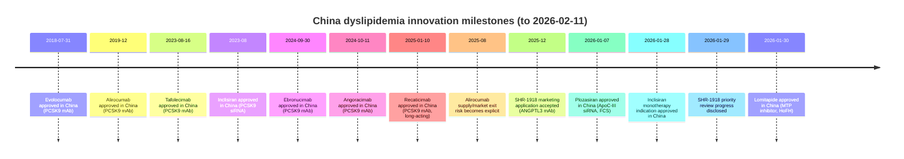

# TEMP_CHECK
# 中国血脂异常在研与即将上市药物全景报告

## 执行摘要

截至 2026-02-11，中国血脂异常（dyslipidemia）领域的创新药研发呈现出“靶点聚集—剂型迭代—适应症精细化”的格局：PCSK9 轴（单抗、siRNA、口服小分子/环肽、融合蛋白）在国内外企业的集中投入下快速扩容，同时以 ApoC-III、ANGPTL3、Lp(a) 为代表的“残余风险/罕见病”靶点进入关键验证与注册节奏。

在“已获批/刚获批”层面，2023–2026 年间中国连续迎来多款长效降脂创新药或新适应症：  
- 2023-08-16，国产 PCSK9 单抗托莱西单抗在华获批。  
- 2024-09-30 与 2024-10-11，国内新增两款 PCSK9 单抗（伊努西单抗、昂戈瑞西单抗）获批。  
- 2025-01-10，瑞卡西单抗获批上市。  
- 2026-01-07，ApoC-III siRNA 药物普乐司兰钠注射液获批用于家族性乳糜微粒血症综合征（FCS），属于我国罕见病/高甘油三酯（TG）管理的重要里程碑。  
- 2026-01-28，英克司兰钠注射液获批新增“单药治疗”适应症，进一步扩展至无需联用他汀的用药场景。  
- 2026-01-30，口服 MTP 抑制剂甲磺酸洛美他派获批用于成人纯合子家族性高胆固醇血症（HoFH）。  

在“即将上市/在审评”层面，国产首款 ANGPTL3 单抗 SHR-1918 已在 2025-12 获上市申请受理并在 2026-01-29 被公开为“拟纳入优先审评”，成为 2026 年后 HoFH 及顽固性高脂血症的重要潜在增量。  

在“在研管线”层面，三条技术路线值得重点关注：  
1) 口服 PCSK9 抑制剂在华进入 III 期（默沙东 MK-0616、阿斯利康 AZD0780），有望把“强效降 LDL-C”从注射时代推进到口服时代；  
2) “更长效/更小注射体积”的第三代 PCSK9 生物药（如 lerodalcibep）把给药频次压到每月一次并争取更低注射体积；  
3) Lp(a) 降脂进入“心血管结局（MACE）验证期”，礼来 lepodisiran 已在含中国的国际多中心 III 期启动；中国本土/在华企业也布局了 Lp(a) siRNA（如靖因 SRSD216）。  

需要特别提示的供给风险：赛诺菲已就阿利西尤单抗在中国市场出现停供/退出进行解释，理由包括全球原料供应紧张与国内竞争格局变化；临床端应将“可及性与替代路径”纳入治疗决策。  

## 研究范围与方法学

本报告以“在中国开展研究/或在中国处于上市审评或已获批”的降脂药物为主线，覆盖指标包括 LDL-C、non‑HDL‑C、ApoB、Lp(a)、TG 等（以各药品说明书/注册适应症及关键试验终点为准）。药物既包括面向常见高胆固醇血症/混合型血脂异常的长期管理产品，也包括面向罕见血脂异常（HoFH、FCS）的孤儿药/创新药。  

信息优先级遵循用户要求：以监管信息、公示材料与可检索临床证据为核心（例如国家医疗保障局公开的医保申报材料、企业公告、国际顶级期刊/会议摘要）。其中，国家医疗保障局公开材料提供了大量“说明书关键字段（适应症、剂量、规格）”“专利到期信息”“同类药上市情况”等结构化信息，是对监管网站反爬限制情况下的高可用补充。  

本报告涉及的主要申报与研发主体包括：诺华、安进、赛诺菲、再生元、信达生物、君实生物、康方生物、恒瑞医药、Arrowhead Pharmaceuticals、凯西中国、默沙东、阿斯利康、翰森制药、海森生物、LIB Therapeutics、云顶新耀、礼来、靖因药业、瑞博生物、睿凯医药、尧唐生物。

局限性与透明度声明：  
- “在中国正在研究”的完整清单理论上应以药物临床试验登记平台的结构化检索为准；但公开检索可用性与企业对部分字段的不公示会导致不可避免的遗漏。因此，本报告力求对“已获批/在审评/进入 III 期或具备明确注册路径”的品种做到全面，对早期（I 期或临床前）项目采取“可证据化纳入”的方式，并在表格中标注“未检索到/未公开”。  

## 机制版图与在华研发趋势

从机制上看，中国血脂异常新药研发已从“传统口服他汀/依折麦布强化”扩展到至少五条可清晰分层的创新路径：PCSK9 蛋白抑制、PCSK9 表达抑制（siRNA）、PCSK9 口服抑制（小分子/环肽）、LPL/TG 代谢轴（ApoC‑III、ANGPTL3）、以及 Lp(a) 特异性降低。  

### 按机制分类的药物清单（在华已获批/在审评/在研）

- PCSK9 单抗（注射）：依洛尤单抗、阿利西尤单抗、托莱西单抗、伊努西单抗、昂戈瑞西单抗、瑞卡西单抗。  
- PCSK9 siRNA（注射）：英克司兰钠（含 2026-01 新增单药适应症）。  
- 第三代/新型 PCSK9 生物药（注射）：lerodalcibep（融合蛋白/小体积月针，处于在华推进阶段）。  
- 口服 PCSK9 抑制剂（口服）：MK‑0616（III 期在华登记信息已公开）、AZD0780（在华获批临床并启动 III 期登记）、HS‑10510（I 期在华登记）。  
- ApoC‑III 抑制（TG 轴）：普乐司兰钠（已获批，FCS）、RBD5044（II 期）、RN0361（IIa 期）。  
- ANGPTL3 抑制（LDLR 非依赖的 LDL/TG 双轴）：SHR‑1918（上市申请受理+优先审评进程公开；II 期 HoFH 数据已发表/报道）、JS401（小核酸 IND 受理信息报道）。  
- Lp(a) 特异性降低：lepodisiran（III 期国际多中心含中国）、olpasiran（中国人群 PK/耐受性研究已发表；在华突破性治疗进程曾被报道）、SRSD216（在华 I 期给药信息已由企业公告）。  
- “一次性/持久性”前沿路径：YOLT‑101（体内碱基编辑沉默 PCSK9，已在华受理临床试验申请并获美国 IND）。  

### 关键里程碑时间线（中国）

上述时间线中：依洛尤单抗的在华获批日期来自企业公告；阿利西尤单抗的在华获批月度来自公开材料与企业新闻稿；2023–2026 年多款国产 PCSK9 单抗、ApoC‑III siRNA 与 MTP 抑制剂的获批及 SHR‑1918 的优先审评进程来自公开监管/权威媒体与企业材料。  

## 全部药物总表（关键字段汇总）

说明：  
- “关键临床试验”优先列出在中国人群/在华注册相关试验或全球关键研究（若直接支撑在华获批/适应症扩展）。  
- “专利/授权”仅在公开材料中明确披露时填写到期时间或权益关系；否则标注“未公开/未检索到”。  
- “监管文件/登记信息”以可链接的公开来源为主（监管公告、公开医保申报材料、企业公告、期刊/会议摘要页面等）。  

| 机制/靶点 | 药物名称（通用名） | 研发代号/商品名（中国） | 开发公司（中国权益） | 适应症与血脂指标（摘要） | 中国阶段/状态（截至 2026-02-11） | 关键临床试验（设计/规模/终点/结果要点） | 给药途径与剂量（公开信息口径） | 已知不良反应/风险（摘要） | 专利与授权（公开信息） | 在中国注册/审批进展与主要监管文件链接 |
|---|---|---|---|---|---|---|---|---|---|---|
| PCSK9（单抗） | 依洛尤单抗（evolocumab） | 瑞百安 Repatha | 安进（进口） | HoFH；后续扩展至 ASCVD 等场景（具体以说明书为准） | 已获批（2018-07-31） | FOURIER：随机、双盲、安慰剂对照；27,564 例；LDL‑C 48周降低 59%，主要复合终点 HR 0.85 | 皮下注射；典型方案 140 mg Q2W 或 420 mg Q4W（公开材料引用） | 注射部位反应等；FOURIER 中注射部位反应较安慰剂略高（文献综述） | 未公开/未检索到 | 在华获批公告与适应症扩展报道 |
| PCSK9（单抗） | 阿利西尤单抗（alirocumab） | 波立达 Praluent | 赛诺菲/再生元（进口） | ASCVD 心血管事件预防；原发性高胆固醇血症/混合型血脂异常等 | 已获批（2019-12；新闻稿显示 2020-01 宣布获批） | ODYSSEY OUTCOMES：随机、双盲；随访中位 2.8 年；主要终点 HR 0.85 | 皮下注射；常用 Q2W 方案（具体剂量以说明书为准；公开文献综述可见） | 注射部位反应、上呼吸道感染等（以说明书/上市后监测为准）；系统综述与说明书中有汇总 | 未公开/未检索到 | 2025 年起出现停供/退出市场风险披露 |
| PCSK9（siRNA） | 英克司兰钠（inclisiran） | 乐可为 Leqvio | 诺华（进口） | 已获批：与他汀（±其他）联用或他汀不耐受场景；2026-01 新增：单药用于成人非家族性原发性高胆固醇血症或混合型血脂异常，以降低 LDL‑C | 已获批 + 新增适应症获批（2026-01-28） | ORION‑10/11：每 6 个月给药方案使 LDL‑C 降幅约 50%；VICTORION‑Mono China（III期）：Day150 LDL‑C 绝对安慰剂校正变化 −69.73 mg/dL；并降低 non‑HDL‑C、apoB 等 | 皮下注射；284 mg：首次后 3 个月再给药，随后每 6 个月一次（公开材料） | 注射部位反应等；总体安全性与安慰剂相似（ORION 及长期随访） | 未公开/未检索到 | 新增单药适应症企业公告；医保材料可见说明书与用量摘要 |
| PCSK9（单抗） | 托莱西单抗 | JS002；君适达® | 君实生物 | 原发性高胆固醇血症/混合型血脂异常；并包含他汀不耐受人群适应症（公开材料指出为国产唯一获批该人群 PCSK9 单抗） | 已获批（2024-10） | 两项 III 期研究（JS002‑003/006）达主要终点（企业新闻稿）；另有公开报道给出试验设计与 806 例样本量、24 周 LDL‑C 改变为主要终点 | 皮下注射：150 mg Q2W 或 300 mg Q4W；HeFH 可用 450 mg Q4W；他汀不耐受人群 150 mg Q2W（公开材料） | 不良事件发生率与安慰剂相似；注射部位反应相对更低等为公开材料主张 | 未公开/未检索到 | 医保申请材料（PPT）含说明书要点与对照信息 |
| PCSK9（单抗） | 瑞卡西单抗 | SHR‑1209；艾心安® | 恒瑞医药 | 原发性高胆固醇血症/混合型血脂异常：与他汀（±其他）联用降低 LDL‑C/TC/ApoB；并可单药用于非家族性与混合型血脂异常（公开材料） | 已获批（2025-01） | 注册 III 期：SHR‑1209‑301/302/303；REMAIN‑2：在稳定他汀基础上 24 周 LDL‑C 降幅（与安慰剂 LS 均值差）约 −53.4%~−62.2% 并可维持至 48 周（公开报道） | 皮下注射：150 mg Q4W 或 300 mg Q8W（公开材料）；文献综述亦提及更长间隔方案探索 | 安全性总体良好、耐受性可接受（注册研究与公开材料） | 结构改造“YTE”延长半衰期为公开材料披露特色 | 上市获批与医保材料（PPT） |
| PCSK9（单抗） | 托莱西单抗（tafolecimab） | IBI306；信必乐® | 信达生物 | 原发性高胆固醇血症/混合型血脂异常：联用他汀或单药降低 LDL‑C/TC/ApoB（公开材料） | 已获批（2023-08-16） | CREDIT‑1（III期，48周）：随机、双盲、安慰剂对照；618 例；在中国非家族性高胆固醇血症人群中 LDL‑C 显著下降，450 mg Q4W 与 600 mg Q6W 方案有效且安全 | 皮下注射：150 mg Q4W 或 300 mg Q8W；HeFH 150 mg Q4W（医保材料摘要） | 上呼吸道感染、注射部位反应等（医保材料引用说明书安全性摘要） | 中国分子专利有效期至 2037-12（公开材料） | NMPA 创新药获批信息；医保材料含说明书要点 |
| PCSK9（单抗） | 伊努西单抗（ebronucimab） | AK102；伊喜宁® | 康方生物/康融东方 | 联用他汀（±其他）用于中等或以上剂量他汀后 LDL‑C 未达标的成人原发性高胆固醇血症（含 HeFH/非家族性）与混合型血脂异常；并在公开材料中给出剂量方案与专利到期 | 已获批（2024-09-30） | 关键试验细节未在本表展开；医保材料中披露对照格局与达标率等主张 | 皮下注射：150 mg Q2W；或 450 mg Q4W（公开材料） | 不良反应>5% 主要为注射部位反应（公开材料主张） | 核心专利到期：2035-02（公开材料） | NMPA 获批信息；医保材料含说明书与注册证下载入口 |
| PCSK9（生物药/融合蛋白） | lerodalcibep | LIB003/LIB 003/HST101；Lerochol 等 | LIB Therapeutics；海森生物（大中华区）等 | 面向高胆固醇血症/ASCVD 高危人群（中国注册性研究正在推进，具体适应症以在华试验与未来说明书为准） | 在华 IND 已获受理/推进注册性研究；公开数据库亦标注中国 III 期 | LIBerate‑HR（随机、安慰剂对照）：ACC 报道显示 52 周 LDL‑C 安慰剂校正降幅约 56%；JAMA Cardiology 发表随机试验提示 300 mg（1.2 mL）月针显著降 LDL‑C 且安全性近似安慰剂 | 皮下注射：300 mg（1.2 mL）每月一次（公开试验与论文摘要口径） | 随机试验提示安全性/免疫原性与安慰剂相近（摘要级信息） | 在中国专利独占期至 2039 年（公开公告） | 在华 IND 受理企业公告；关键证据为 JAMA/ACC 报道 |
| PCSK9（口服） | MK‑0616（enlicitide） | MK‑0616 | 默沙东 | 高胆固醇血症等（以在华 III 期登记信息为准） | 在华 III 期（公开登记号信息平台转载） | 公开报道显示其 2b 期可在多剂量下显著降低 LDL‑C、改善 ApoB/non‑HDL‑C；并已进入/完成多项 III 期（全球） | 口服每日一次（口服 PCSK9 抑制剂定位；具体剂量以在华试验方案为准） | 安全性总体耐受性良好、严重不良事件少为公开报道主张 | 未公开/未检索到 | 在华 III 期试验登记转载（含 CTR 号） |
| PCSK9（口服） | AZD0780 | AZD0780 薄膜衣片 | 阿斯利康 | 在标准治疗基础上 LDL‑C 未达标的血脂异常治疗等（公开报道口径） | 在华获批临床；并在 2025-09 出现“在华启动 III 期登记”报道 | 公开报道提到与瑞舒伐他汀联用 LDL‑C 降幅可接近 80%（来源为会议披露转述） | 口服（具体频次/剂量以在华试验为准） | 早期安全性以试验结果为准（公开仅有会议转述） | 未公开/未检索到 | 在华临床默示许可与 III 期登记报道 |
| PCSK9（口服） | HS‑10510 | HS‑10510 | 翰森制药 | 血脂异常/高胆固醇血症（以 I 期试验登记为准） | 在华 I 期（2025-05 注册信息报道） | 尚无公开关键疗效结果；定位为口服小分子 PCSK9 抑制剂 | 口服（剂量/频次以 I 期方案为准） | 未公开/未检索到 | 未公开/未检索到 | I 期登记信息报道 |
| ApoC‑III（siRNA） | 普乐司兰钠（plozasiran sodium） | ARO‑APOC3；瑞达普® | Arrowhead（在华商业化由赛诺菲中国发布新闻） | 成人 FCS：在饮食控制基础上降低空腹 TG（以说明书为准） | 已获批（2026-01-07） | PALISADE（III期）：NEJM 报道显示 10 个月时空腹 TG 中位变化约 −80%（25 mg 组）；同时降低急性胰腺炎发生风险（公司与论文均有描述） | 皮下注射：每 3 个月一次；NEJM 摘要提及 25 mg、50 mg 方案 | 安全性以说明书/NEJM 论文为准；公司通稿强调获益风险 | 未公开/未检索到 | NMPA 获批信息；关键证据 NEJM |
| ApoC‑III（siRNA） | RBD5044 | RBD5044 | 瑞博生物 | 严重高甘油三酯血症（HTG）等（以在华 II 期信息为准） | 在华 II 期（2026-01 报道显示获 II 期默示许可） | 暂未检索到公开关键疗效读出；公司管线定位为 ApoC‑III 靶向 | 注射给药（小核酸药物；具体剂量频次未公开） | 未公开/未检索到 | 未公开/未检索到 | 在华 II 期推进报道 |
| ApoC‑III（siRNA） | RN0361 | RN0361 | 睿凯医药 | 严重高甘油三酯血症等（以企业公告为准） | 在华/全球 IIa 期（企业公告） | 企业公告：在中国与美国开展 IIa 期，关注持续降脂与安全性特征（细节未公开） | 注射给药（siRNA；剂量频次未公开） | 未公开/未检索到 | 未公开/未检索到 | 企业公告 |
| ANGPTL3（单抗） | SHR‑1918 | SHR‑1918 | 恒瑞医药/盛迪医药 | HoFH：在稳定背景降脂治疗基础上进一步降低 LDL‑C（并观察 TG）；并有混合型高脂血症 III 期布局报道 | 上市申请已受理（2025-12）+ 2026-01 拟纳入优先审评公示；尚未获批（截至 2026-02-11） | 中国多中心 II 期（单臂）：26 例 HoFH；600 mg Q4W 皮下；12 周 LDL‑C 较基线下降 59.09%，TG 亦下降（报道） | 皮下注射：600 mg Q4W（II 期报道） | 不良反应/风险以说明书与上市后监测为准；现阶段公开信息以研究报道为主 | 未公开/未检索到 | 优先审评进程新闻与研究报道 |
| ANGPTL3（小核酸） | JS401 | JS401 | 未在本报告中进一步展开（报道为国内首个 ANGPTL3 小核酸申报临床） | 高脂血症等（以 IND/登记信息为准） | 临床申请/受理阶段报道 | 未公开/未检索到 | 注射给药（推断；类别为小核酸，需以公开方案为准） | 未公开/未检索到 | 未公开/未检索到 | 报道信息 |
| ACLY（口服小分子） | 贝派度酸（bempedoic acid） | 贝派度酸片 | 原研 Esperion；在华多家企业推进临床/仿制注册 | 作为饮食辅助：单独或与其他 LDL‑C 降低疗法联用，降低原发性高脂血症（含 HeFH）成人 LDL‑C（国内企业公告口径） | 在华临床阶段（含 BE 试验 CTR 信息；并有企业推进 III 期会议报道） | 国外关键 III 期之一 NCT02666664：多中心、随机、双盲、安慰剂对照、52 周；2230 例；180 mg QD（综述） | 口服每日一次 180 mg（国际试验常用；国内 BE/注册方案依企业为准） | 不良反应/风险以说明书为准；本表不展开（国内尚未获批） | 未公开/未检索到 | 国内企业获临床试验批准通知书报道 + CTR 信息转载 |
| MTP（口服小分子） | 甲磺酸洛美他派（lomitapide mesylate） | 洛美他派 | 凯西中国（引进/商业化信息报道） | 成人 HoFH：与低脂饮食及其他降脂药物合用（伴或不伴 LDL 血浆分离置换） | 已获批（2026-01-30） | pivotal III 期：单臂、开放；78 周；剂量 5→最高 60 mg/d；26 周 LDL‑C 均值下降约 50%（Lancet 2013） | 口服每日一次；需低脂饮食；需按耐受性滴定（5→最高 60 mg/d） | GI 不良反应高发（>90%）；肝酶升高与脂肪肝风险（说明书） | 未公开/未检索到 | 在华获批与优先审评通道报道 |
| Lp(a)（siRNA） | lepodisiran | LY3819469 | 礼来（国际多中心含中国） | Lp(a) 升高的 ASCVD 或高风险成人：评估降低 MACE 风险（报道口径） | 含中国的 III 期已启动（报道） | 报道：国际入组约 12,500，中国拟入组约 700；给药 400 mg 皮下每 6 个月一次（报道口径） | 皮下注射：400 mg Q6M（报道口径） | 尚无结局数据；安全性需以 III 期为准（目前证据链以早期研究与公开报道为主） | 未公开/未检索到 | 在华启动 III 期临床报道与 CTR 页面转载 |
| Lp(a)（siRNA） | olpasiran | AMG 890 | 安进 | ASCVD 成人降低 Lp(a) 并探索降低心血管事件风险；在华“拟纳入突破性治疗”曾被报道 | 在华突破性治疗进程曾披露；中国人群单剂量 PK/PD 研究已发表 | 中国人群开放单剂量研究：75/225 mg 皮下给药，安全耐受且 Lp(a) 反应与其他人群一致（PubMed 摘要） | 皮下注射：75 或 225 mg 单剂量（中国人群研究） | 尚无结局数据；安全性需以更大样本/更长期随访为准 | 未公开/未检索到 | 拟纳入突破性治疗报道；中国人群研究论文索引 |
| Lp(a)（siRNA） | SRSD216 | SRSD216 | 靖因药业 | ASCVD 风险相关：靶向降低 Lp(a)（企业公告侧重未满足需求） | 中国 I 期已完成首例给药（企业公告）；美国 IND 获批（企业公告） | 目前公开为企业公告级信息（临床前/早期安全性与药效动力学特点） | 注射给药（siRNA；剂量频次未公开） | 未公开/未检索到 | 未公开/未检索到 | 企业公告 |
| PCSK9（基因编辑） | YOLT‑101 | YOLT‑101 注射液 | 尧唐生物 | 家族性高胆固醇血症（FH）：体内碱基编辑沉默 PCSK9，以增强 LDLR 清除 LDL‑C（企业公告） | 在华受理临床试验申请；并获美国 IND（企业公告） | 现阶段以机制与临床前/监管进展披露为主，尚无公开人体关键疗效读出 | 注射给药（LNP 递送；具体剂量/方案未公开） | 一次性/不可逆治疗潜力伴随长期安全性不确定性（需以临床试验为准；此处为机制推断） | 自主专利编辑器与 LNP 递送为企业公告主张 | 企业新闻稿 |

## 与现有治疗的比较：潜在优势、风险与临床应用要点

### 以 LDL‑C 为主靶点的创新方案：从“强效”向“强效+依从性”演进

PCSK9 单抗与 PCSK9 siRNA 的共同优势在于：在他汀基础上可以进一步显著降低 LDL‑C，且在大型随机研究中已经证明部分产品可降低心血管不良事件风险（如 evolocumab 的 FOURIER、alirocumab 的 ODYSSEY OUTCOMES）。  

在中国市场的关键迭代点不再是“能否显著降 LDL‑C”，而是“给药频次、可及性、适用人群（尤其是他汀不耐受）与长期依从性”。这一点在国内多款 PCSK9 产品的公开材料中被反复强调：例如英克司兰钠的给药节律为“首年 2–3 次、次年起半年一次”，以及多款国产单抗在说明书中提供 Q2W、Q4W、甚至更长间隔方案（以各公开摘要为准）。  

风险层面，PCSK9 通路药物整体安全性在随机研究中较可接受，但仍需关注注射部位反应、免疫原性与长期用药坚持率。公开医保材料中甚至直接将“注射频繁导致停药”作为同类药的现实问题，并将“更长给药间隔”作为差异化价值。  

### 口服 PCSK9 抑制剂：可能重塑“二线强化治疗”的用药体验，但需重走口服药的风险路径

口服 PCSK9 抑制剂在中国进入 III 期（MK‑0616、AZD0780）的意义在于：理论上能把“PCSK9 级别的强效降 LDL‑C”转化为日常口服，降低注射门槛与冷链/注射装置依赖。  

但口服小分子/环肽也会带来典型的口服药上市后风险集：药物相互作用、肝肾代谢差异、长期用药依从性（“每日服药”未必优于“半年一针”）等，且最终定位仍需看其在“背景治疗（他汀±依折麦布）基础上”的边际获益、长期安全性与成本可及性。现阶段公开证据主要来自早期试验与登记信息，关键结局证据尚未读出。  

### 罕见病与“LDLR 非依赖”策略：HoFH/FCS 的治疗逻辑与常见高脂血症不同

HoFH 的核心难点之一在于 LDLR 通路严重受损，使得许多依赖 LDLR 上调的疗法效果受限；因此 MTP 抑制剂（lomitapide）与 ANGPTL3 抑制剂（如 SHR‑1918，机制上被认为可通过 LDLR 非依赖途径影响致动脉粥样硬化脂蛋白）在策略上更贴近 HoFH 的病理环节。  

代价在于风险谱显著不同：lomitapide 的说明书级风险集中在胃肠道不良反应高发以及肝脏毒性/脂肪肝相关风险，且需严格低脂饮食与肝功能监测；这决定了其更像“专科中心管理药物”而非大众慢病药。  

在 TG 极高与急性胰腺炎风险突出的 FCS 人群中，ApoC‑III siRNA（plozasiran）的关键价值不仅是“降 TG”，还包括对急性胰腺炎事件风险的影响；在 PALISADE 等关键研究中，10 个月 TG 中位下降约 80%（25 mg 组）并观察到急性胰腺炎发生风险降低的统计学信号，构成其“罕见病临床获益”叙事的核心。  

### Lp(a) 赛道：从“显著降指标”走向“必须给出结局获益”的阶段

在血脂异常管理中，Lp(a) 被视为残余风险的重要来源之一，而现有经典降脂药对 Lp(a) 影响有限，因此 lepodisiran、olpasiran 这类靶向 Lp(a) 的 siRNA 项目把主要战场推向 MACE 结局。含中国的 lepodisiran III 期研究的启动，意味着未来 5–10 年中国心血管结局研究将更频繁地把 Lp(a) 纳入风险分层与治疗目标体系。  

现阶段必须强调证据边界：olpasiran 在中国参与者中已完成单剂量开放研究并显示安全耐受与药效反应一致性，但这仍属于“剂量与人群外推”层面的证据，距离“结局获益”尚需大型随机研究结果读出。  

## 主要来源与监管文件链接（精选）

以下按“监管与公示材料→关键临床证据→供给与市场风险”给出可点击的主要来源链接（以本次检索可用的公开页面为准）：

监管/公示与说明书要点（中国）
- 托莱西单抗在华获批（创新药信息/公告页面）。  
- 伊努西单抗在华获批（创新药信息/公告页面）。  
- 普乐司兰钠在华获批（创新药信息/公告页面）。  
- 英克司兰钠在华新增单药治疗适应症（企业公告）。  
- 甲磺酸洛美他派在华获批与优先审评加速（权威媒体/企业信息）。  
- SHR‑1918：上市申请受理与拟纳入优先审评进程披露。  
- 国家医疗保障局公开医保申报材料（含说明书要点、专利到期、规格剂量、同类药格局等）示例：伊努西单抗、托莱西单抗、英克司兰钠、昂戈瑞西单抗、瑞卡西单抗等。  

关键临床证据（国际顶级期刊/会议摘要）
- FOURIER：evolocumab 降 LDL‑C 并降低主要心血管终点风险（NEJM）。  
- ODYSSEY OUTCOMES：alirocumab 降低主要心血管终点风险（NEJM）。  
- ORION‑10/11：inclisiran 长效降 LDL‑C（NEJM）。  
- VICTORION‑Mono China：inclisiran 单药在中国人群的 III 期结果（European Heart Journal supplement）。  
- CREDIT‑1：tafolecimab 在中国非家族性高胆固醇血症人群的 III 期证据（The Lancet Regional Health – Western Pacific / PubMed）。  
- PALISADE/plozasiran：FCS 人群 TG 显著下降与胰腺炎风险信号（NEJM；并可对照企业披露）。  
- lomitapide pivotal III 期（Lancet 2013）与说明书安全性要点。  
- lerodalcibep：JAMA Cardiology 发表的随机试验与 ACC 总结解读。  

供给/市场风险（影响“可及性”的重要非临床变量）
- 阿利西尤单抗在中国停供/退出市场原因披露与背景。  
# 中国血脂异常在研与即将上市药物全景报告

## 执行摘要

截至 2026-02-11，中国血脂异常（dyslipidemia）领域的创新药研发呈现出“靶点聚集—剂型迭代—适应症精细化”的格局：PCSK9 轴（单抗、siRNA、口服小分子/环肽、融合蛋白）在国内外企业的集中投入下快速扩容，同时以 ApoC-III、ANGPTL3、Lp(a) 为代表的“残余风险/罕见病”靶点进入关键验证与注册节奏。

在“已获批/刚获批”层面，2023–2026 年间中国连续迎来多款长效降脂创新药或新适应症：  
- 2023-08-16，国产 PCSK9 单抗托莱西单抗在华获批。  
- 2024-09-30 与 2024-10-11，国内新增两款 PCSK9 单抗（伊努西单抗、昂戈瑞西单抗）获批。  
- 2025-01-10，瑞卡西单抗获批上市。  
- 2026-01-07，ApoC-III siRNA 药物普乐司兰钠注射液获批用于家族性乳糜微粒血症综合征（FCS），属于我国罕见病/高甘油三酯（TG）管理的重要里程碑。  
- 2026-01-28，英克司兰钠注射液获批新增“单药治疗”适应症，进一步扩展至无需联用他汀的用药场景。  
- 2026-01-30，口服 MTP 抑制剂甲磺酸洛美他派获批用于成人纯合子家族性高胆固醇血症（HoFH）。  

在“即将上市/在审评”层面，国产首款 ANGPTL3 单抗 SHR-1918 已在 2025-12 获上市申请受理并在 2026-01-29 被公开为“拟纳入优先审评”，成为 2026 年后 HoFH 及顽固性高脂血症的重要潜在增量。  

在“在研管线”层面，三条技术路线值得重点关注：  
1) 口服 PCSK9 抑制剂在华进入 III 期（默沙东 MK-0616、阿斯利康 AZD0780），有望把“强效降 LDL-C”从注射时代推进到口服时代；  
2) “更长效/更小注射体积”的第三代 PCSK9 生物药（如 lerodalcibep）把给药频次压到每月一次并争取更低注射体积；  
3) Lp(a) 降脂进入“心血管结局（MACE）验证期”，礼来 lepodisiran 已在含中国的国际多中心 III 期启动；中国本土/在华企业也布局了 Lp(a) siRNA（如靖因 SRSD216）。  

需要特别提示的供给风险：赛诺菲已就阿利西尤单抗在中国市场出现停供/退出进行解释，理由包括全球原料供应紧张与国内竞争格局变化；临床端应将“可及性与替代路径”纳入治疗决策。  

## 研究范围与方法学

本报告以“在中国开展研究/或在中国处于上市审评或已获批”的降脂药物为主线，覆盖指标包括 LDL-C、non‑HDL‑C、ApoB、Lp(a)、TG 等（以各药品说明书/注册适应症及关键试验终点为准）。药物既包括面向常见高胆固醇血症/混合型血脂异常的长期管理产品，也包括面向罕见血脂异常（HoFH、FCS）的孤儿药/创新药。  

信息优先级遵循用户要求：以监管信息、公示材料与可检索临床证据为核心（例如国家医疗保障局公开的医保申报材料、企业公告、国际顶级期刊/会议摘要）。其中，国家医疗保障局公开材料提供了大量“说明书关键字段（适应症、剂量、规格）”“专利到期信息”“同类药上市情况”等结构化信息，是对监管网站反爬限制情况下的高可用补充。  

本报告涉及的主要申报与研发主体包括：诺华、安进、赛诺菲、再生元、信达生物、君实生物、康方生物、恒瑞医药、Arrowhead Pharmaceuticals、凯西中国、默沙东、阿斯利康、翰森制药、海森生物、LIB Therapeutics、云顶新耀、礼来、靖因药业、瑞博生物、睿凯医药、尧唐生物。

局限性与透明度声明：  
- “在中国正在研究”的完整清单理论上应以药物临床试验登记平台的结构化检索为准；但公开检索可用性与企业对部分字段的不公示会导致不可避免的遗漏。因此，本报告力求对“已获批/在审评/进入 III 期或具备明确注册路径”的品种做到全面，对早期（I 期或临床前）项目采取“可证据化纳入”的方式，并在表格中标注“未检索到/未公开”。  

## 机制版图与在华研发趋势

从机制上看，中国血脂异常新药研发已从“传统口服他汀/依折麦布强化”扩展到至少五条可清晰分层的创新路径：PCSK9 蛋白抑制、PCSK9 表达抑制（siRNA）、PCSK9 口服抑制（小分子/环肽）、LPL/TG 代谢轴（ApoC‑III、ANGPTL3）、以及 Lp(a) 特异性降低。  

### 按机制分类的药物清单（在华已获批/在审评/在研）

- PCSK9 单抗（注射）：依洛尤单抗、阿利西尤单抗、托莱西单抗、伊努西单抗、昂戈瑞西单抗、瑞卡西单抗。  
- PCSK9 siRNA（注射）：英克司兰钠（含 2026-01 新增单药适应症）。  
- 第三代/新型 PCSK9 生物药（注射）：lerodalcibep（融合蛋白/小体积月针，处于在华推进阶段）。  
- 口服 PCSK9 抑制剂（口服）：MK‑0616（III 期在华登记信息已公开）、AZD0780（在华获批临床并启动 III 期登记）、HS‑10510（I 期在华登记）。  
- ApoC‑III 抑制（TG 轴）：普乐司兰钠（已获批，FCS）、RBD5044（II 期）、RN0361（IIa 期）。  
- ANGPTL3 抑制（LDLR 非依赖的 LDL/TG 双轴）：SHR‑1918（上市申请受理+优先审评进程公开；II 期 HoFH 数据已发表/报道）、JS401（小核酸 IND 受理信息报道）。  
- Lp(a) 特异性降低：lepodisiran（III 期国际多中心含中国）、olpasiran（中国人群 PK/耐受性研究已发表；在华突破性治疗进程曾被报道）、SRSD216（在华 I 期给药信息已由企业公告）。  
- “一次性/持久性”前沿路径：YOLT‑101（体内碱基编辑沉默 PCSK9，已在华受理临床试验申请并获美国 IND）。  

### 关键里程碑时间线（中国）

上述时间线中：依洛尤单抗的在华获批日期来自企业公告；阿利西尤单抗的在华获批月度来自公开材料与企业新闻稿；2023–2026 年多款国产 PCSK9 单抗、ApoC‑III siRNA 与 MTP 抑制剂的获批及 SHR‑1918 的优先审评进程来自公开监管/权威媒体与企业材料。  

## 全部药物总表（关键字段汇总）

说明：  
- “关键临床试验”优先列出在中国人群/在华注册相关试验或全球关键研究（若直接支撑在华获批/适应症扩展）。  
- “专利/授权”仅在公开材料中明确披露时填写到期时间或权益关系；否则标注“未公开/未检索到”。  
- “监管文件/登记信息”以可链接的公开来源为主（监管公告、公开医保申报材料、企业公告、期刊/会议摘要页面等）。  

| 机制/靶点 | 药物名称（通用名） | 研发代号/商品名（中国） | 开发公司（中国权益） | 适应症与血脂指标（摘要） | 中国阶段/状态（截至 2026-02-11） | 关键临床试验（设计/规模/终点/结果要点） | 给药途径与剂量（公开信息口径） | 已知不良反应/风险（摘要） | 专利与授权（公开信息） | 在中国注册/审批进展与主要监管文件链接 |
|---|---|---|---|---|---|---|---|---|---|---|
| PCSK9（单抗） | 依洛尤单抗（evolocumab） | 瑞百安 Repatha | 安进（进口） | HoFH；后续扩展至 ASCVD 等场景（具体以说明书为准） | 已获批（2018-07-31） | FOURIER：随机、双盲、安慰剂对照；27,564 例；LDL‑C 48周降低 59%，主要复合终点 HR 0.85 | 皮下注射；典型方案 140 mg Q2W 或 420 mg Q4W（公开材料引用） | 注射部位反应等；FOURIER 中注射部位反应较安慰剂略高（文献综述） | 未公开/未检索到 | 在华获批公告与适应症扩展报道 |
| PCSK9（单抗） | 阿利西尤单抗（alirocumab） | 波立达 Praluent | 赛诺菲/再生元（进口） | ASCVD 心血管事件预防；原发性高胆固醇血症/混合型血脂异常等 | 已获批（2019-12；新闻稿显示 2020-01 宣布获批） | ODYSSEY OUTCOMES：随机、双盲；随访中位 2.8 年；主要终点 HR 0.85 | 皮下注射；常用 Q2W 方案（具体剂量以说明书为准；公开文献综述可见） | 注射部位反应、上呼吸道感染等（以说明书/上市后监测为准）；系统综述与说明书中有汇总 | 未公开/未检索到 | 2025 年起出现停供/退出市场风险披露 |
| PCSK9（siRNA） | 英克司兰钠（inclisiran） | 乐可为 Leqvio | 诺华（进口） | 已获批：与他汀（±其他）联用或他汀不耐受场景；2026-01 新增：单药用于成人非家族性原发性高胆固醇血症或混合型血脂异常，以降低 LDL‑C | 已获批 + 新增适应症获批（2026-01-28） | ORION‑10/11：每 6 个月给药方案使 LDL‑C 降幅约 50%；VICTORION‑Mono China（III期）：Day150 LDL‑C 绝对安慰剂校正变化 −69.73 mg/dL；并降低 non‑HDL‑C、apoB 等 | 皮下注射；284 mg：首次后 3 个月再给药，随后每 6 个月一次（公开材料） | 注射部位反应等；总体安全性与安慰剂相似（ORION 及长期随访） | 未公开/未检索到 | 新增单药适应症企业公告；医保材料可见说明书与用量摘要 |
| PCSK9（单抗） | 托莱西单抗 | JS002；君适达® | 君实生物 | 原发性高胆固醇血症/混合型血脂异常；并包含他汀不耐受人群适应症（公开材料指出为国产唯一获批该人群 PCSK9 单抗） | 已获批（2024-10） | 两项 III 期研究（JS002‑003/006）达主要终点（企业新闻稿）；另有公开报道给出试验设计与 806 例样本量、24 周 LDL‑C 改变为主要终点 | 皮下注射：150 mg Q2W 或 300 mg Q4W；HeFH 可用 450 mg Q4W；他汀不耐受人群 150 mg Q2W（公开材料） | 不良事件发生率与安慰剂相似；注射部位反应相对更低等为公开材料主张 | 未公开/未检索到 | 医保申请材料（PPT）含说明书要点与对照信息 |
| PCSK9（单抗） | 瑞卡西单抗 | SHR‑1209；艾心安® | 恒瑞医药 | 原发性高胆固醇血症/混合型血脂异常：与他汀（±其他）联用降低 LDL‑C/TC/ApoB；并可单药用于非家族性与混合型血脂异常（公开材料） | 已获批（2025-01） | 注册 III 期：SHR‑1209‑301/302/303；REMAIN‑2：在稳定他汀基础上 24 周 LDL‑C 降幅（与安慰剂 LS 均值差）约 −53.4%~−62.2% 并可维持至 48 周（公开报道） | 皮下注射：150 mg Q4W 或 300 mg Q8W（公开材料）；文献综述亦提及更长间隔方案探索 | 安全性总体良好、耐受性可接受（注册研究与公开材料） | 结构改造“YTE”延长半衰期为公开材料披露特色 | 上市获批与医保材料（PPT） |
| PCSK9（单抗） | 托莱西单抗（tafolecimab） | IBI306；信必乐® | 信达生物 | 原发性高胆固醇血症/混合型血脂异常：联用他汀或单药降低 LDL‑C/TC/ApoB（公开材料） | 已获批（2023-08-16） | CREDIT‑1（III期，48周）：随机、双盲、安慰剂对照；618 例；在中国非家族性高胆固醇血症人群中 LDL‑C 显著下降，450 mg Q4W 与 600 mg Q6W 方案有效且安全 | 皮下注射：150 mg Q4W 或 300 mg Q8W；HeFH 150 mg Q4W（医保材料摘要） | 上呼吸道感染、注射部位反应等（医保材料引用说明书安全性摘要） | 中国分子专利有效期至 2037-12（公开材料） | NMPA 创新药获批信息；医保材料含说明书要点 |
| PCSK9（单抗） | 伊努西单抗（ebronucimab） | AK102；伊喜宁® | 康方生物/康融东方 | 联用他汀（±其他）用于中等或以上剂量他汀后 LDL‑C 未达标的成人原发性高胆固醇血症（含 HeFH/非家族性）与混合型血脂异常；并在公开材料中给出剂量方案与专利到期 | 已获批（2024-09-30） | 关键试验细节未在本表展开；医保材料中披露对照格局与达标率等主张 | 皮下注射：150 mg Q2W；或 450 mg Q4W（公开材料） | 不良反应>5% 主要为注射部位反应（公开材料主张） | 核心专利到期：2035-02（公开材料） | NMPA 获批信息；医保材料含说明书与注册证下载入口 |
| PCSK9（生物药/融合蛋白） | lerodalcibep | LIB003/LIB 003/HST101；Lerochol 等 | LIB Therapeutics；海森生物（大中华区）等 | 面向高胆固醇血症/ASCVD 高危人群（中国注册性研究正在推进，具体适应症以在华试验与未来说明书为准） | 在华 IND 已获受理/推进注册性研究；公开数据库亦标注中国 III 期 | LIBerate‑HR（随机、安慰剂对照）：ACC 报道显示 52 周 LDL‑C 安慰剂校正降幅约 56%；JAMA Cardiology 发表随机试验提示 300 mg（1.2 mL）月针显著降 LDL‑C 且安全性近似安慰剂 | 皮下注射：300 mg（1.2 mL）每月一次（公开试验与论文摘要口径） | 随机试验提示安全性/免疫原性与安慰剂相近（摘要级信息） | 在中国专利独占期至 2039 年（公开公告） | 在华 IND 受理企业公告；关键证据为 JAMA/ACC 报道 |
| PCSK9（口服） | MK‑0616（enlicitide） | MK‑0616 | 默沙东 | 高胆固醇血症等（以在华 III 期登记信息为准） | 在华 III 期（公开登记号信息平台转载） | 公开报道显示其 2b 期可在多剂量下显著降低 LDL‑C、改善 ApoB/non‑HDL‑C；并已进入/完成多项 III 期（全球） | 口服每日一次（口服 PCSK9 抑制剂定位；具体剂量以在华试验方案为准） | 安全性总体耐受性良好、严重不良事件少为公开报道主张 | 未公开/未检索到 | 在华 III 期试验登记转载（含 CTR 号） |
| PCSK9（口服） | AZD0780 | AZD0780 薄膜衣片 | 阿斯利康 | 在标准治疗基础上 LDL‑C 未达标的血脂异常治疗等（公开报道口径） | 在华获批临床；并在 2025-09 出现“在华启动 III 期登记”报道 | 公开报道提到与瑞舒伐他汀联用 LDL‑C 降幅可接近 80%（来源为会议披露转述） | 口服（具体频次/剂量以在华试验为准） | 早期安全性以试验结果为准（公开仅有会议转述） | 未公开/未检索到 | 在华临床默示许可与 III 期登记报道 |
| PCSK9（口服） | HS‑10510 | HS‑10510 | 翰森制药 | 血脂异常/高胆固醇血症（以 I 期试验登记为准） | 在华 I 期（2025-05 注册信息报道） | 尚无公开关键疗效结果；定位为口服小分子 PCSK9 抑制剂 | 口服（剂量/频次以 I 期方案为准） | 未公开/未检索到 | 未公开/未检索到 | I 期登记信息报道 |
| ApoC‑III（siRNA） | 普乐司兰钠（plozasiran sodium） | ARO‑APOC3；瑞达普® | Arrowhead（在华商业化由赛诺菲中国发布新闻） | 成人 FCS：在饮食控制基础上降低空腹 TG（以说明书为准） | 已获批（2026-01-07） | PALISADE（III期）：NEJM 报道显示 10 个月时空腹 TG 中位变化约 −80%（25 mg 组）；同时降低急性胰腺炎发生风险（公司与论文均有描述） | 皮下注射：每 3 个月一次；NEJM 摘要提及 25 mg、50 mg 方案 | 安全性以说明书/NEJM 论文为准；公司通稿强调获益风险 | 未公开/未检索到 | NMPA 获批信息；关键证据 NEJM |
| ApoC‑III（siRNA） | RBD5044 | RBD5044 | 瑞博生物 | 严重高甘油三酯血症（HTG）等（以在华 II 期信息为准） | 在华 II 期（2026-01 报道显示获 II 期默示许可） | 暂未检索到公开关键疗效读出；公司管线定位为 ApoC‑III 靶向 | 注射给药（小核酸药物；具体剂量频次未公开） | 未公开/未检索到 | 未公开/未检索到 | 在华 II 期推进报道 |
| ApoC‑III（siRNA） | RN0361 | RN0361 | 睿凯医药 | 严重高甘油三酯血症等（以企业公告为准） | 在华/全球 IIa 期（企业公告） | 企业公告：在中国与美国开展 IIa 期，关注持续降脂与安全性特征（细节未公开） | 注射给药（siRNA；剂量频次未公开） | 未公开/未检索到 | 未公开/未检索到 | 企业公告 |
| ANGPTL3（单抗） | SHR‑1918 | SHR‑1918 | 恒瑞医药/盛迪医药 | HoFH：在稳定背景降脂治疗基础上进一步降低 LDL‑C（并观察 TG）；并有混合型高脂血症 III 期布局报道 | 上市申请已受理（2025-12）+ 2026-01 拟纳入优先审评公示；尚未获批（截至 2026-02-11） | 中国多中心 II 期（单臂）：26 例 HoFH；600 mg Q4W 皮下；12 周 LDL‑C 较基线下降 59.09%，TG 亦下降（报道） | 皮下注射：600 mg Q4W（II 期报道） | 不良反应/风险以说明书与上市后监测为准；现阶段公开信息以研究报道为主 | 未公开/未检索到 | 优先审评进程新闻与研究报道 |
| ANGPTL3（小核酸） | JS401 | JS401 | 未在本报告中进一步展开（报道为国内首个 ANGPTL3 小核酸申报临床） | 高脂血症等（以 IND/登记信息为准） | 临床申请/受理阶段报道 | 未公开/未检索到 | 注射给药（推断；类别为小核酸，需以公开方案为准） | 未公开/未检索到 | 未公开/未检索到 | 报道信息 |
| ACLY（口服小分子） | 贝派度酸（bempedoic acid） | 贝派度酸片 | 原研 Esperion；在华多家企业推进临床/仿制注册 | 作为饮食辅助：单独或与其他 LDL‑C 降低疗法联用，降低原发性高脂血症（含 HeFH）成人 LDL‑C（国内企业公告口径） | 在华临床阶段（含 BE 试验 CTR 信息；并有企业推进 III 期会议报道） | 国外关键 III 期之一 NCT02666664：多中心、随机、双盲、安慰剂对照、52 周；2230 例；180 mg QD（综述） | 口服每日一次 180 mg（国际试验常用；国内 BE/注册方案依企业为准） | 不良反应/风险以说明书为准；本表不展开（国内尚未获批） | 未公开/未检索到 | 国内企业获临床试验批准通知书报道 + CTR 信息转载 |
| MTP（口服小分子） | 甲磺酸洛美他派（lomitapide mesylate） | 洛美他派 | 凯西中国（引进/商业化信息报道） | 成人 HoFH：与低脂饮食及其他降脂药物合用（伴或不伴 LDL 血浆分离置换） | 已获批（2026-01-30） | pivotal III 期：单臂、开放；78 周；剂量 5→最高 60 mg/d；26 周 LDL‑C 均值下降约 50%（Lancet 2013） | 口服每日一次；需低脂饮食；需按耐受性滴定（5→最高 60 mg/d） | GI 不良反应高发（>90%）；肝酶升高与脂肪肝风险（说明书） | 未公开/未检索到 | 在华获批与优先审评通道报道 |
| Lp(a)（siRNA） | lepodisiran | LY3819469 | 礼来（国际多中心含中国） | Lp(a) 升高的 ASCVD 或高风险成人：评估降低 MACE 风险（报道口径） | 含中国的 III 期已启动（报道） | 报道：国际入组约 12,500，中国拟入组约 700；给药 400 mg 皮下每 6 个月一次（报道口径） | 皮下注射：400 mg Q6M（报道口径） | 尚无结局数据；安全性需以 III 期为准（目前证据链以早期研究与公开报道为主） | 未公开/未检索到 | 在华启动 III 期临床报道与 CTR 页面转载 |
| Lp(a)（siRNA） | olpasiran | AMG 890 | 安进 | ASCVD 成人降低 Lp(a) 并探索降低心血管事件风险；在华“拟纳入突破性治疗”曾被报道 | 在华突破性治疗进程曾披露；中国人群单剂量 PK/PD 研究已发表 | 中国人群开放单剂量研究：75/225 mg 皮下给药，安全耐受且 Lp(a) 反应与其他人群一致（PubMed 摘要） | 皮下注射：75 或 225 mg 单剂量（中国人群研究） | 尚无结局数据；安全性需以更大样本/更长期随访为准 | 未公开/未检索到 | 拟纳入突破性治疗报道；中国人群研究论文索引 |
| Lp(a)（siRNA） | SRSD216 | SRSD216 | 靖因药业 | ASCVD 风险相关：靶向降低 Lp(a)（企业公告侧重未满足需求） | 中国 I 期已完成首例给药（企业公告）；美国 IND 获批（企业公告） | 目前公开为企业公告级信息（临床前/早期安全性与药效动力学特点） | 注射给药（siRNA；剂量频次未公开） | 未公开/未检索到 | 未公开/未检索到 | 企业公告 |
| PCSK9（基因编辑） | YOLT‑101 | YOLT‑101 注射液 | 尧唐生物 | 家族性高胆固醇血症（FH）：体内碱基编辑沉默 PCSK9，以增强 LDLR 清除 LDL‑C（企业公告） | 在华受理临床试验申请；并获美国 IND（企业公告） | 现阶段以机制与临床前/监管进展披露为主，尚无公开人体关键疗效读出 | 注射给药（LNP 递送；具体剂量/方案未公开） | 一次性/不可逆治疗潜力伴随长期安全性不确定性（需以临床试验为准；此处为机制推断） | 自主专利编辑器与 LNP 递送为企业公告主张 | 企业新闻稿 |

## 与现有治疗的比较：潜在优势、风险与临床应用要点

### 以 LDL‑C 为主靶点的创新方案：从“强效”向“强效+依从性”演进

PCSK9 单抗与 PCSK9 siRNA 的共同优势在于：在他汀基础上可以进一步显著降低 LDL‑C，且在大型随机研究中已经证明部分产品可降低心血管不良事件风险（如 evolocumab 的 FOURIER、alirocumab 的 ODYSSEY OUTCOMES）。  

在中国市场的关键迭代点不再是“能否显著降 LDL‑C”，而是“给药频次、可及性、适用人群（尤其是他汀不耐受）与长期依从性”。这一点在国内多款 PCSK9 产品的公开材料中被反复强调：例如英克司兰钠的给药节律为“首年 2–3 次、次年起半年一次”，以及多款国产单抗在说明书中提供 Q2W、Q4W、甚至更长间隔方案（以各公开摘要为准）。  

风险层面，PCSK9 通路药物整体安全性在随机研究中较可接受，但仍需关注注射部位反应、免疫原性与长期用药坚持率。公开医保材料中甚至直接将“注射频繁导致停药”作为同类药的现实问题，并将“更长给药间隔”作为差异化价值。  

### 口服 PCSK9 抑制剂：可能重塑“二线强化治疗”的用药体验，但需重走口服药的风险路径

口服 PCSK9 抑制剂在中国进入 III 期（MK‑0616、AZD0780）的意义在于：理论上能把“PCSK9 级别的强效降 LDL‑C”转化为日常口服，降低注射门槛与冷链/注射装置依赖。  

但口服小分子/环肽也会带来典型的口服药上市后风险集：药物相互作用、肝肾代谢差异、长期用药依从性（“每日服药”未必优于“半年一针”）等，且最终定位仍需看其在“背景治疗（他汀±依折麦布）基础上”的边际获益、长期安全性与成本可及性。现阶段公开证据主要来自早期试验与登记信息，关键结局证据尚未读出。  

### 罕见病与“LDLR 非依赖”策略：HoFH/FCS 的治疗逻辑与常见高脂血症不同

HoFH 的核心难点之一在于 LDLR 通路严重受损，使得许多依赖 LDLR 上调的疗法效果受限；因此 MTP 抑制剂（lomitapide）与 ANGPTL3 抑制剂（如 SHR‑1918，机制上被认为可通过 LDLR 非依赖途径影响致动脉粥样硬化脂蛋白）在策略上更贴近 HoFH 的病理环节。  

代价在于风险谱显著不同：lomitapide 的说明书级风险集中在胃肠道不良反应高发以及肝脏毒性/脂肪肝相关风险，且需严格低脂饮食与肝功能监测；这决定了其更像“专科中心管理药物”而非大众慢病药。  

在 TG 极高与急性胰腺炎风险突出的 FCS 人群中，ApoC‑III siRNA（plozasiran）的关键价值不仅是“降 TG”，还包括对急性胰腺炎事件风险的影响；在 PALISADE 等关键研究中，10 个月 TG 中位下降约 80%（25 mg 组）并观察到急性胰腺炎发生风险降低的统计学信号，构成其“罕见病临床获益”叙事的核心。  

### Lp(a) 赛道：从“显著降指标”走向“必须给出结局获益”的阶段

在血脂异常管理中，Lp(a) 被视为残余风险的重要来源之一，而现有经典降脂药对 Lp(a) 影响有限，因此 lepodisiran、olpasiran 这类靶向 Lp(a) 的 siRNA 项目把主要战场推向 MACE 结局。含中国的 lepodisiran III 期研究的启动，意味着未来 5–10 年中国心血管结局研究将更频繁地把 Lp(a) 纳入风险分层与治疗目标体系。  

现阶段必须强调证据边界：olpasiran 在中国参与者中已完成单剂量开放研究并显示安全耐受与药效反应一致性，但这仍属于“剂量与人群外推”层面的证据，距离“结局获益”尚需大型随机研究结果读出。  

## 主要来源与监管文件链接（精选）

以下按“监管与公示材料→关键临床证据→供给与市场风险”给出可点击的主要来源链接（以本次检索可用的公开页面为准）：

监管/公示与说明书要点（中国）
- 托莱西单抗在华获批（创新药信息/公告页面）。  
- 伊努西单抗在华获批（创新药信息/公告页面）。  
- 普乐司兰钠在华获批（创新药信息/公告页面）。  
- 英克司兰钠在华新增单药治疗适应症（企业公告）。  
- 甲磺酸洛美他派在华获批与优先审评加速（权威媒体/企业信息）。  
- SHR‑1918：上市申请受理与拟纳入优先审评进程披露。  
- 国家医疗保障局公开医保申报材料（含说明书要点、专利到期、规格剂量、同类药格局等）示例：伊努西单抗、托莱西单抗、英克司兰钠、昂戈瑞西单抗、瑞卡西单抗等。  

关键临床证据（国际顶级期刊/会议摘要）
- FOURIER：evolocumab 降 LDL‑C 并降低主要心血管终点风险（NEJM）。  
- ODYSSEY OUTCOMES：alirocumab 降低主要心血管终点风险（NEJM）。  
- ORION‑10/11：inclisiran 长效降 LDL‑C（NEJM）。  
- VICTORION‑Mono China：inclisiran 单药在中国人群的 III 期结果（European Heart Journal supplement）。  
- CREDIT‑1：tafolecimab 在中国非家族性高胆固醇血症人群的 III 期证据（The Lancet Regional Health – Western Pacific / PubMed）。  
- PALISADE/plozasiran：FCS 人群 TG 显著下降与胰腺炎风险信号（NEJM；并可对照企业披露）。  
- lomitapide pivotal III 期（Lancet 2013）与说明书安全性要点。  
- lerodalcibep：JAMA Cardiology 发表的随机试验与 ACC 总结解读。  

供给/市场风险（影响“可及性”的重要非临床变量）
- 阿利西尤单抗在中国停供/退出市场原因披露与背景。  
# 中国血脂异常在研与即将上市药物全景报告

## 执行摘要

截至 2026-02-11，中国血脂异常（dyslipidemia）领域的创新药研发呈现出“靶点聚集—剂型迭代—适应症精细化”的格局：PCSK9 轴（单抗、siRNA、口服小分子/环肽、融合蛋白）在国内外企业的集中投入下快速扩容，同时以 ApoC-III、ANGPTL3、Lp(a) 为代表的“残余风险/罕见病”靶点进入关键验证与注册节奏。citeturn27search6turn13search1turn13search26turn11search6

在“已获批/刚获批”层面，2023–2026 年间中国连续迎来多款长效降脂创新药或新适应症：  
- 2023-08-16，国产 PCSK9 单抗托莱西单抗在华获批。citeturn15search9  
- 2024-09-30 与 2024-10-11，国内新增两款 PCSK9 单抗（伊努西单抗、昂戈瑞西单抗）获批。citeturn9search0turn18view0  
- 2025-01-10，瑞卡西单抗获批上市。citeturn7search14turn19view0  
- 2026-01-07，ApoC-III siRNA 药物普乐司兰钠注射液获批用于家族性乳糜微粒血症综合征（FCS），属于我国罕见病/高甘油三酯（TG）管理的重要里程碑。citeturn13search26turn8search2turn6search19  
- 2026-01-28，英克司兰钠注射液获批新增“单药治疗”适应症，进一步扩展至无需联用他汀的用药场景。citeturn13search1turn14view4  
- 2026-01-30，口服 MTP 抑制剂甲磺酸洛美他派获批用于成人纯合子家族性高胆固醇血症（HoFH）。citeturn12search3turn12search10turn12search1  

在“即将上市/在审评”层面，国产首款 ANGPTL3 单抗 SHR-1918 已在 2025-12 获上市申请受理并在 2026-01-29 被公开为“拟纳入优先审评”，成为 2026 年后 HoFH 及顽固性高脂血症的重要潜在增量。citeturn11search0turn11search6turn11search5  

在“在研管线”层面，三条技术路线值得重点关注：  
1) 口服 PCSK9 抑制剂在华进入 III 期（默沙东 MK-0616、阿斯利康 AZD0780），有望把“强效降 LDL-C”从注射时代推进到口服时代；citeturn20search0turn20search2turn20search12  
2) “更长效/更小注射体积”的第三代 PCSK9 生物药（如 lerodalcibep）把给药频次压到每月一次并争取更低注射体积；citeturn26search5turn26search3turn26search6  
3) Lp(a) 降脂进入“心血管结局（MACE）验证期”，礼来 lepodisiran 已在含中国的国际多中心 III 期启动；中国本土/在华企业也布局了 Lp(a) siRNA（如靖因 SRSD216）。citeturn10search2turn6search14turn10search11  

需要特别提示的供给风险：赛诺菲已就阿利西尤单抗在中国市场出现停供/退出进行解释，理由包括全球原料供应紧张与国内竞争格局变化；临床端应将“可及性与替代路径”纳入治疗决策。citeturn27search6turn27search1turn27search10  

## 研究范围与方法学

本报告以“在中国开展研究/或在中国处于上市审评或已获批”的降脂药物为主线，覆盖指标包括 LDL-C、non‑HDL‑C、ApoB、Lp(a)、TG 等（以各药品说明书/注册适应症及关键试验终点为准）。药物既包括面向常见高胆固醇血症/混合型血脂异常的长期管理产品，也包括面向罕见血脂异常（HoFH、FCS）的孤儿药/创新药。citeturn12search3turn11search5turn13search26turn8search2  

信息优先级遵循用户要求：以监管信息、公示材料与可检索临床证据为核心（例如国家医疗保障局公开的医保申报材料、企业公告、国际顶级期刊/会议摘要）。其中，国家医疗保障局公开材料提供了大量“说明书关键字段（适应症、剂量、规格）”“专利到期信息”“同类药上市情况”等结构化信息，是对监管网站反爬限制情况下的高可用补充。citeturn17view0turn16view1turn16view0turn19view0  

本报告涉及的主要申报与研发主体包括：entity["company","诺华","pharma company | basel, ch"]、entity["company","安进","biopharma company | ca, us"]、entity["company","赛诺菲","pharma company | paris, fr"]、entity["company","再生元","biotech company | ny, us"]、entity["company","信达生物","biopharma company | suzhou, cn"]、entity["company","君实生物","biopharma company | shanghai, cn"]、entity["company","康方生物","biopharma company | zhongshan, cn"]、entity["company","恒瑞医药","pharma company | lianyungang, cn"]、entity["company","Arrowhead Pharmaceuticals","biotech company | pasadena, ca"]、entity["company","凯西中国","pharma company | shanghai, cn"]、entity["company","默沙东","pharma company | nj, us"]、entity["company","阿斯利康","pharma company | cambridge, uk"]、entity["company","翰森制药","pharma company | lianyungang, cn"]、entity["company","海森生物","biopharma company | shanghai, cn"]、entity["company","LIB Therapeutics","biopharma company | us"]、entity["company","云顶新耀","biopharma company | shanghai, cn"]、entity["company","礼来","pharma company | indianapolis, in"]、entity["company","靖因药业","biotech company | shanghai, cn"]、entity["company","瑞博生物","biotech company | suzhou, cn"]、entity["company","睿凯医药","biotech company | shanghai, cn"]、entity["company","尧唐生物","biotech company | shanghai, cn"]。citeturn13search1turn27search7turn27search12turn15search9turn7search1turn9search0turn11search6turn13search26turn12search10turn20search0turn20search2turn20search17turn26search3turn10search2turn6search14turn6search3turn6search11turn26search20  

局限性与透明度声明：  
- “在中国正在研究”的完整清单理论上应以药物临床试验登记平台的结构化检索为准；但公开检索可用性与企业对部分字段的不公示会导致不可避免的遗漏。因此，本报告力求对“已获批/在审评/进入 III 期或具备明确注册路径”的品种做到全面，对早期（I 期或临床前）项目采取“可证据化纳入”的方式，并在表格中标注“未检索到/未公开”。citeturn23search6turn20search0turn20search2turn6search3  

## 机制版图与在华研发趋势

从机制上看，中国血脂异常新药研发已从“传统口服他汀/依折麦布强化”扩展到至少五条可清晰分层的创新路径：PCSK9 蛋白抑制、PCSK9 表达抑制（siRNA）、PCSK9 口服抑制（小分子/环肽）、LPL/TG 代谢轴（ApoC‑III、ANGPTL3）、以及 Lp(a) 特异性降低。citeturn13search1turn18view0turn13search26turn11search5turn10search2turn10search11  

image_group{"layout":"carousel","aspect_ratio":"16:9","query":["PCSK9 inhibitor mechanism diagram LDL receptor","inclisiran siRNA mechanism PCSK9 liver diagram","ANGPTL3 inhibition lipid metabolism diagram","ApoC-III siRNA triglyceride lowering mechanism diagram","lipoprotein(a) Lp(a) siRNA mechanism diagram"],"num_per_query":1}

### 按机制分类的药物清单（在华已获批/在审评/在研）

- PCSK9 单抗（注射）：依洛尤单抗、阿利西尤单抗、托莱西单抗、伊努西单抗、昂戈瑞西单抗、瑞卡西单抗。citeturn27search7turn27search12turn15search9turn9search0turn18view0turn19view0  
- PCSK9 siRNA（注射）：英克司兰钠（含 2026-01 新增单药适应症）。citeturn13search1turn16view1turn14view4  
- 第三代/新型 PCSK9 生物药（注射）：lerodalcibep（融合蛋白/小体积月针，处于在华推进阶段）。citeturn26search5turn26search3turn26search6  
- 口服 PCSK9 抑制剂（口服）：MK‑0616（III 期在华登记信息已公开）、AZD0780（在华获批临床并启动 III 期登记）、HS‑10510（I 期在华登记）。citeturn20search0turn20search2turn20search12turn20search17  
- ApoC‑III 抑制（TG 轴）：普乐司兰钠（已获批，FCS）、RBD5044（II 期）、RN0361（IIa 期）。citeturn13search26turn8search2turn6search19turn6search3turn6search11  
- ANGPTL3 抑制（LDLR 非依赖的 LDL/TG 双轴）：SHR‑1918（上市申请受理+优先审评进程公开；II 期 HoFH 数据已发表/报道）、JS401（小核酸 IND 受理信息报道）。citeturn11search0turn11search6turn11search5turn6search16  
- Lp(a) 特异性降低：lepodisiran（III 期国际多中心含中国）、olpasiran（中国人群 PK/耐受性研究已发表；在华突破性治疗进程曾被报道）、SRSD216（在华 I 期给药信息已由企业公告）。citeturn10search2turn10search11turn10search10turn6search14  
- “一次性/持久性”前沿路径：YOLT‑101（体内碱基编辑沉默 PCSK9，已在华受理临床试验申请并获美国 IND）。citeturn26search20  

### 关键里程碑时间线（中国）

上述时间线中：依洛尤单抗的在华获批日期来自企业公告；阿利西尤单抗的在华获批月度来自公开材料与企业新闻稿；2023–2026 年多款国产 PCSK9 单抗、ApoC‑III siRNA 与 MTP 抑制剂的获批及 SHR‑1918 的优先审评进程来自公开监管/权威媒体与企业材料。citeturn27search7turn27search0turn27search12turn15search9turn13search1turn13search26turn11search6turn12search3turn27search6  

## 全部药物总表（关键字段汇总）

说明：  
- “关键临床试验”优先列出在中国人群/在华注册相关试验或全球关键研究（若直接支撑在华获批/适应症扩展）。  
- “专利/授权”仅在公开材料中明确披露时填写到期时间或权益关系；否则标注“未公开/未检索到”。  
- “监管文件/登记信息”以可链接的公开来源为主（监管公告、公开医保申报材料、企业公告、期刊/会议摘要页面等）。  

| 机制/靶点 | 药物名称（通用名） | 研发代号/商品名（中国） | 开发公司（中国权益） | 适应症与血脂指标（摘要） | 中国阶段/状态（截至 2026-02-11） | 关键临床试验（设计/规模/终点/结果要点） | 给药途径与剂量（公开信息口径） | 已知不良反应/风险（摘要） | 专利与授权（公开信息） | 在中国注册/审批进展与主要监管文件链接 |
|---|---|---|---|---|---|---|---|---|---|---|
| PCSK9（单抗） | 依洛尤单抗（evolocumab） | 瑞百安 Repatha | 安进（进口） | HoFH；后续扩展至 ASCVD 等场景（具体以说明书为准）citeturn27search7turn27search5 | 已获批（2018-07-31）citeturn27search7 | FOURIER：随机、双盲、安慰剂对照；27,564 例；LDL‑C 48周降低 59%，主要复合终点 HR 0.85citeturn8search0 | 皮下注射；典型方案 140 mg Q2W 或 420 mg Q4W（公开材料引用）citeturn17view0turn27search3 | 注射部位反应等；FOURIER 中注射部位反应较安慰剂略高（文献综述）citeturn27search3turn8search0 | 未公开/未检索到 | 在华获批公告与适应症扩展报道citeturn27search7turn27search5 |
| PCSK9（单抗） | 阿利西尤单抗（alirocumab） | 波立达 Praluent | 赛诺菲/再生元（进口） | ASCVD 心血管事件预防；原发性高胆固醇血症/混合型血脂异常等citeturn27search12turn27search8 | 已获批（2019-12；新闻稿显示 2020-01 宣布获批）citeturn27search0turn27search12 | ODYSSEY OUTCOMES：随机、双盲；随访中位 2.8 年；主要终点 HR 0.85citeturn8search1turn8search5 | 皮下注射；常用 Q2W 方案（具体剂量以说明书为准；公开文献综述可见）citeturn27search8 | 注射部位反应、上呼吸道感染等（以说明书/上市后监测为准）；系统综述与说明书中有汇总citeturn27search8 | 未公开/未检索到 | 2025 年起出现停供/退出市场风险披露citeturn27search1turn27search6turn27search10 |
| PCSK9（siRNA） | 英克司兰钠（inclisiran） | 乐可为 Leqvio | 诺华（进口） | 已获批：与他汀（±其他）联用或他汀不耐受场景；2026-01 新增：单药用于成人非家族性原发性高胆固醇血症或混合型血脂异常，以降低 LDL‑Cciteturn16view1turn13search1 | 已获批 + 新增适应症获批（2026-01-28）citeturn13search1 | ORION‑10/11：每 6 个月给药方案使 LDL‑C 降幅约 50%citeturn7search3turn7search7；VICTORION‑Mono China（III期）：Day150 LDL‑C 绝对安慰剂校正变化 −69.73 mg/dL；并降低 non‑HDL‑C、apoB 等citeturn14view4 | 皮下注射；284 mg：首次后 3 个月再给药，随后每 6 个月一次（公开材料）citeturn16view1 | 注射部位反应等；总体安全性与安慰剂相似（ORION 及长期随访）citeturn7search3turn7search19 | 未公开/未检索到 | 新增单药适应症企业公告citeturn13search1；医保材料可见说明书与用量摘要citeturn16view1 |
| PCSK9（单抗） | 托莱西单抗 | JS002；君适达® | 君实生物 | 原发性高胆固醇血症/混合型血脂异常；并包含他汀不耐受人群适应症（公开材料指出为国产唯一获批该人群 PCSK9 单抗）citeturn18view0 | 已获批（2024-10）citeturn18view0turn7search13 | 两项 III 期研究（JS002‑003/006）达主要终点（企业新闻稿）；另有公开报道给出试验设计与 806 例样本量、24 周 LDL‑C 改变为主要终点citeturn7search1turn7search5 | 皮下注射：150 mg Q2W 或 300 mg Q4W；HeFH 可用 450 mg Q4W；他汀不耐受人群 150 mg Q2W（公开材料）citeturn18view0 | 不良事件发生率与安慰剂相似；注射部位反应相对更低等为公开材料主张citeturn18view0 | 未公开/未检索到 | 医保申请材料（PPT）含说明书要点与对照信息citeturn18view0 |
| PCSK9（单抗） | 瑞卡西单抗 | SHR‑1209；艾心安® | 恒瑞医药 | 原发性高胆固醇血症/混合型血脂异常：与他汀（±其他）联用降低 LDL‑C/TC/ApoB；并可单药用于非家族性与混合型血脂异常（公开材料）citeturn19view0 | 已获批（2025-01）citeturn7search14turn19view0 | 注册 III 期：SHR‑1209‑301/302/303；REMAIN‑2：在稳定他汀基础上 24 周 LDL‑C 降幅（与安慰剂 LS 均值差）约 −53.4%~−62.2% 并可维持至 48 周（公开报道）citeturn7search14turn7search18turn19view0 | 皮下注射：150 mg Q4W 或 300 mg Q8W（公开材料）；文献综述亦提及更长间隔方案探索citeturn19view0turn7search10 | 安全性总体良好、耐受性可接受（注册研究与公开材料）citeturn7search18turn19view0 | 结构改造“YTE”延长半衰期为公开材料披露特色citeturn19view0 | 上市获批与医保材料（PPT）citeturn7search14turn19view0 |
| PCSK9（单抗） | 托莱西单抗（tafolecimab） | IBI306；信必乐® | 信达生物 | 原发性高胆固醇血症/混合型血脂异常：联用他汀或单药降低 LDL‑C/TC/ApoB（公开材料）citeturn16view0turn15search9 | 已获批（2023-08-16）citeturn15search9 | CREDIT‑1（III期，48周）：随机、双盲、安慰剂对照；618 例；在中国非家族性高胆固醇血症人群中 LDL‑C 显著下降，450 mg Q4W 与 600 mg Q6W 方案有效且安全citeturn7search0turn7search4 | 皮下注射：150 mg Q4W 或 300 mg Q8W；HeFH 150 mg Q4W（医保材料摘要）citeturn16view0 | 上呼吸道感染、注射部位反应等（医保材料引用说明书安全性摘要）citeturn16view2 | 中国分子专利有效期至 2037-12（公开材料）citeturn16view2 | NMPA 创新药获批信息citeturn15search9；医保材料含说明书要点citeturn16view0 |
| PCSK9（单抗） | 伊努西单抗（ebronucimab） | AK102；伊喜宁® | 康方生物/康融东方 | 联用他汀（±其他）用于中等或以上剂量他汀后 LDL‑C 未达标的成人原发性高胆固醇血症（含 HeFH/非家族性）与混合型血脂异常；并在公开材料中给出剂量方案与专利到期citeturn17view0 | 已获批（2024-09-30）citeturn9search0turn17view0 | 关键试验细节未在本表展开；医保材料中披露对照格局与达标率等主张citeturn17view0 | 皮下注射：150 mg Q2W；或 450 mg Q4W（公开材料）citeturn17view0 | 不良反应>5% 主要为注射部位反应（公开材料主张）citeturn17view0 | 核心专利到期：2035-02（公开材料）citeturn17view0 | NMPA 获批信息citeturn9search0；医保材料含说明书与注册证下载入口citeturn17view0 |
| PCSK9（生物药/融合蛋白） | lerodalcibep | LIB003/LIB 003/HST101；Lerochol 等 | LIB Therapeutics；海森生物（大中华区）等 | 面向高胆固醇血症/ASCVD 高危人群（中国注册性研究正在推进，具体适应症以在华试验与未来说明书为准）citeturn26search3turn26search0 | 在华 IND 已获受理/推进注册性研究；公开数据库亦标注中国 III 期citeturn26search3turn26search8 | LIBerate‑HR（随机、安慰剂对照）：ACC 报道显示 52 周 LDL‑C 安慰剂校正降幅约 56%；JAMA Cardiology 发表随机试验提示 300 mg（1.2 mL）月针显著降 LDL‑C 且安全性近似安慰剂citeturn26search1turn26search5 | 皮下注射：300 mg（1.2 mL）每月一次（公开试验与论文摘要口径）citeturn26search5turn26search1 | 随机试验提示安全性/免疫原性与安慰剂相近（摘要级信息）citeturn26search5turn26search15 | 在中国专利独占期至 2039 年（公开公告）citeturn26search6turn26search13 | 在华 IND 受理企业公告citeturn26search3；关键证据为 JAMA/ACC 报道citeturn26search5turn26search1 |
| PCSK9（口服） | MK‑0616（enlicitide） | MK‑0616 | 默沙东 | 高胆固醇血症等（以在华 III 期登记信息为准）citeturn20search0turn20search19 | 在华 III 期（公开登记号信息平台转载）citeturn20search0 | 公开报道显示其 2b 期可在多剂量下显著降低 LDL‑C、改善 ApoB/non‑HDL‑C；并已进入/完成多项 III 期（全球）citeturn20search19turn7search9turn20search1 | 口服每日一次（口服 PCSK9 抑制剂定位；具体剂量以在华试验方案为准）citeturn20search19turn20search4 | 安全性总体耐受性良好、严重不良事件少为公开报道主张citeturn20search4turn20search19 | 未公开/未检索到 | 在华 III 期试验登记转载（含 CTR 号）citeturn20search0 |
| PCSK9（口服） | AZD0780 | AZD0780 薄膜衣片 | 阿斯利康 | 在标准治疗基础上 LDL‑C 未达标的血脂异常治疗等（公开报道口径）citeturn20search12turn20search16 | 在华获批临床；并在 2025-09 出现“在华启动 III 期登记”报道citeturn20search12turn20search2 | 公开报道提到与瑞舒伐他汀联用 LDL‑C 降幅可接近 80%（来源为会议披露转述）citeturn20search12turn20search20 | 口服（具体频次/剂量以在华试验为准）citeturn20search12 | 早期安全性以试验结果为准（公开仅有会议转述）citeturn20search12 | 未公开/未检索到 | 在华临床默示许可与 III 期登记报道citeturn20search12turn20search2 |
| PCSK9（口服） | HS‑10510 | HS‑10510 | 翰森制药 | 血脂异常/高胆固醇血症（以 I 期试验登记为准）citeturn20search17turn20search6 | 在华 I 期（2025-05 注册信息报道）citeturn20search17 | 尚无公开关键疗效结果；定位为口服小分子 PCSK9 抑制剂citeturn20search6turn20search17 | 口服（剂量/频次以 I 期方案为准）citeturn20search17 | 未公开/未检索到 | 未公开/未检索到 | I 期登记信息报道citeturn20search17turn20search6 |
| ApoC‑III（siRNA） | 普乐司兰钠（plozasiran sodium） | ARO‑APOC3；瑞达普® | Arrowhead（在华商业化由赛诺菲中国发布新闻） | 成人 FCS：在饮食控制基础上降低空腹 TG（以说明书为准）citeturn13search26turn6search19 | 已获批（2026-01-07）citeturn13search26 | PALISADE（III期）：NEJM 报道显示 10 个月时空腹 TG 中位变化约 −80%（25 mg 组）；同时降低急性胰腺炎发生风险（公司与论文均有描述）citeturn8search2turn8search6 | 皮下注射：每 3 个月一次；NEJM 摘要提及 25 mg、50 mg 方案citeturn8search2turn8search10 | 安全性以说明书/NEJM 论文为准；公司通稿强调获益风险citeturn6search19turn8search2 | 未公开/未检索到 | NMPA 获批信息citeturn13search26；关键证据 NEJMciteturn8search2 |
| ApoC‑III（siRNA） | RBD5044 | RBD5044 | 瑞博生物 | 严重高甘油三酯血症（HTG）等（以在华 II 期信息为准）citeturn6search3 | 在华 II 期（2026-01 报道显示获 II 期默示许可）citeturn6search3 | 暂未检索到公开关键疗效读出；公司管线定位为 ApoC‑III 靶向citeturn6search3 | 注射给药（小核酸药物；具体剂量频次未公开）citeturn6search3 | 未公开/未检索到 | 未公开/未检索到 | 在华 II 期推进报道citeturn6search3 |
| ApoC‑III（siRNA） | RN0361 | RN0361 | 睿凯医药 | 严重高甘油三酯血症等（以企业公告为准）citeturn6search11 | 在华/全球 IIa 期（企业公告）citeturn6search11 | 企业公告：在中国与美国开展 IIa 期，关注持续降脂与安全性特征（细节未公开）citeturn6search11 | 注射给药（siRNA；剂量频次未公开）citeturn6search11 | 未公开/未检索到 | 未公开/未检索到 | 企业公告citeturn6search11 |
| ANGPTL3（单抗） | SHR‑1918 | SHR‑1918 | 恒瑞医药/盛迪医药 | HoFH：在稳定背景降脂治疗基础上进一步降低 LDL‑C（并观察 TG）；并有混合型高脂血症 III 期布局报道citeturn11search5turn11search1 | 上市申请已受理（2025-12）+ 2026-01 拟纳入优先审评公示；尚未获批（截至 2026-02-11）citeturn11search0turn11search6 | 中国多中心 II 期（单臂）：26 例 HoFH；600 mg Q4W 皮下；12 周 LDL‑C 较基线下降 59.09%，TG 亦下降（报道）citeturn11search5 | 皮下注射：600 mg Q4W（II 期报道）citeturn11search5 | 不良反应/风险以说明书与上市后监测为准；现阶段公开信息以研究报道为主citeturn11search5turn11search21 | 未公开/未检索到 | 优先审评进程新闻与研究报道citeturn11search6turn11search5 |
| ANGPTL3（小核酸） | JS401 | JS401 | 未在本报告中进一步展开（报道为国内首个 ANGPTL3 小核酸申报临床）citeturn6search16 | 高脂血症等（以 IND/登记信息为准）citeturn6search16 | 临床申请/受理阶段报道citeturn6search16 | 未公开/未检索到 | 注射给药（推断；类别为小核酸，需以公开方案为准）citeturn6search16 | 未公开/未检索到 | 未公开/未检索到 | 报道信息citeturn6search16 |
| ACLY（口服小分子） | 贝派度酸（bempedoic acid） | 贝派度酸片 | 原研 Esperion；在华多家企业推进临床/仿制注册 | 作为饮食辅助：单独或与其他 LDL‑C 降低疗法联用，降低原发性高脂血症（含 HeFH）成人 LDL‑C（国内企业公告口径）citeturn25search0turn25search3 | 在华临床阶段（含 BE 试验 CTR 信息；并有企业推进 III 期会议报道）citeturn25search3turn25search4 | 国外关键 III 期之一 NCT02666664：多中心、随机、双盲、安慰剂对照、52 周；2230 例；180 mg QD（综述）citeturn25search13turn25search16 | 口服每日一次 180 mg（国际试验常用；国内 BE/注册方案依企业为准）citeturn25search13turn25search3 | 不良反应/风险以说明书为准；本表不展开（国内尚未获批）citeturn25search13 | 未公开/未检索到 | 国内企业获临床试验批准通知书报道 + CTR 信息转载citeturn25search0turn25search3 |
| MTP（口服小分子） | 甲磺酸洛美他派（lomitapide mesylate） | 洛美他派 | 凯西中国（引进/商业化信息报道） | 成人 HoFH：与低脂饮食及其他降脂药物合用（伴或不伴 LDL 血浆分离置换）citeturn12search3turn12search10 | 已获批（2026-01-30）citeturn12search3turn12search10 | pivotal III 期：单臂、开放；78 周；剂量 5→最高 60 mg/d；26 周 LDL‑C 均值下降约 50%（Lancet 2013）citeturn12search1turn12search4 | 口服每日一次；需低脂饮食；需按耐受性滴定（5→最高 60 mg/d）citeturn12search1turn12search5 | GI 不良反应高发（>90%）；肝酶升高与脂肪肝风险（说明书）citeturn12search2turn12search5turn12search9 | 未公开/未检索到 | 在华获批与优先审评通道报道citeturn12search3turn12search10 |
| Lp(a)（siRNA） | lepodisiran | LY3819469 | 礼来（国际多中心含中国） | Lp(a) 升高的 ASCVD 或高风险成人：评估降低 MACE 风险（报道口径）citeturn10search2turn10search13 | 含中国的 III 期已启动（报道）citeturn10search2turn10search13 | 报道：国际入组约 12,500，中国拟入组约 700；给药 400 mg 皮下每 6 个月一次（报道口径）citeturn10search2turn10search13 | 皮下注射：400 mg Q6M（报道口径）citeturn10search2 | 尚无结局数据；安全性需以 III 期为准（目前证据链以早期研究与公开报道为主）citeturn10search2turn10search15 | 未公开/未检索到 | 在华启动 III 期临床报道与 CTR 页面转载citeturn10search2turn10search13 |
| Lp(a)（siRNA） | olpasiran | AMG 890 | 安进 | ASCVD 成人降低 Lp(a) 并探索降低心血管事件风险；在华“拟纳入突破性治疗”曾被报道citeturn10search10turn10search3 | 在华突破性治疗进程曾披露；中国人群单剂量 PK/PD 研究已发表citeturn10search11turn10search10 | 中国人群开放单剂量研究：75/225 mg 皮下给药，安全耐受且 Lp(a) 反应与其他人群一致（PubMed 摘要）citeturn10search11 | 皮下注射：75 或 225 mg 单剂量（中国人群研究）citeturn10search11 | 尚无结局数据；安全性需以更大样本/更长期随访为准citeturn10search11turn10search9 | 未公开/未检索到 | 拟纳入突破性治疗报道citeturn10search10turn10search3；中国人群研究论文索引citeturn10search11 |
| Lp(a)（siRNA） | SRSD216 | SRSD216 | 靖因药业 | ASCVD 风险相关：靶向降低 Lp(a)（企业公告侧重未满足需求）citeturn6search14 | 中国 I 期已完成首例给药（企业公告）；美国 IND 获批（企业公告）citeturn6search14 | 目前公开为企业公告级信息（临床前/早期安全性与药效动力学特点）citeturn6search14 | 注射给药（siRNA；剂量频次未公开）citeturn6search14 | 未公开/未检索到 | 未公开/未检索到 | 企业公告citeturn6search14 |
| PCSK9（基因编辑） | YOLT‑101 | YOLT‑101 注射液 | 尧唐生物 | 家族性高胆固醇血症（FH）：体内碱基编辑沉默 PCSK9，以增强 LDLR 清除 LDL‑C（企业公告）citeturn26search20 | 在华受理临床试验申请；并获美国 IND（企业公告）citeturn26search20 | 现阶段以机制与临床前/监管进展披露为主，尚无公开人体关键疗效读出citeturn26search20 | 注射给药（LNP 递送；具体剂量/方案未公开）citeturn26search20 | 一次性/不可逆治疗潜力伴随长期安全性不确定性（需以临床试验为准；此处为机制推断）citeturn26search20 | 自主专利编辑器与 LNP 递送为企业公告主张citeturn26search20 | 企业新闻稿citeturn26search20 |

## 与现有治疗的比较：潜在优势、风险与临床应用要点

### 以 LDL‑C 为主靶点的创新方案：从“强效”向“强效+依从性”演进

PCSK9 单抗与 PCSK9 siRNA 的共同优势在于：在他汀基础上可以进一步显著降低 LDL‑C，且在大型随机研究中已经证明部分产品可降低心血管不良事件风险（如 evolocumab 的 FOURIER、alirocumab 的 ODYSSEY OUTCOMES）。citeturn8search0turn8search1  

在中国市场的关键迭代点不再是“能否显著降 LDL‑C”，而是“给药频次、可及性、适用人群（尤其是他汀不耐受）与长期依从性”。这一点在国内多款 PCSK9 产品的公开材料中被反复强调：例如英克司兰钠的给药节律为“首年 2–3 次、次年起半年一次”，以及多款国产单抗在说明书中提供 Q2W、Q4W、甚至更长间隔方案（以各公开摘要为准）。citeturn16view1turn18view0turn19view0  

风险层面，PCSK9 通路药物整体安全性在随机研究中较可接受，但仍需关注注射部位反应、免疫原性与长期用药坚持率。公开医保材料中甚至直接将“注射频繁导致停药”作为同类药的现实问题，并将“更长给药间隔”作为差异化价值。citeturn19view0turn16view1  

### 口服 PCSK9 抑制剂：可能重塑“二线强化治疗”的用药体验，但需重走口服药的风险路径

口服 PCSK9 抑制剂在中国进入 III 期（MK‑0616、AZD0780）的意义在于：理论上能把“PCSK9 级别的强效降 LDL‑C”转化为日常口服，降低注射门槛与冷链/注射装置依赖。citeturn20search0turn20search2  

但口服小分子/环肽也会带来典型的口服药上市后风险集：药物相互作用、肝肾代谢差异、长期用药依从性（“每日服药”未必优于“半年一针”）等，且最终定位仍需看其在“背景治疗（他汀±依折麦布）基础上”的边际获益、长期安全性与成本可及性。现阶段公开证据主要来自早期试验与登记信息，关键结局证据尚未读出。citeturn20search4turn20search12turn20search19  

### 罕见病与“LDLR 非依赖”策略：HoFH/FCS 的治疗逻辑与常见高脂血症不同

HoFH 的核心难点之一在于 LDLR 通路严重受损，使得许多依赖 LDLR 上调的疗法效果受限；因此 MTP 抑制剂（lomitapide）与 ANGPTL3 抑制剂（如 SHR‑1918，机制上被认为可通过 LDLR 非依赖途径影响致动脉粥样硬化脂蛋白）在策略上更贴近 HoFH 的病理环节。citeturn12search1turn12search5turn11search21  

代价在于风险谱显著不同：lomitapide 的说明书级风险集中在胃肠道不良反应高发以及肝脏毒性/脂肪肝相关风险，且需严格低脂饮食与肝功能监测；这决定了其更像“专科中心管理药物”而非大众慢病药。citeturn12search2turn12search5turn12search9  

在 TG 极高与急性胰腺炎风险突出的 FCS 人群中，ApoC‑III siRNA（plozasiran）的关键价值不仅是“降 TG”，还包括对急性胰腺炎事件风险的影响；在 PALISADE 等关键研究中，10 个月 TG 中位下降约 80%（25 mg 组）并观察到急性胰腺炎发生风险降低的统计学信号，构成其“罕见病临床获益”叙事的核心。citeturn8search2turn8search6turn13search26  

### Lp(a) 赛道：从“显著降指标”走向“必须给出结局获益”的阶段

在血脂异常管理中，Lp(a) 被视为残余风险的重要来源之一，而现有经典降脂药对 Lp(a) 影响有限，因此 lepodisiran、olpasiran 这类靶向 Lp(a) 的 siRNA 项目把主要战场推向 MACE 结局。含中国的 lepodisiran III 期研究的启动，意味着未来 5–10 年中国心血管结局研究将更频繁地把 Lp(a) 纳入风险分层与治疗目标体系。citeturn10search2turn10search13turn10search15  

现阶段必须强调证据边界：olpasiran 在中国参与者中已完成单剂量开放研究并显示安全耐受与药效反应一致性，但这仍属于“剂量与人群外推”层面的证据，距离“结局获益”尚需大型随机研究结果读出。citeturn10search11turn10search9  

## 主要来源与监管文件链接（精选）

以下按“监管与公示材料→关键临床证据→供给与市场风险”给出可点击的主要来源链接（以本次检索可用的公开页面为准）：

监管/公示与说明书要点（中国）
- 托莱西单抗在华获批（创新药信息/公告页面）。citeturn15search9  
- 伊努西单抗在华获批（创新药信息/公告页面）。citeturn9search0  
- 普乐司兰钠在华获批（创新药信息/公告页面）。citeturn13search26  
- 英克司兰钠在华新增单药治疗适应症（企业公告）。citeturn13search1  
- 甲磺酸洛美他派在华获批与优先审评加速（权威媒体/企业信息）。citeturn12search3turn12search10  
- SHR‑1918：上市申请受理与拟纳入优先审评进程披露。citeturn11search0turn11search6  
- 国家医疗保障局公开医保申报材料（含说明书要点、专利到期、规格剂量、同类药格局等）示例：伊努西单抗、托莱西单抗、英克司兰钠、昂戈瑞西单抗、瑞卡西单抗等。citeturn17view0turn16view0turn16view1turn18view0turn19view0  

关键临床证据（国际顶级期刊/会议摘要）
- FOURIER：evolocumab 降 LDL‑C 并降低主要心血管终点风险（NEJM）。citeturn8search0  
- ODYSSEY OUTCOMES：alirocumab 降低主要心血管终点风险（NEJM）。citeturn8search1  
- ORION‑10/11：inclisiran 长效降 LDL‑C（NEJM）。citeturn7search3turn7search7  
- VICTORION‑Mono China：inclisiran 单药在中国人群的 III 期结果（European Heart Journal supplement）。citeturn14view4  
- CREDIT‑1：tafolecimab 在中国非家族性高胆固醇血症人群的 III 期证据（The Lancet Regional Health – Western Pacific / PubMed）。citeturn7search0turn7search4  
- PALISADE/plozasiran：FCS 人群 TG 显著下降与胰腺炎风险信号（NEJM；并可对照企业披露）。citeturn8search2turn8search6  
- lomitapide pivotal III 期（Lancet 2013）与说明书安全性要点。citeturn12search1turn12search4turn12search5  
- lerodalcibep：JAMA Cardiology 发表的随机试验与 ACC 总结解读。citeturn26search5turn26search1  

供给/市场风险（影响“可及性”的重要非临床变量）
- 阿利西尤单抗在中国停供/退出市场原因披露与背景。citeturn27search6turn27search1turn27search10
